+++
banner = 'https://raw.githubusercontent.com/Umi4Life/umi4.life/refs/heads/master/content/posts/building-proxmox-homelab/cover.jpg'
cover = 'https://raw.githubusercontent.com/Umi4Life/umi4.life/refs/heads/master/content/posts/building-proxmox-homelab/cover.jpg'
date = '2026-04-04T10:35:08+07:00'
draft = false
title = 'Building a Proxmox Homelab'
description = 'Own your infra'
tags = ["proxmox", "linux", "homelab", "ai", "documentation"]
categories = ["homelab"]
mermaid = true
+++

### The plan
I've been wanting to host my own bare-metal server for a while. It all started from my PC running out of storage and planning to build a NAS, along the way during planning I just had a random thought "hey, why not turn it into a full scale home server to host all my own microservices".

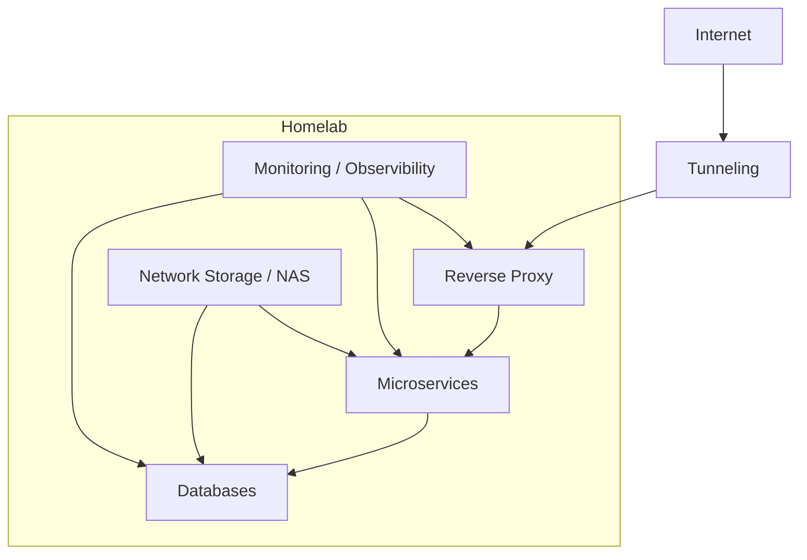

With recent news of AWS and Cloudflare outages, I think this is something more people should get into as well.

This will be more of a diary of my journey building this infrastructure rather than a detailed guide of how to set up your own lab or a technical deep dive.

### The hardware
It's a mix of new and old pc parts

```Markdown
Mobo: ASRock B550M Pro4
CPU: AMD Ryzen 5 5500 6-core 3.6 GHz
GPU: NVIDIA GeForce GTX 1080 Ti
Memory: Corsair Vengence LPX 32GB DDR4 3200MHz
Storage:
 - Boot drive: WD Blue SN5000 1TB
 - HDD: 
     - x2 Seagate IronWolf 4 TB
     - x1 Old WD 640 GB
     - x3 mixes of 2nd hand 500 GB WD Blue and Toshiba HDD from taobao
PSU: Corsair RM750x 750W Power Supply
Case: JONSBO N6
Cooling: 
  - Thermalright AXP90-X36 Low Profile CPU Cooler
  - Bunch of Thermalright 12cm fans
```

Because of the current ram shortage, going with DDR4 is a must. And this the case I bought looks aesthetically pleasing, it is limited to ITX/MATX so I have less room for pcie and sata slot than it should with full size ATX board.

I'm currenty scouring through facebook marketplace to find good deal on second hand RTX 3090 to replace the GTX 1080 Ti. The 3090 would let me host bigger ai model like 27b and 30b and looking at the Gemma-4 release, I did not want to miss the fun. I'll be stuck at 4b-7b model with 1080 Ti.


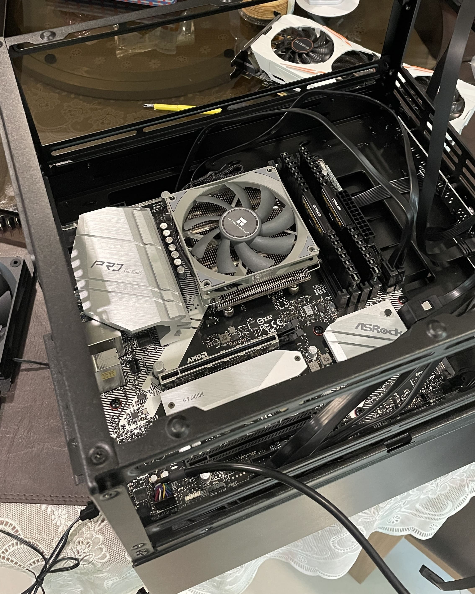
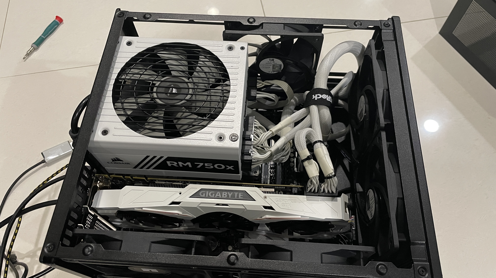
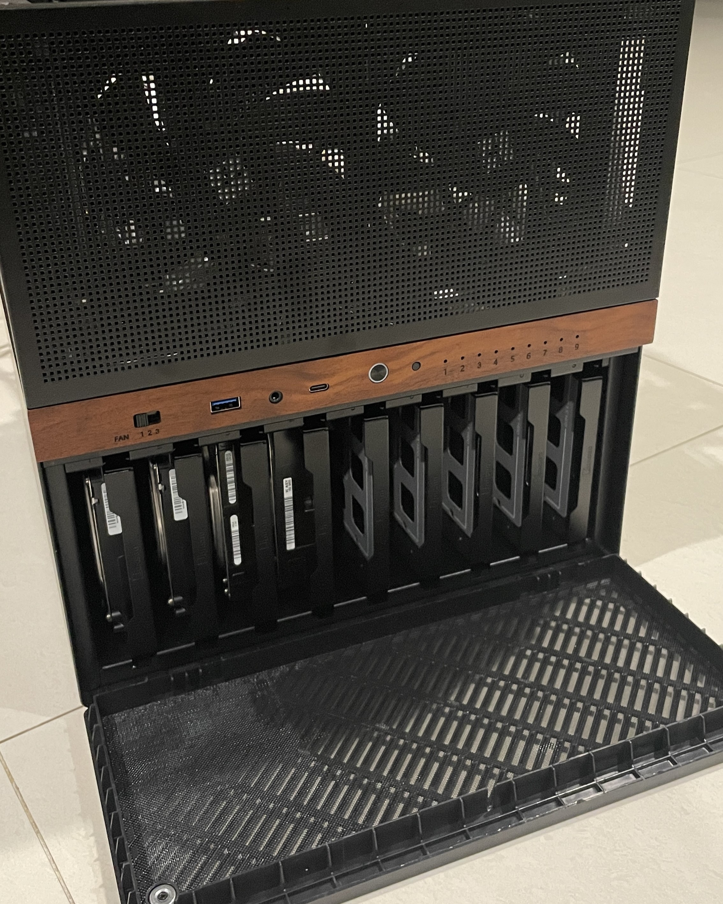
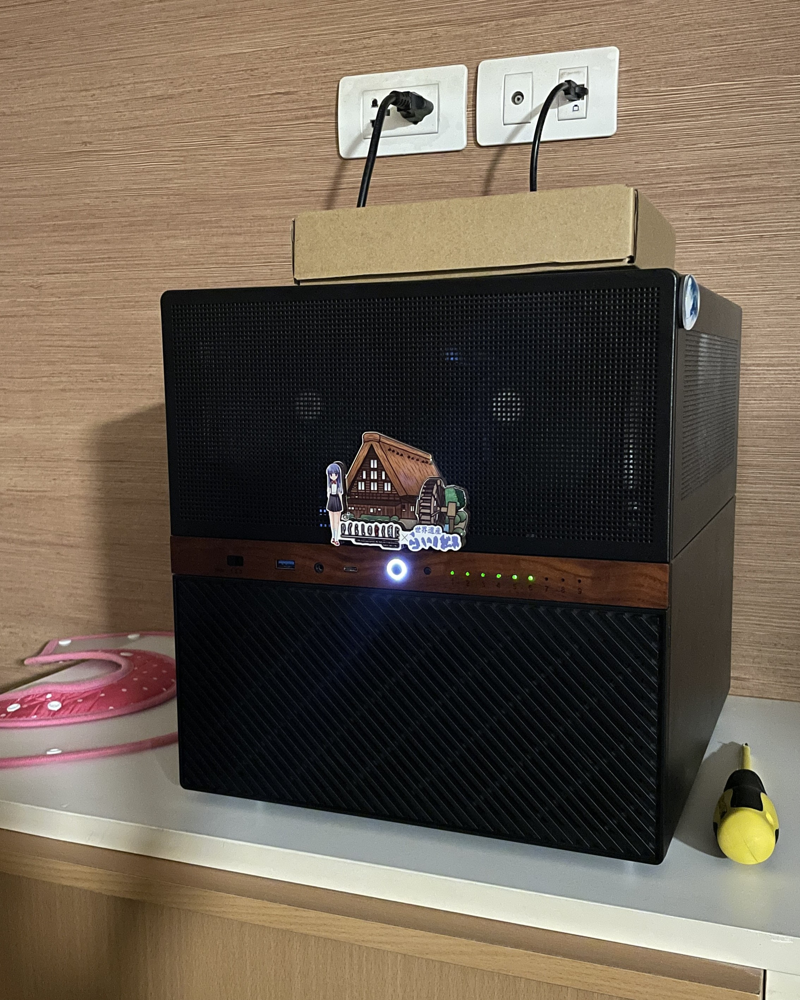


As for the OS, I grabbed the [Proxmox VE ISO](https://www.proxmox.com/en/downloads/proxmox-virtual-environment/iso) and started setting up the hosts and the network. Proxmox VE is basically a virtualization platform. It allows me to spin up LXC (Linux Container) for my micro services, or even create VM to host multiple OS such as Windows 11, Arch Linux, TrueNAS in one platform.

I chose Proxmox mainly because it's free and open source. It support for both KVM virtual machines and lightweight LXC containers for good flexibility. It is a community standard of homelab hobbyist while still giving enterprise-grade features. Other OS such as Unraid may give me better time but it has license fee.

The first thing I did after installing Proxmox is to install TrueNAS as my main network attached storage into its VM, and create 2 data pools.
- the first pool is mirror RAID1 using the x2 4 TB IronWolf for main storage
  - RAID1 mirrors(requires 2 disks), providing instant failover and fast reads at the cost of using only half the total storage space.
  - 1 Drive out of 2 can fail and be easily replaced
- the second is RAIDZ1(requires minimum 3 disks) using 4 smaller old 500 GB HDDs for secondary, and something to tinker with
  - RAID Z1 stripes data across three or more drives with single-drive protection, sacrificing 1 drive space for redundancy
  - 1 Drive out of 3 can fail and I can keep adding more drive ulike mirror. But also unlike mirror RAID1, each restripe will take significantly longer time

This puts me at ~ 5.5 TB of network storage


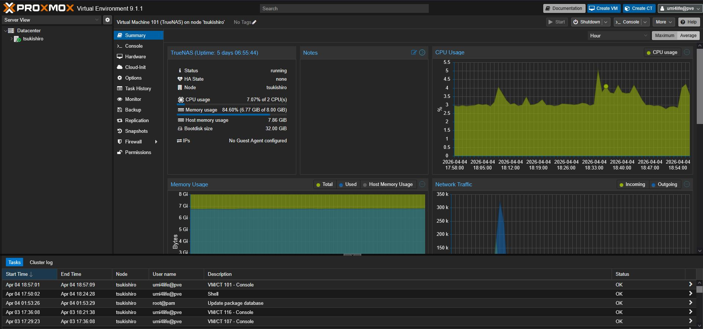
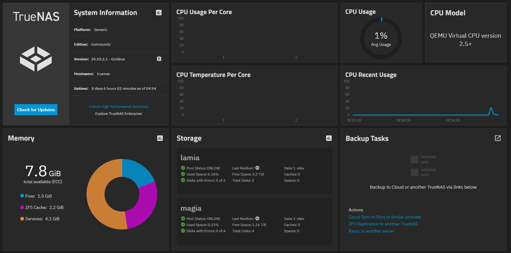


After setting up data set and created SMB share for my main PC, phones, and family, I immediatly started spinning up some LXCs

### The mistakes
I came across a curated list of community script for automatically creating LXCs for listed services https://community-scripts.org. Initially I was only after the [Prometheus Exporter](https://community-scripts.org/scripts/prometheus-pve-exporter) for Grafana observibility of my system. However, I started getting trigger happy and created *bunch* of containers, each dedicated for only one microservice.

Without realizing, I my Proxmox server got filled with 20+ LXCs and that would be very bad for memory overhead. I spent days re-creating LXCs and setting up Docker manually, migrating each service inside those LXCs into proper Docker container. This came with headache of moving to central database LXC, converting many of which were using sqlite into postgres table. There were only 2 survivors left, the affrmentioned Prometheus Exporter LXC and Ollama LXC which need to work closely with the kernel.

The idea virtualization strategy should be the following

| Workload      | Type   | Reason                                                    |
| :------------ | :----- | :-------------------------------------------------------- |
| Proxy         | LXC    | External point, Isolation, networking flexibility         |
| Apps          | LXC    | Lightweight, fast                                         |
| Database      | LXC    | Centralized persistent data Performance, low overhead     |           
| Monitoring    | LXC    | Observability of the entire system                        |    
| NAS           | VM     | Filesystem control (ZFS, passthrough)                     |
| DMZ           | VM     | External app hoting to the internet, isolated from kernel |

In the end, the LXCs structure look something like this
```Markdown
Proxmox Host
├── LXC Containers
│   ├── Prometheus Exporter
│   │   └── Script for system metrics export
│   ├── ollama
│   │   └── ollama serving directly
│   ├── network
│   │   └── Docker
│   │       └── AdGuard
│   ├── proxy
│   │   └── Docker
│   │       └── Traefik
│   ├── databases
│   │   └── Docker
│   │       ├── Postgres
│   │       ├── Redis
│   │       └── MariaDB
│   ├── Monitoring
│   │   └── Docker
│   │       ├── Grafana
│   │       └── Prometheus
│   ├── services-productivity
│   │   └── Docker
│   │       ├── Memos
│   │       ├── Docmost
│   │       ├── Penpot
│   │       ├── Paperless
│   │       └── Planka
│   ├── services-ai
│   │   └── Docker
│   │       ├── Open WebUI
│   │       ├── LiteLLM
│   │       ├── Paperless-AI
│   │       └── SearXNG
│   ├── services-git
│   │   └── Docker
│   │       ├── Gitea
│   │       └── Gitea Runner
│   └── services-personal
│       └── Docker
│           └── Stashapp
|
└─── Virtual Machines
    └── TrueNAS
```
Each LXCs' Dockers also have cadvisor running to send more real-time observibility data to Prometheus -> Grafana. There's also NVIDIA DCGM exporter to monitor my GPU metrics.


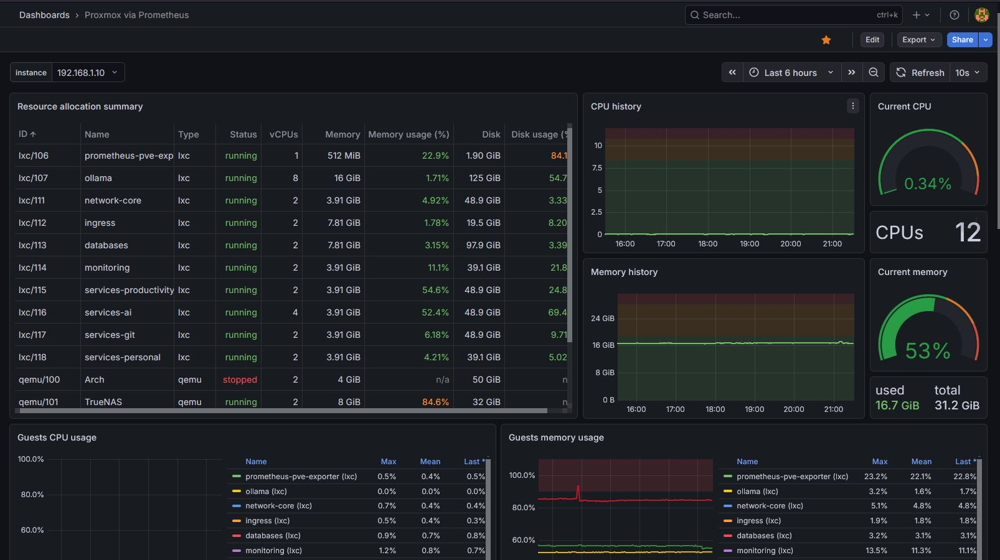
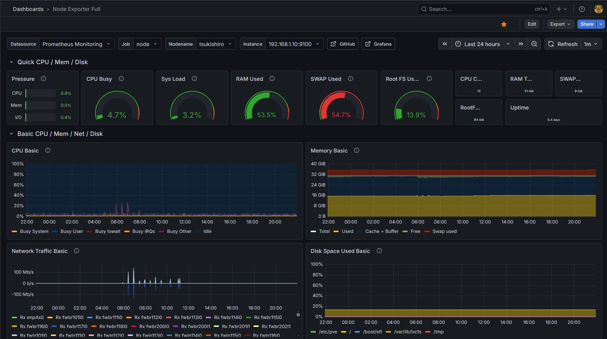
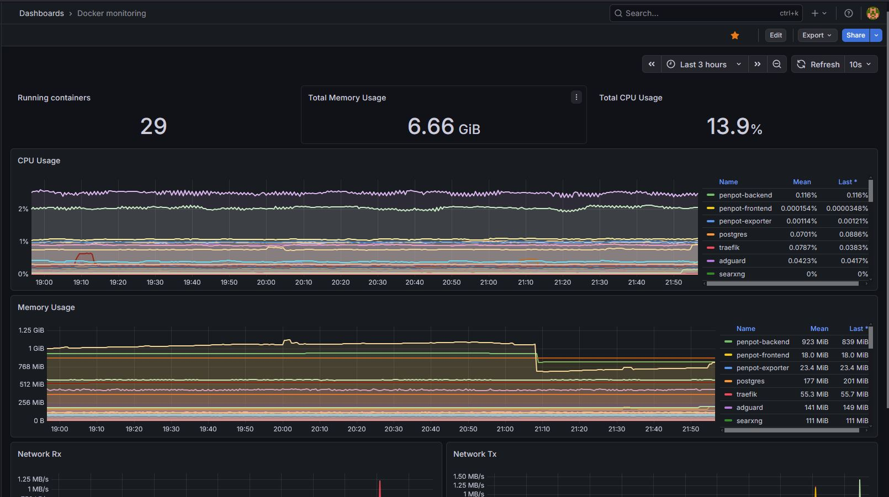
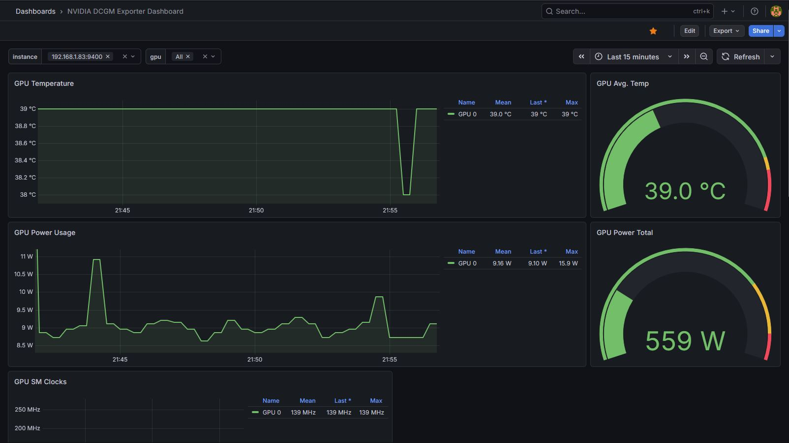


My Grafana can the track system's
- cpu/memory usage
- how much resource each container is taking
- uptime of each container
- gpu usages, temperature, power draw
- disk read and writes

### What I'd avoid next time
Lazily sing community script to spin up LXCs not only ends up with inefficient resource usage, but because I was specifally using express version, every container got assined with dynamic IP by router DHCP. This gives me headache organizing each IP in Traefik.

I had to reorganize into static IP as such

| Service / Role        | IP Address    |   
| ----------------------|---------------|
| Proxmox Host          | 192.168.1.10  |
| AdGuard DNS           | 192.168.1.2   |
| Traefik Reverse Proxy | 192.168.1.3   |
| Central Database      | 192.168.1.30  |
| Monitoring            | 192.168.1.31  |
| services-productivity | 192.168.1.40  |
| services-ai           | 192.168.1.41  |
| services-git          | 192.168.1.42  |
| services-personal     | 192.168.1.43  |
| TrueNAS               | 192.168.1.200 |


To provide some more background, my current router DCHP assigns dynamic IP between `101-199`. I put all these containers into IP out of DCHP range, starting with Proxmox host at `.10`, dns& proxy at `.2` & `.3`, database & monitoring at `.30` & `.32`, servuces starting at `.40`, and VM starting at `.200`

Reassiging IP broke relation bewtween my services, had to go inside each Docker compose file/condig to update the IPs. But on the brightside his prevents mixing with other network device such as home computer, phones, printers and such. It also paves standard to expand more stuff such as new Promxmox nodes into my lab.

The conclusion of this mistake is to plan out IP assignment of what you're going to host from the start, to have a more organized IP hierarchy.

### High-Level Architecture
```mermaid
flowchart LR

    subgraph External
        A[Internet]
    end

    subgraph Edge
        B[Router / Firewall]
    end

    subgraph Proxmox Host
        C[Traefik Reverse Proxy Container]
        D[Apps LXCs]
        E[Database LXCs]
        F[TrueNAS Storage VM]
        G[Monitoring LXC]
    end

    A --> B --> C
    C --> D
    D --> E
    F --> D
    F --> E
    G --> C
    G --> D
    G --> E
  ```


### The LXC -> GPU shenanigans 
The installation of Ollama didn't go smoothly. Apparently my kernel version was too new leading to nvidia driver build failling. I had to downgrade to previous version to get my LXC to properly detect GPU with passthrough.

```Bash
root@ollama:~# nvidia-smi
+-----------------------------------------------------------------------------------------+
| NVIDIA-SMI 550.163.01             Driver Version: 550.163.01     CUDA Version: 12.4     |
|-----------------------------------------+------------------------+----------------------+
| GPU  Name                 Persistence-M | Bus-Id          Disp.A | Volatile Uncorr. ECC |
| Fan  Temp   Perf          Pwr:Usage/Cap |           Memory-Usage | GPU-Util  Compute M. |
|                                         |                        |               MIG M. |
|=========================================+========================+======================|
|   0  NVIDIA GeForce GTX 1080 Ti     Off |   00000000:01:00.0 Off |                  N/A |
|  0%   53C    P2            231W /  250W |    7431MiB /  11264MiB |     97%      Default |
|                                         |                        |                  N/A |
+-----------------------------------------+------------------------+----------------------+
                                                                                         
+-----------------------------------------------------------------------------------------+
| Processes:                                                                              |
|  GPU   GI   CI        PID   Type   Process name                              GPU Memory |
|        ID   ID                                                               Usage      |
|=========================================================================================|
+-----------------------------------------------------------------------------------------+
```

### Networking and Proxies
I set up AdGuard as a DNS rewriter. The ability to block ad from the entire network is just a side benefit. This way, I can just type in a custom domain name instead of having to remember IP of each LXC I want to access.

On top of that, there's Traefik to reverse proxy each microservice. With this, I don't have to type the port either, just the name of the host. I simply had to point every DNS rewrite in AdGuard to Traefik IP to get everything to work. 

I also set up Let's Encrypt using domain name umi4.life I got from Cloudflare so that every service I host will have SSL/TLS.

`Internet → Router → DNS → Reverse Proxy (Traefik) → Internal Services`

Reverse Proxy (Traefik) acts as a unified gateway to each internal services, it provides;
 - A single point of security and 
 - performance optimization
 - traffic management
I can easily edit the centralized proxy setting without touching proxy setting on other microservices inside Docker.


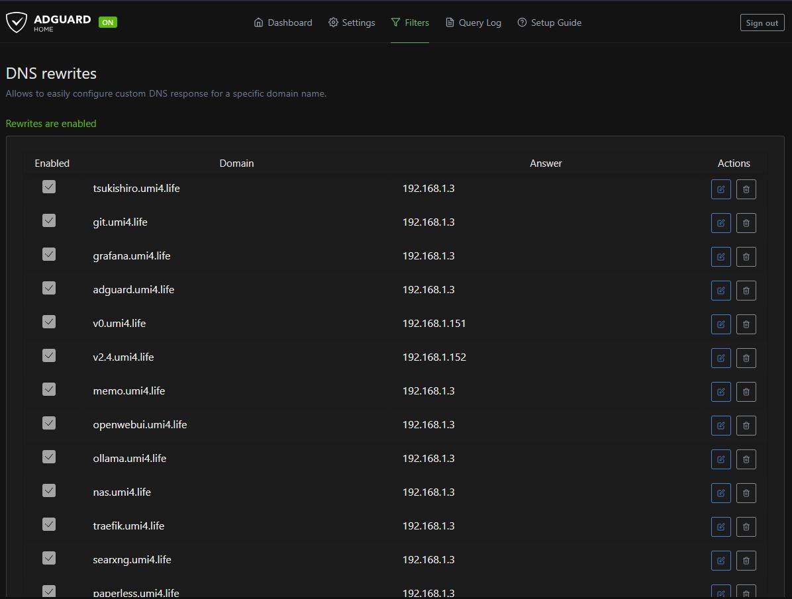
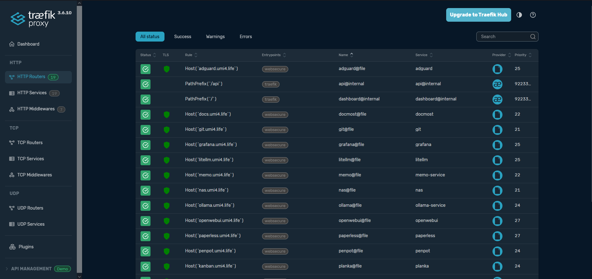
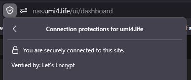


None of these are exposed to the internet of course. They can only be accessed when connected to the same network as the Proxmox server, which brings us to...

### Private VPN
At first I was going to use WireGuard for self hosted VPN. However, my home network is locked behind not just dynamic IP, but also CGNAT by my ISP, preventing any inbound connections. I had to rely on 3rd party relay, leading me to [Tailscale](https://tailscale.com/) which coincidently also uses WireGuard protocol.

By installing Tailscale directly on the Proxmox host and...

- advertise subnet route on the host
- set up split DNS on Tailscale admin console to point to the AdGuard IP

I can not only access my Proxmox server from external network, but also anything inside my home network including my 3d printer from edge devices.


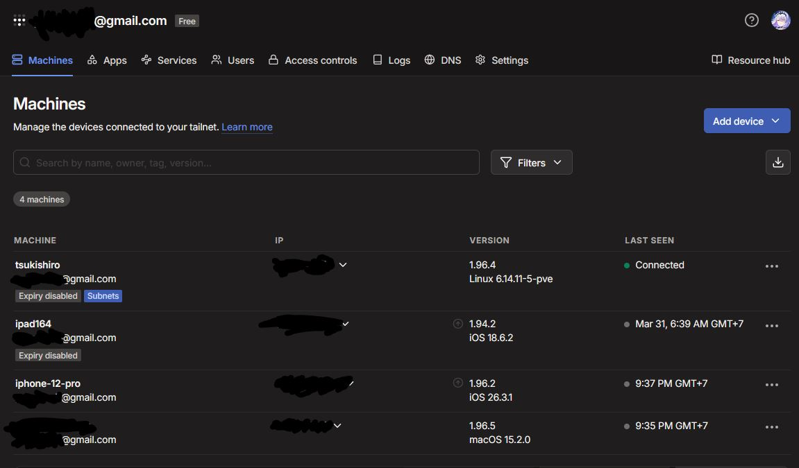
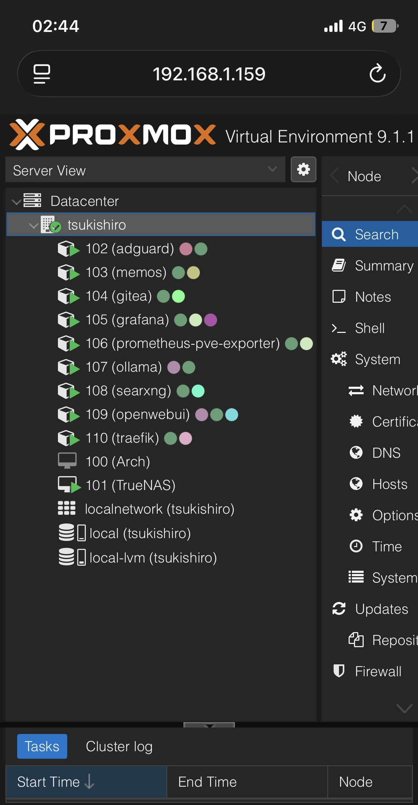



### Overall stacks
This finally brings up to the stacks diagram of my infrastructure.


This diagram is not 100% accurate yet. The places where where the stuff is hosted aren't up to date, some haven't been added to the diagram and as aforementioned, I'm using a consumer ISP package with consumer router, which is unable to do VLAN to properly seperate DMZ services from my internal service. I ended just creating another VM for Traefik, put everything on separate VMBR, created reverse tunnel on those DMZ services and put everthing under strict firewall policy to make sure other people can't access my internal network.

### The DMZ
This is where I host public stuff via Cloudflare Tunnel. As of now, there's only fork of [ARTEMiS server](https://gitea.tendokyu.moe/Hay1tsme/artemis) hosting on https://artemis.umi4.life with it's frontend at https://artemis-web.umi4.life. I'm planning to host more arcade servers and some other pet project in the future.

The artemis server is not just something I pulled from tendokyu and serve as-is. First I forked it into my self hosted private git repo. Setting up CI/CD to build Docker image and push into my self hosted registry stored in the NAS, and then do some ssh jumping to the destination container to pull it from that registry and re compose up.

The reason I didn't push directly to the service container is because since this is a DMZ service, everything is cut completely off from the rest of my internal network, so I made them communicate over internet instead.

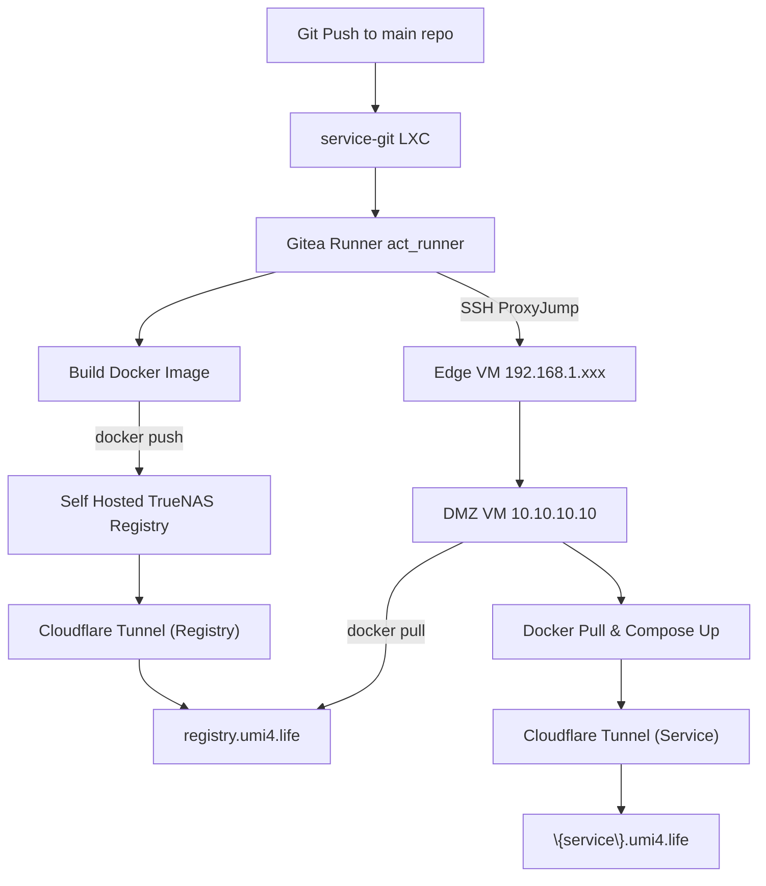

### Result
In the end, I ended up with infrastructure that I own 100% and have complete control over (besides Cloudflare tunnel and Tailscale VPN). Right now my RAM usage is sitting at ~17 GB out of 32 GB which is something I definitely have to upgrade in the future. 

I ended up tearing and re-doing lots of things along the way, broke many stuff, got my whole house wifi down while my family is streaming movie. But I did not regret a single step, *the point of homelab is to make and break things to learn more stuff and be able to fix things on the go*. That's the philosophy I came across in multiple guides I came across during research of making a homelab.

### Furure plan

There's still a lot to do. As of now there is 0 backup plan and recovery strategy. That's something I need to work on asap to have something to rollback to. How I'd probably implement is to create each day snapshot of central DBs into my NAS.

I'm also planning to integrate [Terraform](https://developer.hashicorp.com/terraform) and [Ansible](https://github.com/ansible/ansible) to turn my whole Proxmox environment into Infrastructure as a Code and version control everything into my private git, so that's something to look forward to.

As mentioned, my current AI capability is very limited, anything LLM model over 9b spilled to RAM and slowed down token/s significantly, 3090 is one of the top priority hardware upgrade I want, second from RAM upgrade
