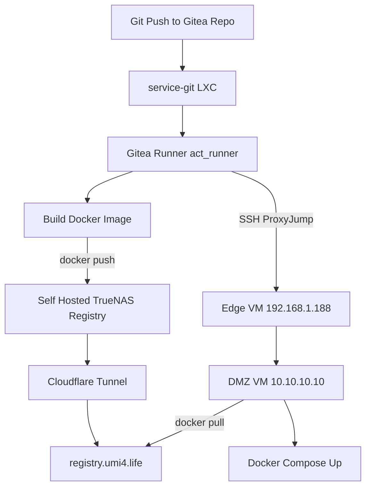

+++
banner = 'https://github.com/Umi4Life/umi4.life/posts/building-proxmox-homelab/cover.jpg'
cover = 'https://github.com/Umi4Life/umi4.life/posts/building-proxmox-homelab/cover.jpg'
date = '2026-04-04T10:35:08+07:00'
draft = false
title = 'Building a Proxmox Homelab'
mermaid = true
+++

### The begnning
I've been wanting to host my own bare-metal server for a while. It all started from my pc running out of storage and planning to buil a NAS, along the way during planning I just had a random thought "hey, why not turn it into a full scale home server to host all my own microservices".

With recent news of AWS and Cloudflare outages, I think this is something more people should get into as well.

### The hardware
It's a mix of new and old pc parts

```Markdown
Mobo: ASRock B550M Pro4
CPU: AMD Ryzen 5 5500 6-core 3.6 GHz
GPU: NVIDIA GeForce GTX 1080 Ti
Memory: Corsair Vengence LPX 32GB DDR4 3200MHz
Storage:
 - Boot drive: WD Blue SN5000 1TB
 - HDD: 
     - x2 Seagate IronWolf 4 TB
     - x1 Old WD 640 GB
     - x3 mixes 2nd hand of WD Blue and Toshiba HDD from taobao
PSU: Corsair RM750x 750W Power Supply
Case: JONSBO N6
Cooling: 
  - Thermalright AXP90-X36 Low Profile CPU Cooler
  - Bunch of Thermalright 12cm fans
```






As for the OS, I grabbed the [Proxmox VE ISO](https://www.proxmox.com/en/downloads/proxmox-virtual-environment/iso) and started setting up the hosts and the network. Proxmox VE is basically a virtualization platform. It allows me to spin up LXC (Linux Container) for my micro services, or even create VM to host multiple OS such as Windows 11, Arch Linux, TrueNAS in one platform.

The first thing I did after installing Proxmox is to install TrueNAS as my main network attached storage into its VM, and create 2 data pools.
- the first pool is mirror RAID1 using the x2 4 TB IronWolf for main storage
  - RAID1 mirrors 2 disks, providing instant failover and fast reads at the cost of using only half the total storage space.
- the second is RAIDZ1 using 4 smaller old 500 GB HDDs for secondary, and someting to tinker with
  - RAID Z1 stripes data across three or more drives with single-drive protection, sacrificing 1 drive space for redundancy

This puts me at ~ 5.5 TB of network storage






After setting up data set and created SMB share for my main PC, phones, and family, I immediatly started spinning up some LXCs

### The mistakes
I came across a repostory of community script which would automatically create LXCs for many services https://community-scripts.org/. Initially I was only after the [Prometheus Exporter](https://community-scripts.org/scripts/prometheus-pve-exporter) for Grafana observibility of my system. However, I started getting trigger happy and created *bunch* of containers, each dedicated for only one microservice.

Without realizing, I my Proxmox server ended up with 20+ LXCs which would be bad for memory overhead. I spend days re-creating LXCs and setting up docker manually, migrating each service inside those containers into docker. This came with headache of moving to central database LXC, converting many which were using sqlite into postgres table. There was only 2 survivors left, the affrmentioned Prometheus Exporter LXC and Ollama LXC which need to work closly with the kernel.

In the end, the LXCs structure look something like this
```Markdown
Proxmox Host
├── LXC Containers
│   ├── Prometheus Exporter
│   │   └── Script for system metrics export
│   ├── ollama
│   │   └── ollama serving directly
│   ├── network
│   │   └── Docker
│   │       └── AdGuard
│   ├── ingress
│   │   └── Docker
│   │       └── Traefik
│   ├── databases
│   │   └── Docker
│   │       ├── Postgres
│   │       ├── Redis
│   │       └── MariaDB
│   ├── Monitoring
│   │   └── Docker
│   │       ├── Grafana
│   │       └── Prometheus
│   ├── services-productivity
│   │   └── Docker
│   │       ├── Memos
│   │       ├── Docmost
│   │       ├── Penpot
│   │       ├── Paperless
│   │       └── Planka
│   ├── services-ai
│   │   └── Docker
│   │       ├── Open WebUI
│   │       ├── LiteLLM
│   │       ├── Paperless-AI
│   │       └── SearXNG
│   ├── services-git
│   │   └── Docker
│   │       ├── Gitea
│   │       └── Gitea Runner
│   └── services-personal
│       └── Docker
│           └── Stashapp
|
└─── Virtual Machines
    └── TrueNAS
```
Each LXCs' dockers also have cadvisor running to send more real-time observibility data to Prometheus -> Grafana. There's also NVIDIA DCGM exporter which lets me monitor my GPU usage.






### The LXC -> GPU shenanigans 
The installation of Ollama didn't go smoothly. Apparently my kernel version was too new which caused nvidia driver build to fail. I had to downgrade to previous version to get my LXC to detect GPU with passthrough.

```Bash
root@ollama:~# nvidia-smi
+-----------------------------------------------------------------------------------------+
| NVIDIA-SMI 550.163.01             Driver Version: 550.163.01     CUDA Version: 12.4     |
|-----------------------------------------+------------------------+----------------------+
| GPU  Name                 Persistence-M | Bus-Id          Disp.A | Volatile Uncorr. ECC |
| Fan  Temp   Perf          Pwr:Usage/Cap |           Memory-Usage | GPU-Util  Compute M. |
|                                         |                        |               MIG M. |
|=========================================+========================+======================|
|   0  NVIDIA GeForce GTX 1080 Ti     Off |   00000000:01:00.0 Off |                  N/A |
|  0%   53C    P2            231W /  250W |    7431MiB /  11264MiB |     97%      Default |
|                                         |                        |                  N/A |
+-----------------------------------------+------------------------+----------------------+
                                                                                         
+-----------------------------------------------------------------------------------------+
| Processes:                                                                              |
|  GPU   GI   CI        PID   Type   Process name                              GPU Memory |
|        ID   ID                                                               Usage      |
|=========================================================================================|
+-----------------------------------------------------------------------------------------+
```

### Networking and Proxies
I setup AdGuard as a DNS rewriter. The ability to block ad from the entire network is just a side benifit. This way, I can just type in a custom domain name instead of having to type in IP of each LXC I want to access.

On top of that, there's Traefik to help me proxy each microservice. With this, I don't have to type in the port either, just the name of the host. I simply had to point every DNS rewrite in AdGuard to Traefik IP to get everything to work. 

I also setup Let's Encrypt using domain name umi4.life I got from cloudflare so that every service I host will have SSL/TLS.






None of these are exposed to the internet, of course. These hosts can only be accessed when connected to the same network as the Proxmox server, which brings us to...

### Private VPN
At first I was going to use WireGuard for self hosted VPN. However, my home network is locked behind not just dynamic IP, but also CGNAT by my ISP which made it impossible by preventing inbound connections. I had to rely on external relay service which led me to [Tailscale](https://tailscale.com/) which coincidently also uses WireGuard protocol.

By installing directly on the Proxmox host, advertise subnet route on it, and setup split DNS on Tailscale console to point to the AdGuard IP, I can not only access my Proxmox server from external network, but also anything inside my home network including my 3d printer from edge devices.






### Overall stacks
This finally brings up to the stacks diagram of my homelab.


This diagram is not 100% accurate yet. Where stuff are hosted aren't up to date, some I haven't add to the diagram and as afformention, I'm using a consumer ISP package with consumer router, which is unable to do VLAN to properly seperate DMZ services from my internal service. I ended just creating another VM for Traefik, put everthing on seperate VMBR, reverse tunnel those DMZ services and put everthing under strict firewall policy to make sure that ousiders can't access my internal network.

### The DMZ
This is where I host public stuff. As of now, there's only fork of [ARTEMiS server](https://gitea.tendokyu.moe/Hay1tsme/artemis) hosting on https://artemis.umi4.life with it's frontend at https://artemis-web.umi4.life. I'm planning to host more arcade servers and some other pet project in the future.

The artemis server is not just something I pulled from tendokyu and serve as-is either. First I forked it into my self hosted private git repo. Setup CI/CD to build docker image and push into my self hosted registry stored in the NAS, and then do some ssh jumping to the destination destination to pull it from that registry and re compose up.



### Result
In the end, I ended up with infra, services and data that I own 100% and have complete control over (besides Cloudflare tunnel and Tailscale VPN). Right now my RAM usage is sitting at ~17 GB out of 32 GB which is something I definitely have to upgrade in the future. 

There's still a lot to do. I'm planning to integrate Terraform and Ansible to turn my whole Proxmob homelab into Infrastructure as a Code and version control everything into my private git, so that's something to look forward to.

I ended up tearing and re-doing lots of things along the way, broke many stuff, got my whole house wifi down while my family is streaming movie. But I did not regret a single step, *the point of homelab is to make and break things to learn more stuff and be able to fix things on the go*. That's the philosophy I came across in multiple guides I came across during research of making a homelab.