+++
banner = 'https://raw.githubusercontent.com/Umi4Life/umi4.life/refs/heads/master/content/posts/building-proxmox-homelab/cover.jpg'
cover = 'https://raw.githubusercontent.com/Umi4Life/umi4.life/refs/heads/master/content/posts/building-proxmox-homelab/cover.jpg'
date = '2026-04-04T10:35:08+07:00'
draft = false
translationKey = 'building-proxmox-homelab'
title = 'สร้าง Proxmox Homelab ของตัวเอง'
description = 'ไดอารี่การสร้าง homelab: Proxmox VE บน bare metal, TrueNAS, Docker, Traefik, AdGuard, Tailscale และ Cloudflare Tunnel สำหรับ self-hosted services'
tags = ["proxmox", "linux", "homelab", "ai", "documentation"]
categories = ["homelab"]
mermaid = true
+++

### The plan

ผมอยาก host bare-metal server ของตัวเองมาสักพักแล้ว จุดเริ่มต้นจริง ๆ คือ PC พื้นที่ใกล้เต็ม เลยคิดจะประกอบ NAS แต่ระหว่างวางแผนก็มีความคิดโผล่มาว่า “ถ้างั้นทำให้มันเป็น home server เต็มรูปแบบสำหรับ host microservices ของตัวเองไปเลยดีไหม”

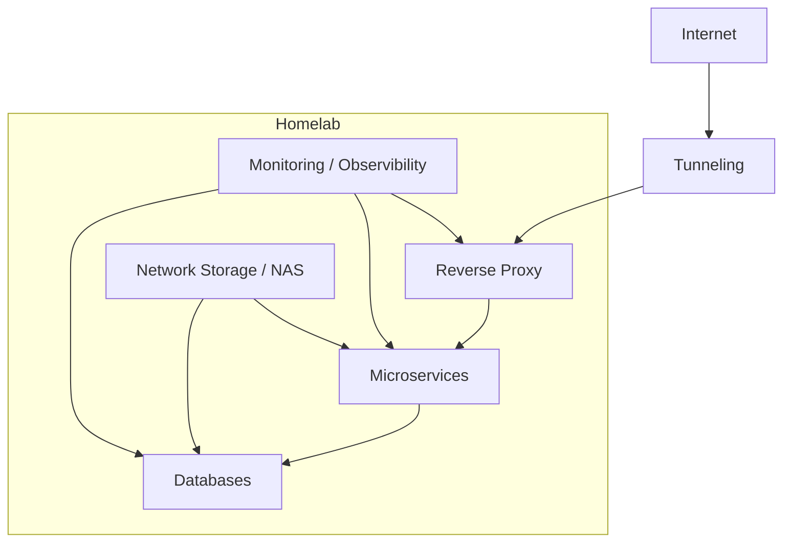

ช่วงหลังมีข่าว AWS และ Cloudflare outage บ่อยขึ้น ผมเลยรู้สึกว่านี่เป็นสิ่งที่คนควรลองเล่นกันมากขึ้นเหมือนกัน อย่างน้อยก็เพื่อเข้าใจว่า infrastructure ที่เราใช้ทุกวันมันทำงานยังไง

บทความนี้จะเป็น diary การสร้าง infrastructure ของผมมากกว่า guide แบบละเอียดหรือ technical deep dive สำหรับตั้ง lab ของตัวเอง

### The hardware

เครื่องนี้เป็นส่วนผสมระหว่างอะไหล่ใหม่กับอะไหล่ PC เก่า

```Markdown
Mobo: ASRock B550M Pro4
CPU: AMD Ryzen 5 5500 6-core 3.6 GHz
GPU: NVIDIA GeForce GTX 1080 Ti
Memory: Corsair Vengence LPX 32GB DDR4 3200MHz
Storage:
 - Boot drive: WD Blue SN5000 1TB
 - HDD:
     - x2 Seagate IronWolf 4 TB
     - x1 Old WD 640 GB
     - x3 mixes of 2nd hand 500 GB WD Blue and Toshiba HDD from taobao
PSU: Corsair RM750x 750W Power Supply
Case: JONSBO N6
Cooling:
  - Thermalright AXP90-X36 Low Profile CPU Cooler
  - Bunch of Thermalright 12cm fans
```

เพราะช่วงนี้ RAM ขาดตลาด การเลือก DDR4 แทบจะเป็นทางบังคับ เคสที่ผมซื้อหน้าตาดี แต่จำกัดอยู่ที่ ITX/MATX ทำให้พื้นที่สำหรับ PCIe และ SATA slot น้อยกว่าที่ควรจะได้จากบอร์ด ATX เต็มขนาด

ตอนนี้ผมยังไล่หา deal RTX 3090 มือสองใน Facebook Marketplace เพื่อแทน GTX 1080 Ti อยู่ 3090 จะช่วยให้ host AI model ขนาดใหญ่ขึ้นอย่าง 27B หรือ 30B ได้ และพอเห็นข่าว Gemma-4 แล้วก็ไม่อยากพลาดความสนุก ถ้าอยู่กับ 1080 Ti ต่อไปคงติดอยู่แถว model 4B-7B


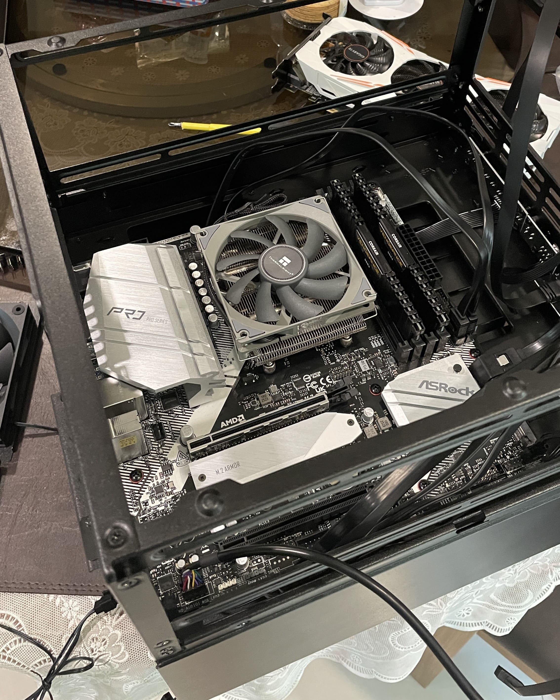
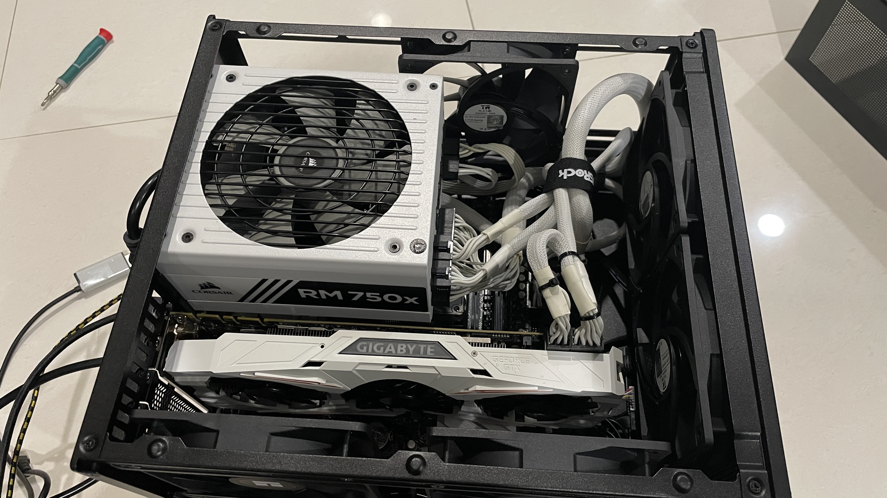
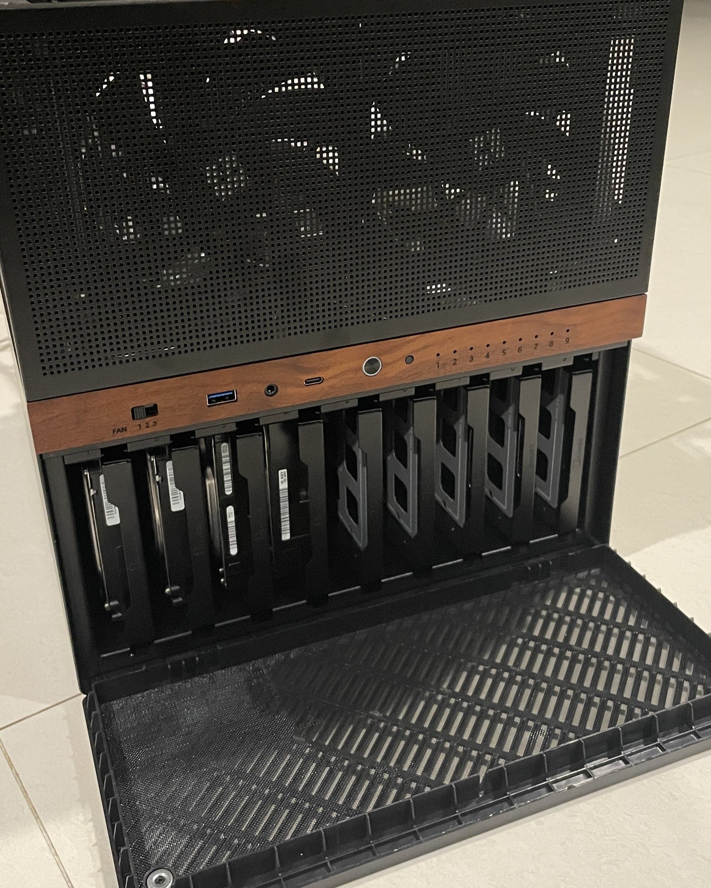
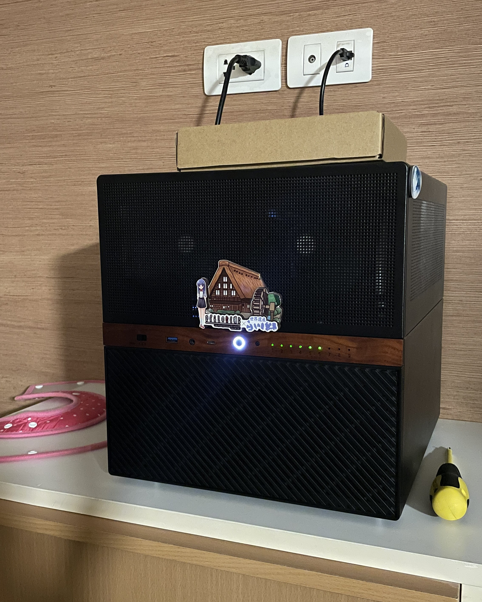


ฝั่ง OS ผมโหลด [Proxmox VE ISO](https://www.proxmox.com/en/downloads/proxmox-virtual-environment/iso) แล้วเริ่มตั้งค่า host กับ network Proxmox VE คือ virtualization platform ที่ให้ผม spin up LXC (Linux Container) สำหรับ microservices หรือสร้าง VM เพื่อ host OS หลายแบบ เช่น Windows 11, Arch Linux และ TrueNAS บน platform เดียวกัน

เหตุผลหลักที่เลือก Proxmox คือ free และ open source รองรับทั้ง KVM virtual machines และ LXC containers ทำให้ยืดหยุ่นดีมาก มันเป็น community standard ของสาย homelab แต่ยังมี feature ระดับ enterprise ถ้าใช้ OS อื่นอย่าง Unraid อาจ setup สบายกว่า แต่ก็มีค่า license

สิ่งแรกที่ผมทำหลังติดตั้ง Proxmox คือสร้าง TrueNAS เป็น VM สำหรับ network attached storage หลัก แล้วสร้าง data pool 2 ชุด

- pool แรกเป็น mirror RAID1 ใช้ IronWolf 4 TB จำนวน 2 ลูกสำหรับ main storage
  - RAID1 mirror ต้องใช้ 2 disks ให้ failover ได้ทันทีและ read เร็วขึ้น แลกกับ usable capacity เหลือครึ่งเดียว
  - disk เสียได้ 1 ลูกจาก 2 ลูกและเปลี่ยนแทนได้ค่อนข้างง่าย
- pool ที่สองเป็น RAIDZ1 ต้องใช้ขั้นต่ำ 3 disks ใช้ HDD เก่า 500 GB จำนวน 4 ลูกเป็น secondary storage และพื้นที่สำหรับลองของ
  - RAIDZ1 stripe data ข้าม 3 drives ขึ้นไปพร้อม single-drive protection แลกพื้นที่ disk 1 ลูกเพื่อ redundancy
  - disk เสียได้ 1 ลูกจาก 3 ลูก และยังเพิ่ม drive เพิ่มได้ ต่างจาก mirror แต่การ resilver/restripe แต่ละครั้งจะใช้เวลานานกว่ามาก

รวมแล้วผมได้ network storage ประมาณ 5.5 TB


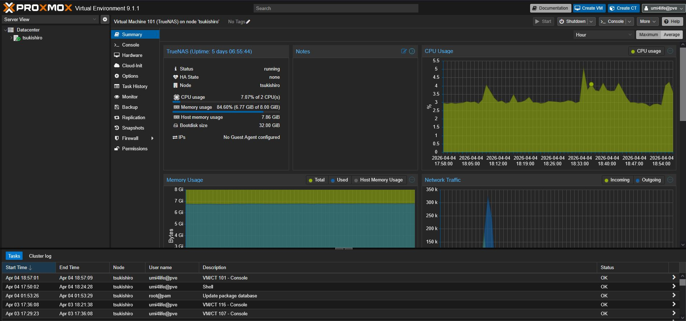
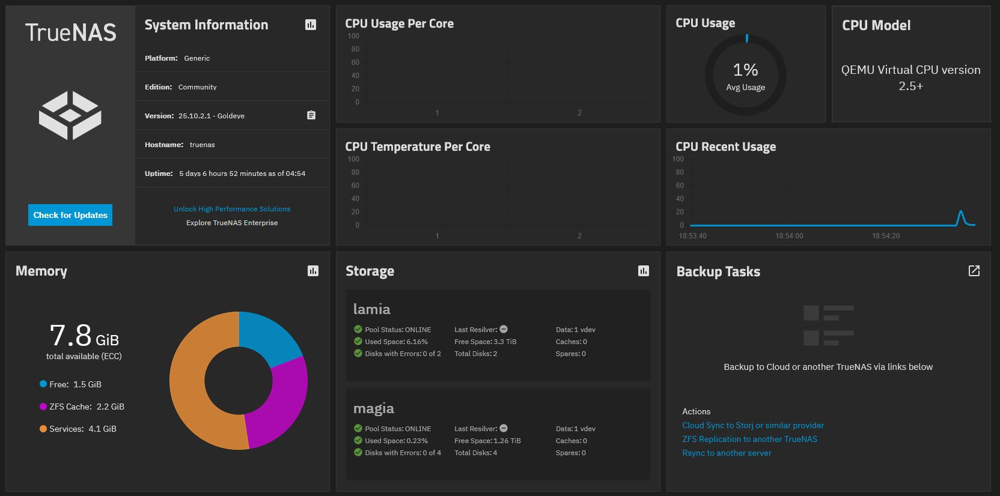


หลังตั้ง dataset และสร้าง SMB share สำหรับ main PC, โทรศัพท์ และครอบครัวเสร็จ ผมก็เริ่ม spin up LXC ทันที

### The mistakes

ผมเจอ curated list ของ community scripts สำหรับสร้าง LXC ของ service ต่าง ๆ อัตโนมัติที่ https://community-scripts.org ตอนแรกผมตั้งใจใช้แค่ [Prometheus Exporter](https://community-scripts.org/scripts/prometheus-pve-exporter) เพื่อส่ง observability data ไป Grafana เท่านั้น แต่หลังจากนั้นมือเริ่มไวเกินไป แล้วสร้าง container เป็นกอง โดยแต่ละตัวมีไว้สำหรับ microservice เดียว

รู้ตัวอีกที Proxmox server ก็เต็มไปด้วย LXC 20+ ตัว ซึ่งไม่ดีเลยสำหรับ memory overhead ผมใช้เวลาหลายวันสร้าง LXC ใหม่ จัด Docker เอง และย้าย service ใน LXC เหล่านั้นเข้า Docker container ที่เหมาะสมกว่า งานนี้มาพร้อมความปวดหัวเรื่อง central database LXC และการย้ายหลาย service จาก SQLite ไปเป็น Postgres table สุดท้ายเหลือ survivor แค่ 2 ตัว คือ Prometheus Exporter LXC ที่พูดถึงไปแล้ว และ Ollama LXC ที่ต้องทำงานใกล้กับ kernel/GPU

virtualization strategy ที่ควรเป็นตั้งแต่แรกน่าจะประมาณนี้

| Workload      | Type   | Reason                                                    |
| :------------ | :----- | :-------------------------------------------------------- |
| Proxy         | LXC    | External point, Isolation, networking flexibility         |
| Apps          | LXC    | Lightweight, fast                                         |
| Database      | LXC    | Centralized persistent data Performance, low overhead     |
| Monitoring    | LXC    | Observability of the entire system                        |
| NAS           | VM     | Filesystem control (ZFS, passthrough)                     |
| DMZ           | VM     | External app hoting to the internet, isolated from kernel |

สุดท้าย LXC structure ออกมาประมาณนี้

```Markdown
Proxmox Host
├── LXC Containers
│   ├── Prometheus Exporter
│   │   └── Script for system metrics export
│   ├── ollama
│   │   └── ollama serving directly
│   ├── network
│   │   └── Docker
│   │       └── AdGuard
│   ├── proxy
│   │   └── Docker
│   │       └── Traefik
│   ├── databases
│   │   └── Docker
│   │       ├── Postgres
│   │       ├── Redis
│   │       └── MariaDB
│   ├── Monitoring
│   │   └── Docker
│   │       ├── Grafana
│   │       └── Prometheus
│   ├── services-productivity
│   │   └── Docker
│   │       ├── Memos
│   │       ├── Docmost
│   │       ├── Penpot
│   │       ├── Paperless
│   │       └── Planka
│   ├── services-ai
│   │   └── Docker
│   │       ├── Open WebUI
│   │       ├── LiteLLM
│   │       ├── Paperless-AI
│   │       └── SearXNG
│   ├── services-git
│   │   └── Docker
│   │       ├── Gitea
│   │       └── Gitea Runner
│   └── services-personal
│       └── Docker
│           └── Stashapp
|
└─── Virtual Machines
    └── TrueNAS
```

Docker ในแต่ละ LXC ยังมี cAdvisor เพื่อส่ง real-time observability data ไป Prometheus -> Grafana และมี NVIDIA DCGM exporter สำหรับ monitor GPU metrics ด้วย


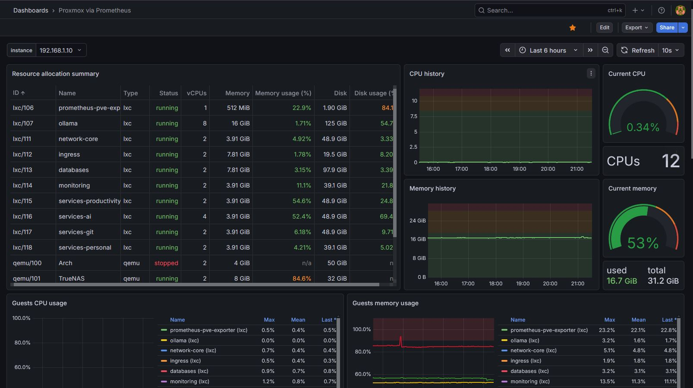
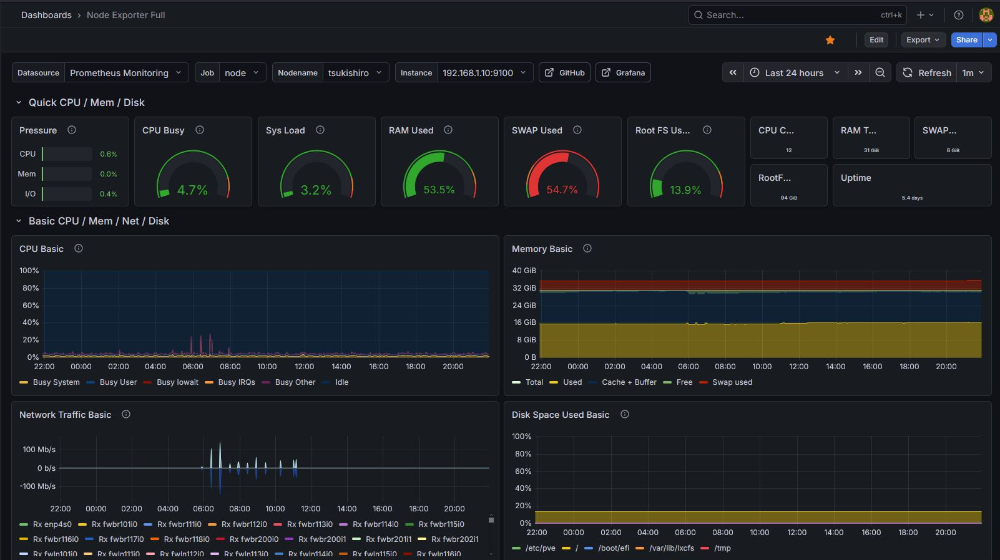
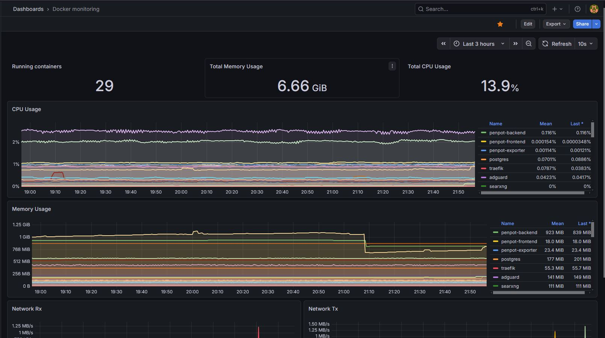
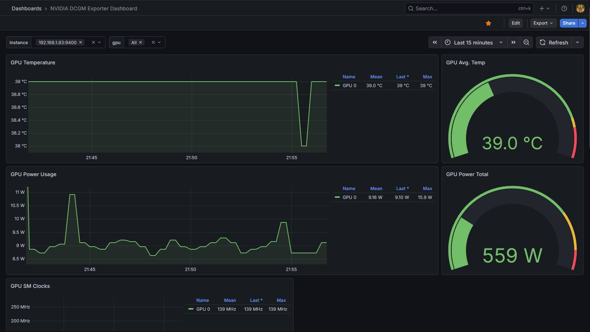


Grafana ของผม track ได้หลายอย่าง:

- CPU/memory usage
- resource ที่แต่ละ container ใช้
- uptime ของแต่ละ container
- GPU usage, temperature, power draw
- disk read/write

### สิ่งที่ผมจะเลี่ยงถ้าทำใหม่

การใช้ community scripts แบบขี้เกียจเพื่อ spin up LXC ทำให้ resource usage ไม่มีประสิทธิภาพ และเพราะผมใช้ express version ทุก container เลยได้ dynamic IP จาก router DHCP ผลคือจัด IP ใน Traefik ยุ่งมาก

ผมต้อง reorganize เป็น static IP แบบนี้

| Service / Role        | IP Address    |
| ----------------------|---------------|
| Proxmox Host          | 192.168.1.10  |
| AdGuard DNS           | 192.168.1.2   |
| Traefik Reverse Proxy | 192.168.1.3   |
| Central Database      | 192.168.1.30  |
| Monitoring            | 192.168.1.31  |
| services-productivity | 192.168.1.40  |
| services-ai           | 192.168.1.41  |
| services-git          | 192.168.1.42  |
| services-personal     | 192.168.1.43  |
| TrueNAS               | 192.168.1.200 |

router DHCP ปัจจุบันแจก dynamic IP อยู่ในช่วง `101-199` ผมเลยวาง container ทั้งหมดไว้นอกช่วง DHCP โดยเริ่มจาก Proxmox host ที่ `.10`, DNS และ proxy ที่ `.2` กับ `.3`, database และ monitoring ที่ `.30` กับ `.31`, services เริ่มที่ `.40`, และ VM เริ่มที่ `.200`

การ assign IP ใหม่ทำให้ relation ระหว่าง service พัง ต้องเข้าไปแก้ Docker Compose/config แต่ละตัวให้ชี้ IP ใหม่หมด แต่ข้อดีคือมันไม่ปนกับ device อื่นในบ้าน เช่น computer, phone, printer และช่วยวาง standard สำหรับขยาย lab ในอนาคต เช่นเพิ่ม Proxmox node ใหม่

บทเรียนจากจุดนี้คือควรวางแผน IP assignment ตั้งแต่แรก ว่า service ไหนจะ host อะไร และควรมี hierarchy ของ IP ที่อ่านแล้วเข้าใจง่าย

### High-Level Architecture

```mermaid
flowchart LR

    subgraph External
        A[Internet]
    end

    subgraph Edge
        B[Router / Firewall]
    end

    subgraph Proxmox Host
        C[Traefik Reverse Proxy Container]
        D[Apps LXCs]
        E[Database LXCs]
        F[TrueNAS Storage VM]
        G[Monitoring LXC]
    end

    A --> B --> C
    C --> D
    D --> E
    F --> D
    F --> E
    G --> C
    G --> D
    G --> E
  ```

### The LXC -> GPU shenanigans

การติดตั้ง Ollama ไม่ได้ราบรื่นเท่าไร ปรากฏว่า kernel version ของผมใหม่เกินไปจน build NVIDIA driver ไม่ผ่าน ผมต้อง downgrade kernel กลับไป version ก่อนหน้าเพื่อให้ LXC detect GPU ผ่าน passthrough ได้ถูกต้อง

```Bash
root@ollama:~# nvidia-smi
+-----------------------------------------------------------------------------------------+
| NVIDIA-SMI 550.163.01             Driver Version: 550.163.01     CUDA Version: 12.4     |
|-----------------------------------------+------------------------+----------------------+
| GPU  Name                 Persistence-M | Bus-Id          Disp.A | Volatile Uncorr. ECC |
| Fan  Temp   Perf          Pwr:Usage/Cap |           Memory-Usage | GPU-Util  Compute M. |
|                                         |                        |               MIG M. |
|=========================================+========================+======================|
|   0  NVIDIA GeForce GTX 1080 Ti     Off |   00000000:01:00.0 Off |                  N/A |
|  0%   53C    P2            231W /  250W |    7431MiB /  11264MiB |     97%      Default |
|                                         |                        |                  N/A |
+-----------------------------------------+------------------------+----------------------+

+-----------------------------------------------------------------------------------------+
| Processes:                                                                              |
|  GPU   GI   CI        PID   Type   Process name                              GPU Memory |
|        ID   ID                                                               Usage      |
|=========================================================================================|
+-----------------------------------------------------------------------------------------+
```

### Networking and Proxies

ผมตั้ง AdGuard เป็น DNS rewriter ความสามารถ block ads ทั้ง network เป็นแค่ผลพลอยได้ สิ่งสำคัญคือผมพิมพ์ custom domain name เพื่อเข้า service ได้ โดยไม่ต้องจำ IP ของ LXC แต่ละตัว

ชั้นถัดมาคือ Traefik สำหรับ reverse proxy ไปหา microservice แต่ละตัว วิธีนี้ทำให้ไม่ต้องพิมพ์ port แค่จำชื่อ host ก็พอ ผมเพียงชี้ DNS rewrite ทุกตัวใน AdGuard ไปที่ IP ของ Traefik ทุกอย่างก็เริ่มเข้าที่

ผมยังตั้ง Let’s Encrypt กับ domain `umi4.life` ที่อยู่บน Cloudflare เพื่อให้ทุก service ที่ host มี SSL/TLS

`Internet → Router → DNS → Reverse Proxy (Traefik) → Internal Services`

Reverse Proxy (Traefik) ทำหน้าที่เป็น unified gateway ไปหา internal services แต่ละตัว มันช่วยเรื่อง:

- single point สำหรับ security
- performance optimization
- traffic management

ผมสามารถแก้ proxy setting จากจุดกลางได้โดยไม่ต้องไปแตะ proxy setting ของ microservice แต่ละตัวใน Docker


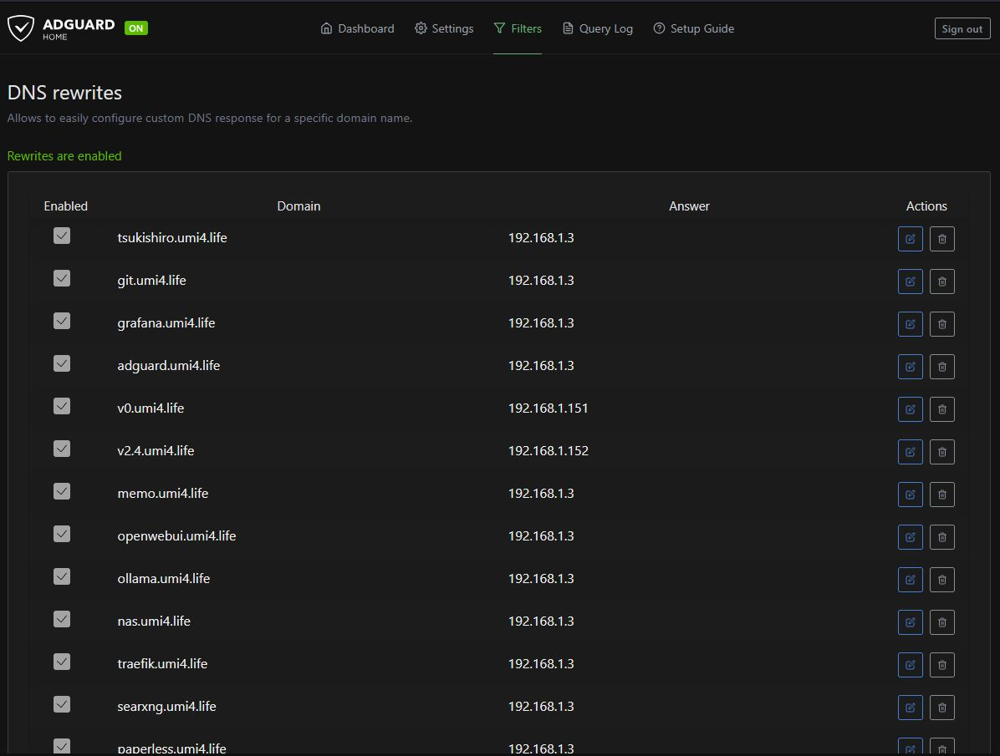
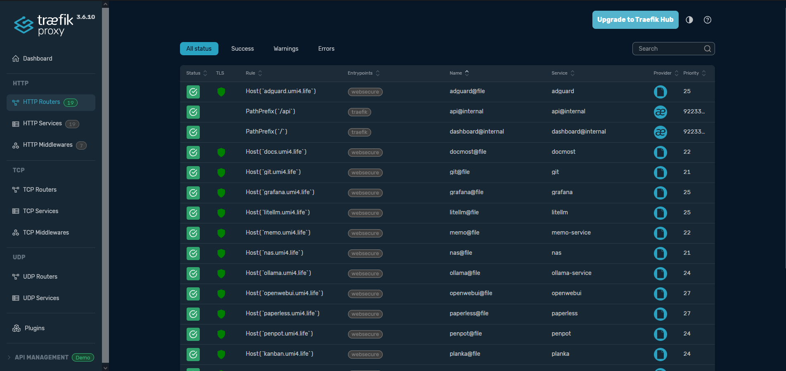
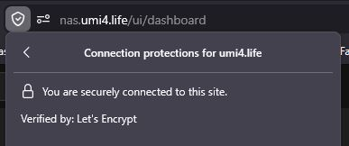


แน่นอนว่า service เหล่านี้ไม่ได้ expose ออก internet ทั้งหมด เข้าได้เฉพาะตอนอยู่ network เดียวกับ Proxmox server เท่านั้น ซึ่งพาไปสู่หัวข้อถัดไป

### Private VPN

ตอนแรกผมตั้งใจใช้ WireGuard สำหรับ self-hosted VPN แต่ home network ของผมไม่ได้เจอแค่ dynamic IP ยังอยู่หลัง CGNAT ของ ISP ด้วย ทำให้ inbound connection เข้าบ้านไม่ได้ ผมเลยต้องพึ่ง third-party relay และสุดท้ายไปจบที่ [Tailscale](https://tailscale.com/) ซึ่งบังเอิญใช้ WireGuard protocol อยู่แล้ว

โดยติดตั้ง Tailscale ตรงบน Proxmox host แล้วทำสองอย่าง:

- advertise subnet route บน host
- ตั้ง split DNS ใน Tailscale admin console ให้ชี้ไปที่ AdGuard IP

ผมก็สามารถเข้า Proxmox server จาก network ข้างนอกได้ และยังเข้าถึงของในบ้านผ่าน edge devices ได้ด้วย รวมถึง 3D printer


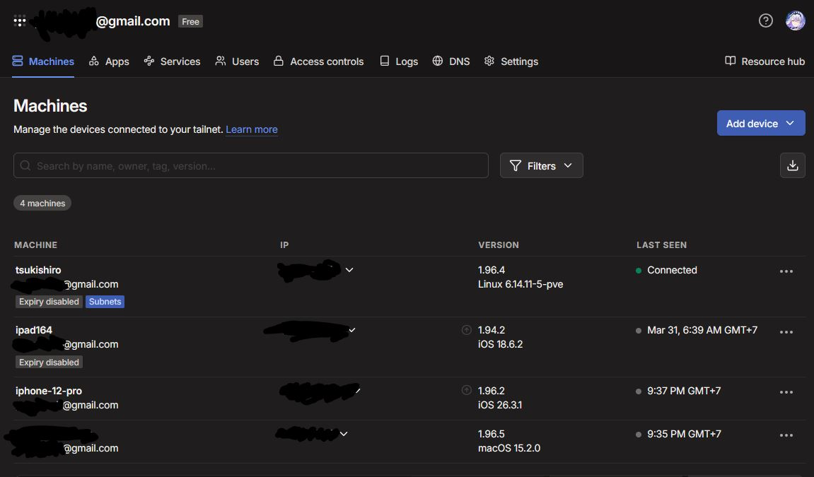
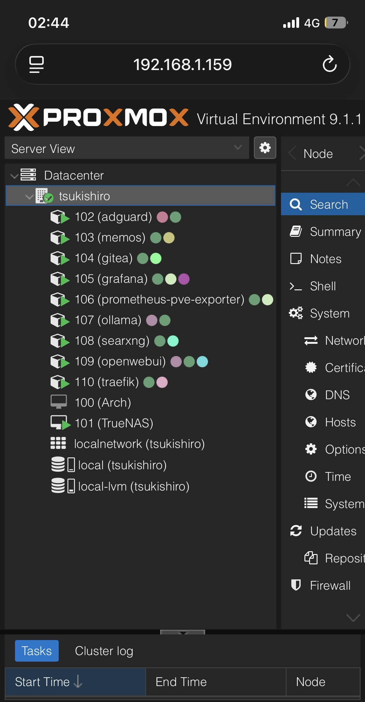


### Overall stacks

สุดท้ายก็มาถึง stacks diagram ของ infrastructure ทั้งชุด


diagram นี้ยังไม่ accurate 100% ตำแหน่งที่ host service บางอย่างยังไม่ update บางตัวก็ยังไม่ได้เพิ่มเข้า diagram และอย่างที่บอกไป ผมใช้ consumer ISP package กับ consumer router ซึ่งทำ VLAN เพื่อแยก DMZ services ออกจาก internal services แบบจริงจังไม่ได้ สุดท้ายผมเลยสร้าง VM อีกตัวสำหรับ Traefik, แยกทุกอย่างไว้บน VMBR คนละชุด, สร้าง reverse tunnel ให้ DMZ services และบังคับ firewall policy เข้ม ๆ เพื่อไม่ให้คนอื่นเข้ามาถึง internal network ได้

### The DMZ

ส่วนนี้คือพื้นที่สำหรับ host ของ public ผ่าน Cloudflare Tunnel ตอนนี้มีแค่ fork ของ [ARTEMiS server](https://gitea.tendokyu.moe/Hay1tsme/artemis) ที่อยู่บน https://artemis.umi4.life และ frontend ที่ https://artemis-web.umi4.life ในอนาคตผมอยาก host arcade servers เพิ่ม รวมถึง pet project อื่น ๆ

ARTEMiS server นี้ไม่ใช่สิ่งที่ผม pull จาก tendokyu มาแล้ว serve ตรง ๆ ผม fork เข้า self-hosted private git repo ของตัวเองก่อน จากนั้นตั้ง CI/CD เพื่อ build Docker image และ push เข้า self-hosted registry ที่เก็บอยู่ใน NAS แล้วค่อย SSH jump ไปยัง destination container เพื่อ pull image จาก registry และ `compose up` ใหม่

เหตุผลที่ไม่ push ตรงไปยัง service container คือ service นี้อยู่ใน DMZ และถูกตัดขาดจาก internal network ที่เหลือ ผมเลยให้มันสื่อสารกันผ่าน internet แทน

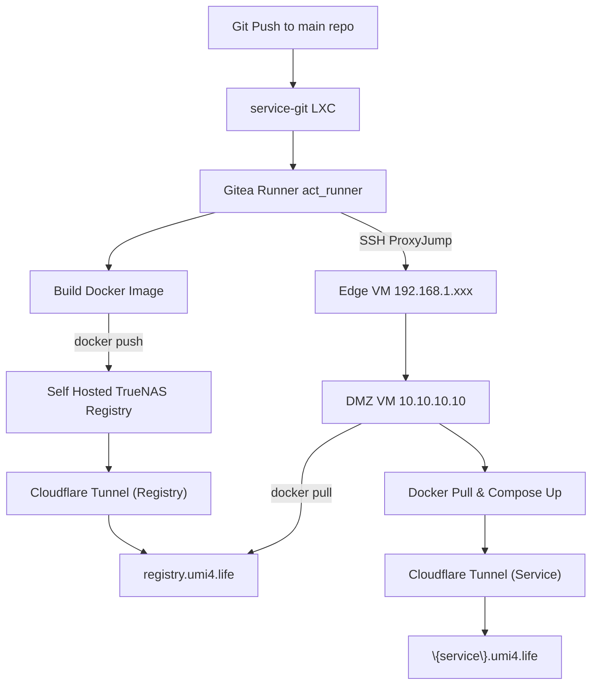

### Result

สุดท้ายผมได้ infrastructure ที่เป็นของตัวเอง 100% และควบคุมได้เต็มที่ ยกเว้นส่วนที่ยังพึ่ง Cloudflare Tunnel กับ Tailscale VPN ตอนนี้ RAM usage อยู่ประมาณ 17 GB จาก 32 GB ซึ่งเป็นสิ่งที่ต้อง upgrade ในอนาคตแน่นอน

ระหว่างทางผมรื้อและทำใหม่หลายอย่าง ทำของพังหลายรอบ จนถึงขั้นทำ Wi‑Fi ทั้งบ้านล่มตอนครอบครัวกำลัง stream หนังอยู่ แต่ผมไม่เสียใจเลยสักขั้นตอน เพราะหัวใจของ homelab คือการสร้างและทำพังเพื่อเรียนรู้ แล้วฝึกแก้ปัญหาได้หน้างาน นี่เป็น philosophy ที่ผมเจอซ้ำ ๆ จากหลาย guide ระหว่าง research การทำ homelab

### Future plan

ยังมีอีกหลายอย่างที่ต้องทำ ตอนนี้ยังไม่มี backup plan และ recovery strategy จริงจังเลย ซึ่งเป็นสิ่งที่ควรรีบทำมาก ผมน่าจะเริ่มจาก snapshot central databases เข้า NAS ทุกวัน เพื่อให้มีจุด rollback กลับไปได้

ผมยังวางแผน integrate [Terraform](https://developer.hashicorp.com/terraform) และ [Ansible](https://github.com/ansible/ansible) เพื่อเปลี่ยน Proxmox environment ทั้งชุดให้เป็น Infrastructure as Code และ version control ทุกอย่างไว้ใน private git นี่เป็นสิ่งที่น่าติดตามต่อ

อย่างที่พูดไป capability ด้าน AI ตอนนี้ยังจำกัดมาก LLM model ที่เกิน 9B จะ spill ไป RAM และทำให้ token/s ช้าลงอย่างเห็นได้ชัด ดังนั้น RTX 3090 เป็น hardware upgrade ที่ผมให้ priority สูงมาก รองลงมาจากการเพิ่ม RAM
