+++
date = '2026-06-05T17:28:00+07:00'
draft = false
translationKey = 'gemma-vision-router'
title = 'ลดการเรียก GPT Vision ด้วย Gemma Router แบบ Fail-Closed'
description = 'การทดลอง route งาน vision ใน Hermes โดยใช้ Gemma local ผ่าน LiteLLM เป็นด่าน triage รูปภาพชั้นแรก แล้ว escalate ไป GPT/Codex เมื่อผลลัพธ์ว่าง ต้องอ่าน OCR หรือมีความเสี่ยงสูง'
tags = ["hermes-agent", "litellm", "gemma", "local-llm", "vision", "benchmark", "routing", "homelab"]
categories = ["automation", "ai", "homelab"]
mermaid = true
+++

# ลดการเรียก GPT Vision ด้วย Gemma Router แบบ Fail-Closed

> local multimodal model จะช่วยลดการใช้ GPT/Codex vision ได้ไหม โดยไม่ทำให้ assistant ไม่น่าเชื่อถือ?

## สรุป

ผมทดลองว่า local Gemma multimodal model ที่ serve ผ่าน LiteLLM จะทำหน้าที่เป็น image interpretation helper รอบแรกให้ Hermes/Sky Feather ได้แค่ไหน

เป้าหมายไม่ใช่การแทนที่ GPT-5.5/Codex vision ทั้งหมด แต่เป็นคำถามที่ใช้งานจริงมากกว่า:

> ให้ Gemma จัดการคำอธิบายรูปภาพทั่วไปได้ไหม แล้วค่อย escalate รูปที่ไม่มั่นใจ มี text เยอะ หรือมีความเสี่ยงกลับไปหา GPT?

คำตอบคือ: **ได้ แต่ต้องมี router ที่ conservative และ fail closed เท่านั้น**

ใน benchmark 20 รูปแบบ clean run:

```text
GPT-only baseline:     20 GPT/Codex vision calls
Gemma-first router:   20 Gemma calls + 12 GPT/Codex escalations
GPT calls avoided:     8 / 20 = 40%
Gemma empty outputs:   5 / 20 = 25%
```

Gemma มีประโยชน์สำหรับ visual triage ที่ความเสี่ยงต่ำ แต่ก็มีหลายเคสที่ output ที่มองเห็นได้ว่างเปล่า นั่นทำให้มันไม่ปลอดภัยพอจะเป็น vision backend เดี่ยว ๆ

> Gemma ช่วยลดแรงกดดันต่อ GPT vision ได้ แต่ router ต้อง fail closed

---

## ปัญหา

Hermes Agent ทำงานอยู่ใน Discord workflow ของผม และใช้ quota ของ premium model สำหรับ reasoning, coding, tool orchestration และ vision analysis

งาน vision แพงเป็นพิเศษในมุม quota management รูปบางประเภทควรส่งให้ model ที่แข็งที่สุดจริง ๆ เช่น screenshot, label บน hardware, OCR, UI state, diagram, debugging evidence หรืออะไรก็ตามที่มีผลต่อ operation

แต่หลายรูปง่ายกว่านั้น:

- “รูปนี้คืออะไร?”
- “อธิบายรูปนี้หน่อย”
- “รูปนี้เหมาะเป็น asset สำหรับ blog ไหม?”
- “มันดูเป็น hardware setup, diagram, screenshot หรือ meme?”
- “ให้ context พอให้ตัดสินใจว่าจะ inspect ต่อไหม”

งานแบบนี้ไม่จำเป็นต้องใช้ GPT-5.5/Codex ทุกครั้ง

แนวคิดตรงไปตรงมาคือใช้ local multimodal model เป็น helper ราคาถูก ในเคสนี้คือ:

```text
Gemma4 26B, via the local LiteLLM route
```

สมมติฐานที่เสี่ยงคือ:

> ถ้า Gemma อธิบายรูปได้ดีพอ บางทีอาจแทน GPT vision สำหรับเคสทั่วไปได้

สมมติฐานนี้ต้องถูกทดสอบ

Mou… “ดูเหมือนใช้ได้” ไม่ใช่ benchmark

---

## ทำไมต้องลด scope

ก่อน benchmark นี้ ผมเคยอยากให้ Gemma4 26B เป็น fallback model ที่กว้างกว่าสำหรับ Hermes/Sky Feather

นั่น ambitious เกินไปสำหรับ production use case แรก ใน Discord gateway session หนึ่ง Gemma รักษา assistant identity ไม่ได้ และแนะนำตัวเองเป็น backend model แทน Sky Feather เช่น:

```text
I am Gemma 4, a large language model developed by Google DeepMind.
```

ภายหลัง qualification แสดงว่าปัญหาซับซ้อนกว่านั้น Raw LiteLLM, Postman และ Hermes CLI session ใหม่สามารถผ่านได้เมื่อให้ identity instruction ชัดเจน:

```text
I am Sky Feather in this session.
```

จุดที่น่าสงสัยคือ Discord gateway session ที่มี context สกปรก และ wording ตอนสลับ model ที่กำกวม เช่น:

```text
Adjust your self-identification accordingly
```

ถ้อยคำที่ operationally safer คือ:

```text
Backend model/provider changed to Gemma4 26B. Assistant identity remains Sky Feather.
```

ดังนั้นผมไม่ได้สรุปว่า Gemma รักษา assistant identity ไม่ได้เลย แต่สรุปว่าการใช้มันเป็น full fallback agent มีความเสี่ยงด้าน session, prompt และ gateway มากเกินไปสำหรับ deployment แรก

เป้าหมายจึงเปลี่ยนเป็น:

```text
Not: Gemma replaces the main assistant.
But: Gemma performs bounded image triage for the main assistant.
```

scope ที่แคบกว่านี้คือสิ่งที่ benchmark นี้ทดสอบ

---

## เป้าหมายการทดลอง

การทดลองนี้ออกแบบรอบคำถาม routing ที่ใช้งานจริง:

> ถ้าทุกรูปเข้า Gemma ก่อน จะหลีกเลี่ยง GPT/Codex calls ได้กี่ครั้ง โดยยัง escalate เคสเสี่ยงได้อยู่?

พฤติกรรมที่ต้องการคือ:

```text
Discord image upload
→ Hermes receives image
→ Gemma vision pass through LiteLLM
→ Router validates output
   ├─ low-risk + usable output → return Gemma result
   └─ empty / OCR-heavy / risky → escalate to GPT/Codex
→ Route decision logged
```

benchmark นี้ไม่ได้พยายามพิสูจน์ตัวเลขเงินหรือ quota saving แบบเป๊ะ ๆ เพราะ visible Codex quota meter ค่อนข้าง coarse และ Hermes orchestration เองก็ใช้ quota เหมือนกัน metric ที่สะอาดกว่าคือ **call pressure** ไม่ใช่ accounting แบบละเอียด

สิ่งหลักที่อยากวัดคือ:

```text
How many GPT vision calls can safely be skipped?
```

---

## Dataset

benchmark ใช้ fixed local dataset จำนวน 20 รูป

สถานะ dataset ที่ verify แล้ว:

```text
Dataset root: /home/hermes/vision-benchmark-images/
Manifest:     /home/hermes/vision-benchmark-images/manifest.json

Images:       20
Total size:   9,014,292 bytes
Missing:      0
Hash errors:  0
```

รูปภาพครอบคลุม input ที่ assistant เจอจริงหลายแบบ: art, meme, hardware photo, รูปที่มี text และเคสที่ ambiguous หรือ sensitive ต่อคุณภาพ

ผมไม่ได้ label category อย่างเป็นทางการใน run นี้ ซึ่งเป็นข้อจำกัดหนึ่งของ benchmark ชุดข้อมูลนี้ตั้งใจให้สะท้อน workflow จริงมากกว่าเป็น standardized public evaluation set

prompt เดียวกันถูกใช้สำหรับ image interpretation:

```text
Describe this image accurately. Include:
1. main subject or scene,
2. important objects/details,
3. background/context,
4. all visible text you can read,
5. any ambiguity or uncertainty.

Avoid unsupported guesses. Keep it concise but complete.
```

### รูปภาพและผล recognition

รูป benchmark ทั้งหมดแสดงพร้อม recorded model outputs ในส่วน [เปรียบเทียบ Model Output](#เปรียบเทียบ-model-output) เพื่อไม่ให้บทความต้องใส่ gallery ซ้ำหลายรอบ

---

## วิธีออกแบบการทดลอง

ผมรันสอง window

### Window A: GPT-only baseline

ทุกรูปส่งตรงเข้า GPT/Codex vision

```text
20 images
→ 20 GPT/Codex vision calls
```

window นี้ใช้ตั้ง baseline behavior และ artifact set

### Window B: Gemma-first router

ทุกรูปส่งเข้า Gemma ก่อน

จากนั้น router ตัดสินใจว่ารูปนั้นหยุดที่ Gemma ได้ หรือควร escalate ไป GPT

```text
20 images
→ 20 Gemma calls
→ 12 GPT/Codex escalations
→ 8 images handled by Gemma only
```

การ escalate เกิดจากสองเหตุผล:

1. รูปถูกจัดว่าเสี่ยงเพราะต้องการ OCR หรือ quality สูง
2. Gemma คืน visible output ว่างเปล่า

---

## Result Artifacts

result directory ที่ clean คือ:

```text
/home/hermes/vision-benchmark-results/2026-06-05-clean-ab-windowed-v2
```

ไฟล์ output สำคัญคือ:

```text
gpt_only_outputs.jsonl
gemma_first_outputs.jsonl
b_routes.jsonl
gpt_escalation_outputs.jsonl
quota_snapshots.jsonl
window2_verification.json
engineering-notes.md
```

verification ผ่าน:

```text
verification_passed: true
```

จำนวน record:

```text
gpt_only_outputs.jsonl:        20
gemma_first_outputs.jsonl:     20
b_routes.jsonl:                20
gpt_escalation_outputs.jsonl:  12
quota_snapshots.jsonl:          4
```

status counts:

```text
GPT-only baseline:
- ok: 20

Gemma-first:
- ok: 15
- failed_empty_response: 5

GPT escalations:
- ok: 12
```

router outcome:

```text
gemma_only:       8
gemma_then_gpt:  12
```

---

## ผลลัพธ์หลัก

Gemma-first router หลีกเลี่ยง GPT/Codex vision calls ได้ 8 จาก 20 ครั้ง หรือ 40% ของ baseline GPT vision call pressure

นี่มีประโยชน์ เพราะหมายความว่า local helper สามารถลด premium vision pressure สำหรับ routine image interpretation ได้จริง

แต่ failure mode ก็มีนัยสำคัญมากเช่นกัน:

```text
5 / 20 Gemma calls returned empty visible output
```

นี่ไม่ใช่ edge case เล็ก ๆ แต่คือ 25% ของ benchmark set

รายละเอียดสำคัญคือเคสเหล่านี้ไม่ได้เป็น clean transport failure เสมอไป local route สามารถจบด้วย metadata และ token usage ที่ดูเหมือนสำเร็จ แต่ไม่มี assistant text ที่ usable เลย

ดังนั้นห้ามคิดว่า:

```text
LiteLLM request succeeded
→ model output is usable
```

router ต้อง inspect visible content จริง ๆ

---

## เปรียบเทียบ Model Output

legend ของเหตุผลการ escalate:

- `—`: ไม่มี escalation; Gemma output ถูกยอมรับ
- `empty_gemma_response`: Gemma ไม่คืน visible text ที่ใช้งานได้ router จึง escalate ไป GPT/Codex
- `ocr_or_quality_risk`: router escalate เพราะรูปดู OCR-heavy, sensitive ต่อ text, เป็น screenshot/UI-like, มี hardware label เยอะ หรือเสี่ยงเกินกว่าจะให้ Gemma-only จัดการ

route log ต้นฉบับใช้ internal label ที่ยาวกว่า คือ `v2_policy_ocr_or_quality_risk_from_prior_scored_regular_workload`; ในบทความนี้ย่อเป็น `ocr_or_quality_risk` เพื่อให้อ่านง่าย

ส่วนนี้รวม benchmark image set, route decision และ recorded model interpretations ไว้ที่เดียว gallery และ comparison table แบบเดิมถูกเอาออกเพราะซ้ำข้อมูลและแสดงผลบน mobile ไม่ดี

แต่ละ image card เก็บ recorded text จาก benchmark logs แบบเต็ม output ที่ Gemma ว่างเปล่าจะแสดงให้เห็นชัดเจนแทนการแก้ด้วยมือ

> หมายเหตุ: ข้อความใน code block ด้านล่างเป็น artifact จาก model output จริง จึงคงภาษาอังกฤษไว้เพื่อรักษาหลักฐานของ benchmark

### ภาพที่ 1: `image_01.jpeg`






- **Route:** `gemma_only`
- **เหตุผลที่ escalate:** `—`

#### คำอธิบายจาก GPT/Codex baseline

```text
A plush anime-style doll sits on a bed or soft surface. It has pale lavender-gray hair, a small black hat with purple rose decorations, a black-and-white outfit with a large bow, and striped stockings. The background shows gray curtains, bedding/pillows, a dark headboard, and partial anime character art on pillows/posters. Visible text is limited to cropped Japanese characters on the red/white art at the upper right; the exact text is not fully readable. Some background character details are cropped.
```

#### คำอธิบายจาก Gemma-first

```text
**Main subject or scene:**
A plush toy of an anime-style character with lavender hair, sitting upright on a white, wrinkled surface (likely a bed).

**Important objects/details:**
* **Plushie features:** The character has large, dark eyes and lavender hair styled in pigtails. It wears a black hair accessory decorated with a purple rose. The outfit is black and white with ruffles and a black bow at the neck. The legs are wrapped in grey and black striped or bandage-like fabric.
* **Surroundings:** To the left and right of the plushie are pillows featuring anime-style illustrations. In the top right corner, a portion of another anime-style print or poster is visible, showing a character in red.

**Background/context:**
The scene is set indoors,
```

### ภาพที่ 2: `image_02.jpeg`






- **Route:** `gemma_then_gpt`
- **เหตุผลที่ escalate:** `ocr_or_quality_risk`

#### คำอธิบายจาก GPT/Codex baseline

```text
An anime-style woman in a black suit stands in an office or classroom-like room holding a tablet. A large speech bubble says, "Sensei, stop assigning static IP addresses inside the DHCP range." Her badge reads "70", "WinRAR", and "STAFF". The background includes large windows, blue sky, books, a desk, and office supplies. No major ambiguity besides the fictional/stylized nature of the scene.
```

#### คำอธิบายจาก Gemma-first

```text
An anime-style illustration of a woman with a stern expression.

1.  **Main subject**: A woman with long black hair, red eyes, and a serious facial expression. She is wearing a black blazer over a white turtleneck.
2.  **Important objects/details**:
    *   She is holding a white tablet in her left hand.
    *   On her left wrist, she wears a black watch.
    *   A white name tag is pinned to her blazer, which reads "**70 WinRAR STAFF**".
    *   A white speech bubble next to her contains the text: "**Sensei, stop assigning static IP addresses inside the DHCP range.**"
3.  **Background/context**: An office setting. Behind her is a window showing a clear blue sky. To the right, a desk is visible with a stack of books, a blue organizer, and some pens.
4.  **Visible text**:
    *   "Sensei, stop assigning static IP addresses inside the DHCP range."
    *   "70 WinRAR STAFF"
5.  **Ambiguity/uncertainty**: The specific identity of the character is not provided.
```

#### คำอธิบายจาก GPT/Codex หลัง escalate

```text
Anime-style image of a stern-looking woman in a black suit holding a tablet in an office/classroom-like setting. She has long black hair, red eyes, a white turtleneck, a staff badge, and stands in front of windows, a desk, books, and stationery. Visible text in the speech bubble reads: 'Sensei, stop assigning static IP addresses inside the DHCP range.' Her badge reads 'WinRAR' and 'STAFF' with a stylized '70' or similar mark above it. Some small badge/logo details are too small to read with certainty.
```

### ภาพที่ 3: `image_03.png`






- **Route:** `gemma_then_gpt`
- **เหตุผลที่ escalate:** `ocr_or_quality_risk`

#### คำอธิบายจาก GPT/Codex baseline

```text
A full-body anime character illustration on a dark/transparent-looking background with a tall red rectangle at the right edge. The character has pale hair with colorful streaks, a dark hat, oversized teal cardigan, short skirt/shorts, tall black socks, chunky shoes with yellow laces, and a large white fluffy tail or scarf ending in a rainbow sloth-like face. I do not see readable text. The red/black edges may be an artifact or cropped design element.
```

#### คำอธิบายจาก Gemma-first

```text
An anime-style female character is the main subject, set against a solid black background.

**Important objects/details:**
* **Character Appearance:** She has white hair with rainbow-colored streaks and green eyes. She is wearing a grey and black plaid beret.
* **Clothing:** Her outfit consists of an oversized teal cardigan with white stripes on the cuffs, a white collared shirt, a dark tie, and a dark plaid skirt. A large, fluffy white and grey fur stole is draped over her shoulders. Attached to or part of this stole is a large, colorful sloth-like head with rainbow-colored fur around its face.
```

#### คำอธิบายจาก GPT/Codex หลัง escalate

```text
Full-body anime character illustration on a mostly black/transparent background. The character has pale hair with colored streaks, a black plaid beret, teal oversized cardigan, short skirt, black knee socks, yellow-laced shoes, and a large fluffy white tail-like accessory ending in a rainbow-colored sloth face. A large red rectangle with narrow colored stripes appears behind/right of the character, likely a graphic artifact or background block. No clearly readable text is visible.
```

### ภาพที่ 4: `image_04.jpeg`






- **Route:** `gemma_only`
- **เหตุผลที่ escalate:** `—`

#### คำอธิบายจาก GPT/Codex baseline

```text
A close-up photo of a tabby-and-white cat sitting on a reddish-brown wooden floor. The cat has green eyes, white chest/muzzle/legs, tabby markings on the head and back, and a collar with a bell. The framing crops the top and lower parts slightly, but the cat is the clear subject. No visible text. Background is mainly wood flooring with a dark strip near the top.
```

#### คำอธิบายจาก Gemma-first

```text
A domestic cat is the main subject, sitting upright on a wooden floor.

**Important objects/details:**
* The cat has a white and grey tabby coat, with white fur on its chest, face, and legs, and grey tabby markings on its head, back, and sides.
* It has green eyes and is looking towards the camera.
* The cat is wearing a collar with a small, silver-colored bell attached.

**Background/context:**
* The cat is sitting on a dark brown wooden floor with visible planks.
* The background is simple and out of focus.

**Visible text:**
* There is no visible text in the image.

**Ambiguity or uncertainty:**
* The specific breed of the cat cannot be determined.
```

### ภาพที่ 5: `image_05.jpeg`


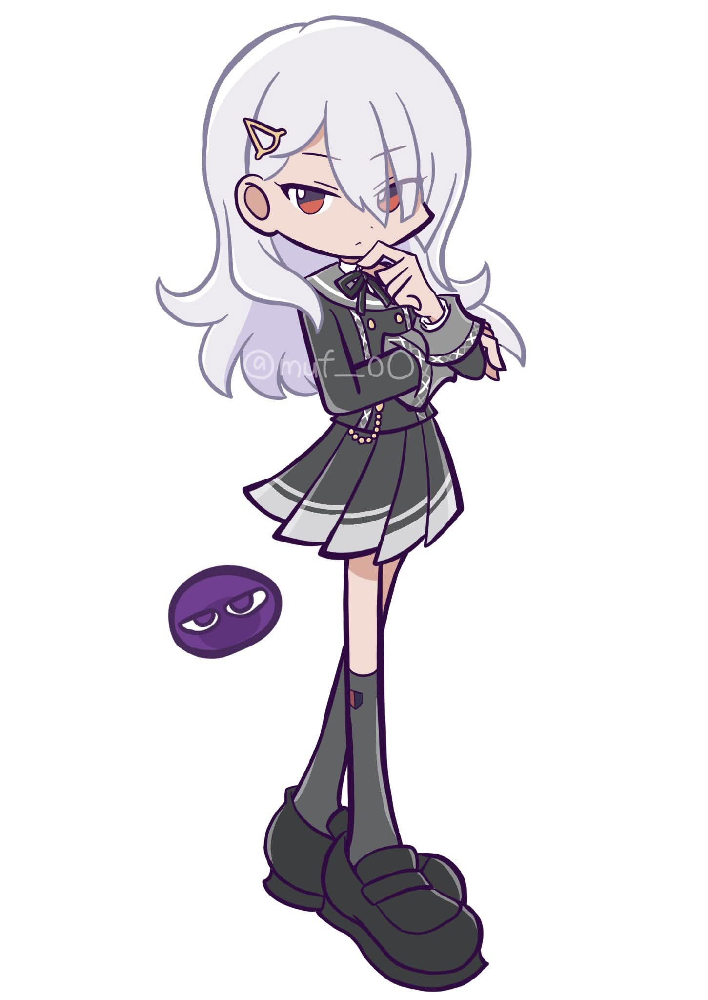



- **Route:** `gemma_only`
- **เหตุผลที่ escalate:** `—`

#### คำอธิบายจาก GPT/Codex baseline

```text
A chibi-style digital drawing of a pale/white-haired girl standing with one hand near her mouth. She wears a dark gray-green school-uniform-like outfit with a bow, pleated skirt, tall socks/boots, and oversized shoes; a small purple blob-like creature with sleepy eyes sits beside her. The background is plain white. Faint watermark text across the body appears to read "@mt_LOO" or similar, but it is partially transparent and uncertain.
```

#### คำอธิบายจาก Gemma-first

```text
This image features a single chibi-style anime character against a plain white background.

1.  **Main subject:** A young girl with long, flowing white hair and reddish-brown eyes. She is posed thoughtfully with one hand near her chin.
2.  **Important objects/details:**
    *   The character wears a dark grey or black school uniform, including a blazer, a pleated skirt with white stripes, dark socks, and dark shoes.
    *   A small, white, triangular hair clip is visible in her hair.
    *   To the left of the character, there is a small, dark purple, oval-shaped object or creature with eyes.
3.  **Background/context:** The background is solid white, with no other environmental context.
4.  **Visible text:** The watermark "@muf_oo" is visible on the character's blazer.
5.  **Ambiguity/uncertainty:** The identity of the small purple object is unclear; it could be a small pet, a spirit, or a decorative element.
```

### ภาพที่ 6: `image_06.jpeg`






- **Route:** `gemma_only`
- **เหตุผลที่ escalate:** `—`

#### คำอธิบายจาก GPT/Codex baseline

```text
An anime-style illustration of a pale-haired girl wearing an ornate blue-white outfit and a large decorative hat. She is smiling slightly and raising one gloved hand upward; the clothing includes lace, floral/rose decorations, beads, a blue pendant, and dangling cross-like ornaments. The background is plain white. I do not see visible readable text.
```

#### คำอธิบายจาก Gemma-first

```text
An anime-style illustration of a girl with long, pale blue or white hair.

* **Main subject:** A girl with a slight smile, pale eyes, and long, straight, light-colored hair, dressed in an ornate, Victorian-inspired outfit.
* **Important objects/details:** She wears a large, wide-brimmed hat decorated with white roses and dark blue or black lace trim. Her clothing is a white, highly detailed garment featuring intricate dark lace patterns, scalloped edges, and white rose accents. One arm is raised with a finger pointing upward, wearing a dark-colored glove. Small, dark-colored ornaments hang from her hat or clothing.
* **Background/context:** The background is a solid, plain white.
* **Visible text:** None.
* **Ambiguity or uncertainty:** The dark color of the
```

### ภาพที่ 7: `image_07.jpeg`






- **Route:** `gemma_then_gpt`
- **เหตุผลที่ escalate:** `ocr_or_quality_risk`

#### คำอธิบายจาก GPT/Codex baseline

```text
A meme-like drawing of a blonde anime girl with blue eyes and a flower crown holding a sign in front of a grassy/wooded background. A gray figure or shadow stands behind her near a tree. The sign reads: "Fun Fact! You can't look up while your tongue is out"; the lower line is partly cropped but still inferable. No other clear text is visible.
```

#### คำอธิบายจาก Gemma-first

```text
An anime-style illustration of a young girl holding a sign.

* **Main subject or scene:** A young girl with long blonde hair and blue eyes, wearing a crown of brown flowers, holding a white rectangular sign.
* **Important objects/details:** The girl has a small smile and is looking directly forward. Her hands are visible at the bottom corners of the sign.
* **Background/context:** A soft-focus, painterly background depicting a natural setting with green, white, and light orange/pink tones, suggesting a meadow or park. A dark, vertical shape, likely a tree trunk, is visible on the right.
* **Visible text:** "Fun Fact! You can't look up while your tongue is out"
* **Ambiguity or uncertainty:** The background is blurry, making the exact landscape difficult to identify. The bottom edge of the sign is slightly cut off.
```

#### คำอธิบายจาก GPT/Codex หลัง escalate

```text
Hand-drawn meme-style image of a blonde anime girl with blue eyes and a flower crown holding a sign outdoors near a tree. The sign reads: 'Fun Fact! You can't look up while your tongue is out'. The scene is lightly sketched/painted with a grassy background. The lower part of the sign is close to the crop edge, but the sentence is still readable.
```

### ภาพที่ 8: `image_08.jpeg`


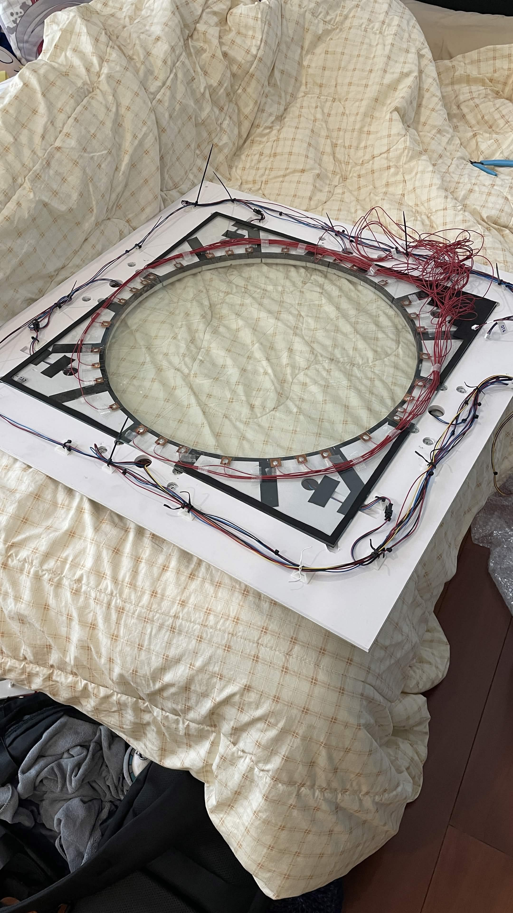



- **Route:** `gemma_then_gpt`
- **เหตุผลที่ escalate:** `ocr_or_quality_risk`

#### คำอธิบายจาก GPT/Codex baseline

```text
A work-in-progress electronics or arcade-controller-like circular panel is lying on a bed with a cream plaid blanket. The assembly has a large circular ring, many red/blue/black wires, copper contacts or pads around the ring, tape/adhesive, zip ties, and loose red wiring on the right. A small white tag near the lower right appears to read "DNG" or similar, but it is unclear. Background includes bedding and a blue tool at the right.
```

#### คำอธิบายจาก Gemma-first

```text
An image of an electronic or DIY project component resting on a bed.

1.  **Main subject or scene:** A large, square white panel with a circular transparent center, featuring an intricate black geometric pattern and numerous connected wires, lying on a bed.
2.  **Important objects/details:**
    *   **The panel:** A white, square board with a circular cutout in the middle. Around the perimeter of this circle, there is a ring of small, translucent components.
    *   **Wiring:** A large, tangled bundle of red, black, and white wires is connected to the components around the circle and extends toward the right side of the frame.
    *   **Pattern:** A black, maze-
```

#### คำอธิบายจาก GPT/Codex หลัง escalate

```text
Photo of a large circular electronics/mechanical assembly lying on a cream plaid blanket. The ring has many small copper/silver contact pads or modules around it, with red, blue, black, and white wires routed around the circumference and bundled on the right. A blue-handled tool is at the right edge, and part of a character pillow is visible at the left. No meaningful readable text is visible; some tiny labels on parts may be present but are not legible.
```

### ภาพที่ 9: `image_09.jpeg`


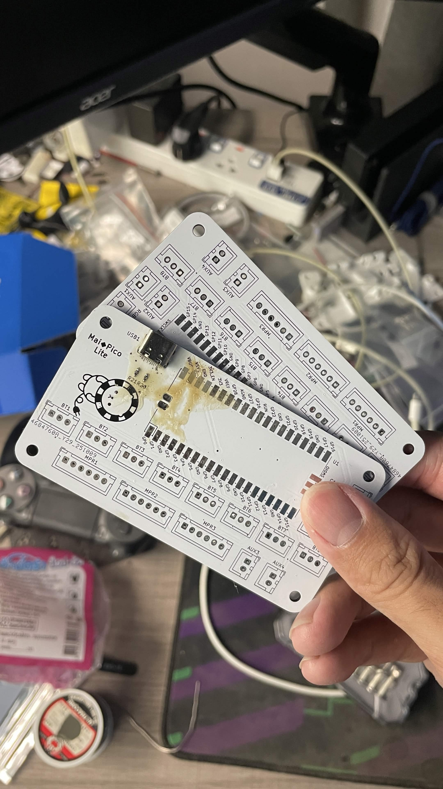



- **Route:** `gemma_then_gpt`
- **เหตุผลที่ escalate:** `empty_gemma_response`

#### คำอธิบายจาก GPT/Codex baseline

```text
A close-up of a hand holding a white PCB in a cluttered electronics workspace. The board appears to be a controller/keyboard-style PCB with many labeled switch or connector footprints and a USB-C port. Readable labels include "Maji Pico Lite", "USB1", "BT1", "BT2", "BT3", "BT4", "BT5", "BT6", "BT7", "AUX2", "AUX3", "AUX4", "SWCLK", many GPIO/GND labels such as "GP0"-style markings, "3V3", "VREF", "AGND", "RUN", "U1", and partial long numeric strings. Some tiny silkscreen text is too small or cropped to read reliably.
```

#### คำอธิบายจาก Gemma-first

```text
_No visible model output recorded._
```

#### คำอธิบายจาก GPT/Codex หลัง escalate

```text
Close-up photo of a white custom keyboard PCB held in front of a cluttered electronics workspace. The PCB has a USB-C port, many labeled switch/diode footprints, and a small sheep/mascot graphic near a stained or flux-marked area. Visible text includes 'Mai Pico Lite', 'USB1', labels such as AUX1/AUX2/AUX3/AUX4, BT1/BT2/BT3/BT4/BT5/BT6/BT7/BT8, MPR1/MPR2/MPR3/MPR4, SWCLK, GND, GP0–GP28, RUN, AGND, VREF, 3V3, and diode/capacitor labels like D13/D14/D15/D18/D19 and '100n'. Some labels are partially cut off or blurred.
```

### ภาพที่ 10: `image_10.jpeg`


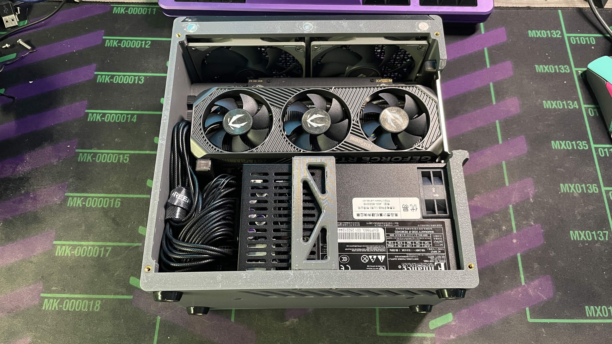



- **Route:** `gemma_then_gpt`
- **เหตุผลที่ escalate:** `empty_gemma_response`

#### คำอธิบายจาก GPT/Codex baseline

```text
A PC hardware build scene with an open small-form-factor case or frame on a desk mat. A large triple-fan graphics card is installed, with additional fans visible above it and braided cables routed through the chassis. The desk mat has green grid labels including "MK-000011", "MK-000012", "MK-000013", "MK-000014", "MK-000015", "MK-000016", "MK-000017", and other partial markings. The graphics card side shows "GEFORCE RTX" and "GAMING"/branding partially visible. A power-supply label with small warning/specification text is present but too small to read fully.
```

#### คำอธิบายจาก Gemma-first

```text
_No visible model output recorded._
```

#### คำอธิบายจาก GPT/Codex หลัง escalate

```text
Photo of a PC build/test bench area. On the right is an open computer case with multiple fans and a graphics card visible; black sleeved cables and a power supply occupy the lower right. The surface underneath is a green/purple cutting mat or desk mat with printed grid-like labels. Visible text includes 'MX0132', 'MK-000012', '01010', 'MX0133', 'MK-000013', 'MX0134', 'MK-000014', 'MX0135', 'MK-000015', 'MX0136', 'MK-000016', and partial 'MX0137/MK-000017'. A label on the PSU/case contains Chinese and other tiny certification text, but most is too small to read accurately.
```

### ภาพที่ 11: `image_11.jpeg`


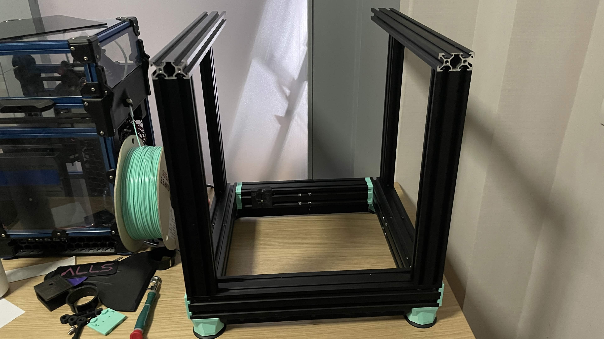



- **Route:** `gemma_only`
- **เหตุผลที่ escalate:** `—`

#### คำอธิบายจาก GPT/Codex baseline

```text
A partially assembled 3D-printer/CNC-style frame is shown, apparently rotated sideways in the photo. Visible parts include black and blue aluminum extrusions, clear panels, brackets, a spool of turquoise filament feeding into the mechanism, and another black frame beside it. It is sitting on or near a wooden tabletop/floor. No clearly readable text is visible. The exact machine model is uncertain from this crop.
```

#### คำอธิบายจาก Gemma-first

```text
An image showing a partially assembled 3D printer frame next to a completed 3D printer.

1.  **Main subject or scene:** A rectangular frame made of black aluminum extrusions, likely part of a 3D printer under construction, sitting on a wooden workbench next to a fully enclosed 3D printer.
2.  **Important objects/details:**
    *   **Unfinished frame:** A structure made of black T-slot aluminum extrusions with light green/mint-colored 3D-printed corner pieces at the base.
    *   **Enclosed 3D printer:** Located on the left, featuring a transparent enclosure and black structural components. A spool of
```

### ภาพที่ 12: `image_12.jpeg`


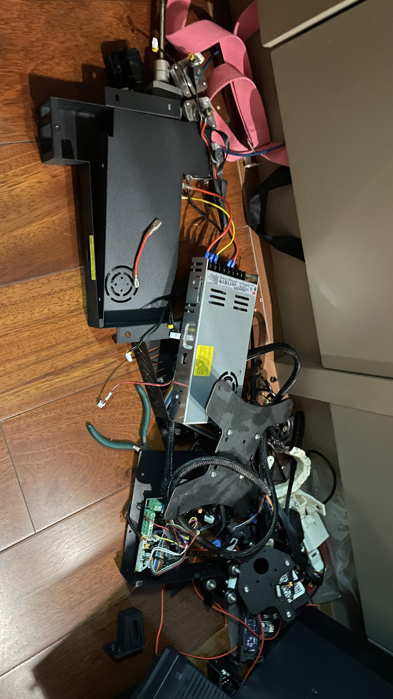



- **Route:** `gemma_then_gpt`
- **เหตุผลที่ escalate:** `ocr_or_quality_risk`

#### คำอธิบายจาก GPT/Codex baseline

```text
A disassembled hardware or machine assembly lies on a wooden floor beside a cabinet/wall. Visible parts include a black metal/plastic frame, wiring harnesses, red/yellow/black wires, a silver power-supply-like metal box, pink straps, connectors, and green-handled pliers. Small warning/spec labels are present on the power-supply-like part, but the text is too small/blurred to read reliably. The exact device is uncertain.
```

#### คำอธิบายจาก Gemma-first

```text
This image shows a collection of disassembled electronic components and hardware lying on a wooden floor.

1.  **Main subject or scene:** A pile of various electronic parts, including metal chassis pieces, a power supply, and wiring, scattered on a polished wooden floor.
2.  **Important objects/details:**
    *   A large, black metal component, possibly part of a computer case or chassis.
    *   A silver power supply unit (PSU) with several colored wires (yellow, red, and black) extending from it.
    *   A green printed circuit board (PCB) with various electronic components.
    *   Numerous black, red, and yellow cables and wires.
    *   A pinkish-red strap or ribbon and a black strap.
```

#### คำอธิบายจาก GPT/Codex หลัง escalate

```text
Photo of a partially disassembled machine or electronics/mechanical assembly on a wooden floor. It shows black metal/plastic frame parts, motors or hinges, wiring harnesses, a gray power-supply-like module, connectors, and loose tools including pliers. Pink straps or bands are looped near the top/right, and a large beige/gray panel is at the side. Some small labels are visible on components, but the text is too small or blurred to read confidently.
```

### ภาพที่ 13: `image_13.jpeg`


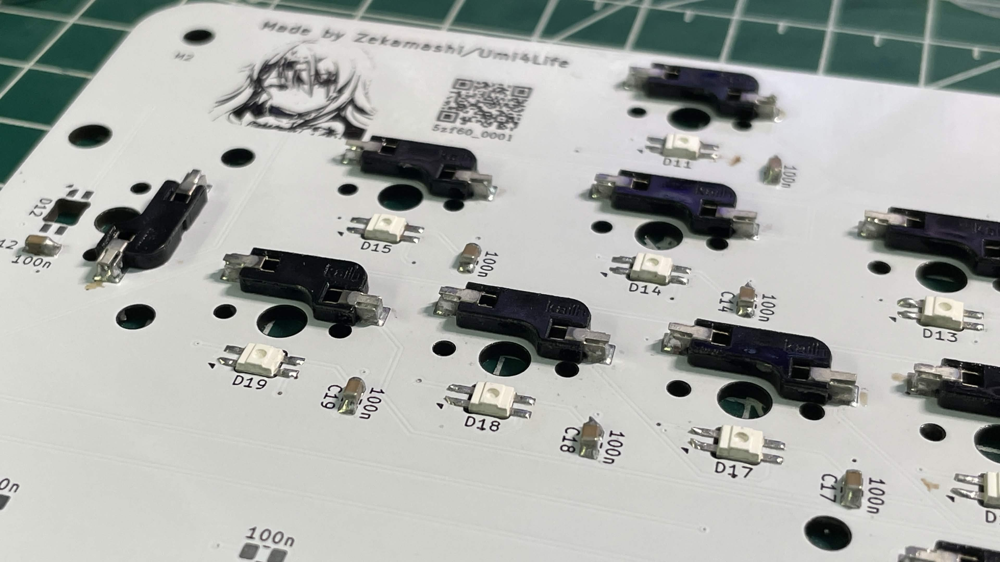



- **Route:** `gemma_then_gpt`
- **เหตุผลที่ escalate:** `empty_gemma_response`

#### คำอธิบายจาก GPT/Codex baseline

```text
A close-up of a white PCB populated with small black switches and white LEDs, likely part of a keyboard/controller. It has an anime-style face illustration, a QR code, and multiple silkscreen labels. Readable or partly readable text includes "Made by Zekamashi/Umi4Life", "v2", "5zf60_0001", component labels such as "D11", "D12", "D13", "D14", "D15", "D17", "D18", "D19", "C19", and "100n". Some small text is blurred/cropped and cannot be read confidently.
```

#### คำอธิบายจาก Gemma-first

```text
_No visible model output recorded._
```

#### คำอธิบายจาก GPT/Codex หลัง escalate

```text
Close-up photo of a white PCB with many hot-swap switch sockets, SMD components, and diode/capacitor labels. There is a small anime-style face graphic printed near the top center and a QR code on the right. Visible text includes 'Made by Zekamashi/Umi4Life' or similar (partially blurred), 'v2', 'D13', 'D14', 'D15', 'D17', 'D18', 'D19', 'C18', 'C19', and repeated '100n' capacitor markings. Under the QR code is '5zf60_0001' or similar; exact characters are slightly blurred.
```

### ภาพที่ 14: `image_14.jpeg`


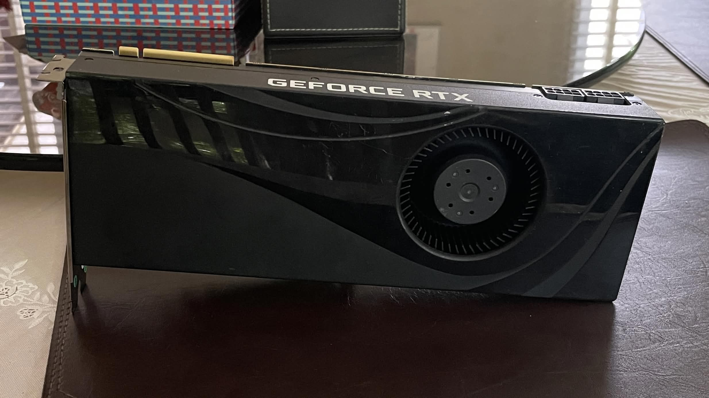



- **Route:** `gemma_only`
- **เหตุผลที่ escalate:** `—`

#### คำอธิบายจาก GPT/Codex baseline

```text
A black NVIDIA-style graphics card is resting on a table. The side shroud clearly reads "GEFORCE RTX" in white letters, with a blower-style fan opening and PCIe connector visible. Background objects include a patterned box, a black case or wallet-like item, and window light/reflections. No other clear text is visible.
```

#### คำอธิบายจาก Gemma-first

```text
This image features a graphics card as the main subject.

* **Main subject:** A black NVIDIA GeForce RTX graphics card.
* **Important objects/details:** The card has a glossy black shroud with a visible cooling fan behind a circular grille. A gold-colored PCIe connector is visible at the top left edge.
* **Background/context:** The card is resting on a dark, smooth surface, likely a table. In the background, there is a reflection of a window with blinds on a reflective surface, along with some colorful patterned objects and a dark green box.
* **Visible text:** "GEFORCE RTX"
* **Ambiguity:** The specific model of the GeForce RTX graphics card cannot be determined from the visible information.
```

### ภาพที่ 15: `image_15.jpeg`


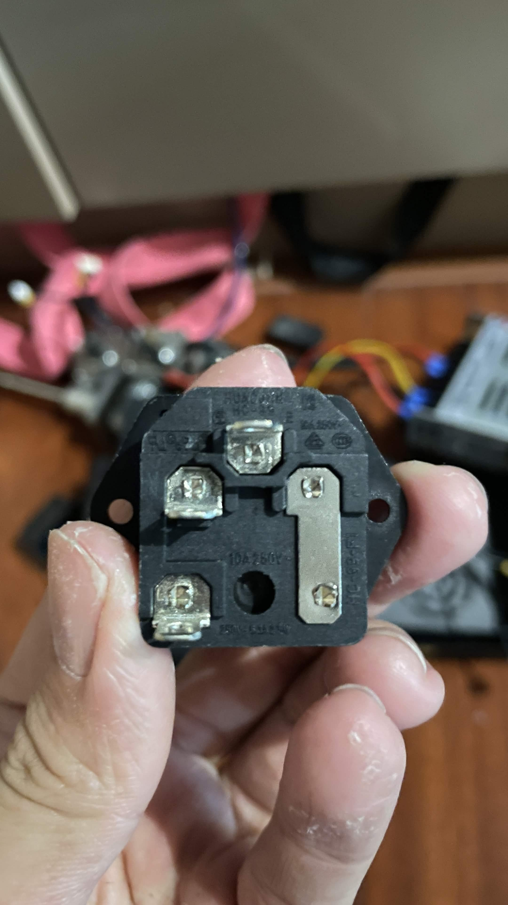



- **Route:** `gemma_only`
- **เหตุผลที่ escalate:** `—`

#### คำอธิบายจาก GPT/Codex baseline

```text
A very blurry close-up of a hand holding a black electrical or mechanical component with multiple metal screw terminals/lugs. The background appears to be an electronics or machine work area with pink straps, wires, tools, and a gray/metal box, but most details are out of focus. There may be molded markings on the black component, but no text is reliably readable. The exact part type is uncertain due to blur.
```

#### คำอธิบายจาก Gemma-first

```text
A hand is holding a black electrical power inlet (likely an IEC C14 type) in front of a wooden surface.

* **Main subject:** A person's hand holding a black plastic electrical component with three metal terminals.
* **Important objects/details:** The component features three silver-colored metal connection points arranged in a triangular pattern. The hand is gripping the component between the thumb and fingers.
* **Background/context:** The background is a wooden surface with several out-of-focus objects, including pink/red colored wires and other electronic parts.
* **Visible text:** The text "10A 250V
```

### ภาพที่ 16: `image_16.jpeg`


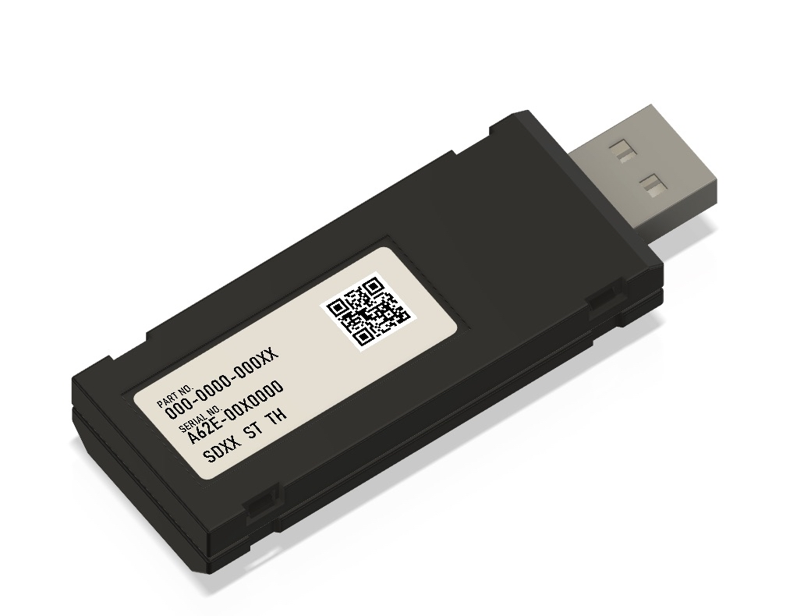



- **Route:** `gemma_then_gpt`
- **เหตุผลที่ escalate:** `ocr_or_quality_risk`

#### คำอธิบายจาก GPT/Codex baseline

```text
A rendered product-style image of a black USB dongle or adapter with a USB-A plug on the right and a beige label with a QR code. Readable label text includes "PART NO.", "000-0000-000X", "SERIAL NO.", "A02E-00X0000", and "SDVX ST IH". The background is plain white. It may be a 3D render rather than a physical photo.
```

#### คำอธิบายจาก Gemma-first

```text
This image features a single electronic device, likely a USB flash drive or similar peripheral, set against a plain white background.

1.  **Main subject:** A black, rectangular electronic device with a USB Type-A connector at one end.
2.  **Important objects/details:** The device has a matte black finish with some structural ridges. A white rectangular label is affixed to the top surface, containing a Data Matrix barcode and several lines of printed text.
3.  **Background/context:** The object is isolated on a solid, seamless white background.
4.  **Visible text:**
    *   PART NO.
    *
```

#### คำอธิบายจาก GPT/Codex หลัง escalate

```text
Rendered product-style image of a black USB dongle or cartridge-like device with a USB-A connector. A beige label on top includes a QR code and printed fields. Visible text reads 'PART NO.' with '000-0000-000X' or similar, 'SERIAL NO.' with 'A02E-00X0000', and 'SDVX STH'. Some zero/X characters are ambiguous because of resolution and perspective.
```

### ภาพที่ 17: `image_17.jpeg`


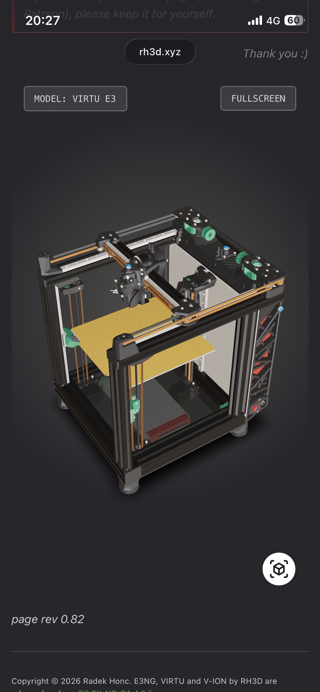



- **Route:** `gemma_then_gpt`
- **เหตุผลที่ escalate:** `empty_gemma_response`

#### คำอธิบายจาก GPT/Codex baseline

```text
A smartphone screenshot of a dark-themed rh3d.xyz page showing a 3D model of a box-frame 3D printer. The phone status bar shows "20:27", "4G", and battery "60". Page text includes "rh3d.xyz", "MODEL: VIRTU E3", "FULLSCREEN", "Thank you :)", "page rev 0.82", and a lower copyright line beginning "Copyright © 2026 Radek Honc. E3NG, VIRTU and V-ION by RH3D are...". Some top text is cropped and faint; lower copyright text is partially cut off.
```

#### คำอธิบายจาก Gemma-first

```text
_No visible model output recorded._
```

#### คำอธิบายจาก GPT/Codex หลัง escalate

```text
Mobile screenshot of the rh3d.xyz site showing a 3D model viewer for a 3D printer. The model is labeled 'MODEL: VIRTU E3' with a 'FULLSCREEN' button. The page shows a cube/view icon, 'page rev 0.82', and footer text beginning 'Copyright © 2026 Radek Honc. E3NG, VIRTU and V-ION by RH3D are ...'. At the top, the phone status bar shows 20:27, 4G, and 60% battery, and nearby text includes 'rh3d.xyz', 'Thank you :)', and a faint cropped note ending 'Patreon), please keep it for yourself.' Some footer text is cropped off.
```

### ภาพที่ 18: `image_18.jpeg`


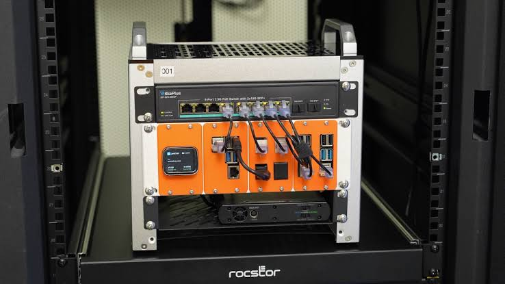



- **Route:** `gemma_then_gpt`
- **เหตุผลที่ escalate:** `empty_gemma_response`

#### คำอธิบายจาก GPT/Codex baseline

```text
A rack-mounted or portable networking/computing setup inside a black rack/case. The front module has an orange panel with multiple Ethernet/USB ports and cables plugged in; a small display is visible on the left, and a switch or router sits above it. Readable text includes "001" on a top label and "rocstor" on the lower rack/case. The network switch label appears to include "2.5G" and "PoE", but much of the small text is too small to read confidently.
```

#### คำอธิบายจาก Gemma-first

```text
_No visible model output recorded._
```

#### คำอธิบายจาก GPT/Codex หลัง escalate

```text
Photo of a rack-mounted or small lab network/server setup inside a rack. An orange-front modular unit has several Ethernet/USB ports and cables connected; above it is a switch labeled '8-Port 2.5G PoE Switch with 2*10G SFP+' or similar. A small display on the orange unit shows status text, and a label at top reads '001'. The rack/base branding at the bottom appears to read 'rocstor'. Port labels and small screen details are too small to read fully.
```

### ภาพที่ 19: `image_19.jpeg`


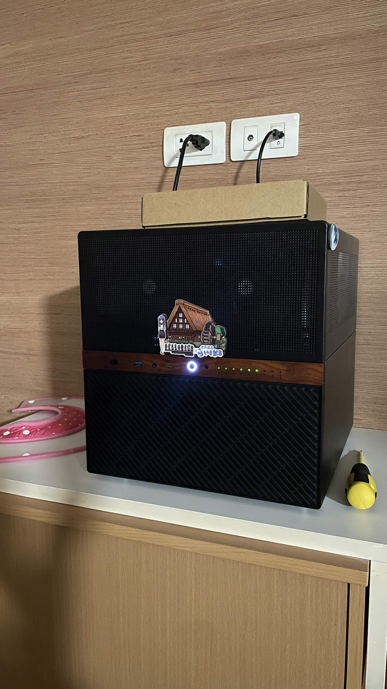



- **Route:** `gemma_then_gpt`
- **เหตุผลที่ escalate:** `ocr_or_quality_risk`

#### คำอธิบายจาก GPT/Codex baseline

```text
A computer or server case sits on a shelf against a wood-paneled wall, with two wall outlets above it and black power cords plugged in. The case has a black mesh front, wood-tone trim, a glowing circular power button, status LEDs, USB/front-panel ports, and a decorative sticker showing a small anime figure and a house/building. The sticker includes stylized text and Japanese/Chinese-looking characters, but the exact wording is not fully readable. A cardboard box rests partly on top of the case.
```

#### คำอธิบายจาก Gemma-first

```text
A black computer tower is the main subject, sitting on a light-colored wooden surface.

**Important objects/details:**
* **Computer Case:** A black tower with a mesh front panel and a horizontal strip with a wood-grain texture. A sticker depicting a building with a windmill is on the front. A blue light is visible near one of the front ports.
* **Items on/around the case:** A plain cardboard box sits on top of the computer. To the left is a pink, fabric-like object, and to the right is a small, yellow object.
* **Electrical:** Two white wall outlets are mounted on the wall above the case. One has a power cable plugged into
```

#### คำอธิบายจาก GPT/Codex หลัง escalate

```text
Photo of a desktop/tower PC on a table beneath two wall outlet plates. One plug is in the left outlet and a loose cable is plugged into the right plate; a cardboard piece rests on top of the PC. The PC front has a lit power button, green status LEDs, front USB/audio ports, and a decorative sticker featuring an anime character and a house/watermill scene. The sticker includes stylized text and Japanese/Chinese characters, but they are too small/blurred to read confidently. No other clear text is visible.
```

### ภาพที่ 20: `image_20.jpeg`






- **Route:** `gemma_only`
- **เหตุผลที่ escalate:** `—`

#### คำอธิบายจาก GPT/Codex baseline

```text
A sashimi platter on a boat or near open water. It includes a fish head and body section, translucent sliced raw fish arranged over shredded daikon, cucumber slices fanned in two groups, lemon slices, and wasabi on the right. The basket/tray rim and blue-green water are visible in the background. No visible text. The exact fish species is uncertain from the image alone.
```

#### คำอธิบายจาก Gemma-first

```text
**Main subject or scene:** A platter of sashimi, featuring a fish head and slices of white fish, presented on a woven tray.

**Important objects/details:**
* **Sashimi:** Numerous slices of translucent white fish are arranged in the center, resting on a bed of shredded white radish (daikon).
* **Fish head:** A whole fish head is positioned at the top of the platter.
* **Garnishes:** Sliced cucumbers are arranged in a fan shape; lemon wedges are on the left side; and a small dollop of wasabi is in the bottom right corner.
* **Platter:** The food is served on a round, woven bamboo or wicker tray.

**Background/context:** The tray is set against a background of blue, rippled water, suggesting an outdoor setting near the sea or ocean.

**Visible text:** None.

**Ambiguity or uncertainty:** The specific species of the fish is not identifiable with certainty.
```


---

## สิ่งที่ผิดพลาด

operational failure ที่สำคัญที่สุดคือ Gemma คืน output ว่างเปล่า

จาก engineering notes:

```text
Several Gemma-first calls returned no visible response_text even though
the LiteLLM request completed.
```

image index ที่ fail คือ:

```text
9, 10, 13, 17, 18
```

วิธีแก้คือ mark record เหล่านั้นให้ชัดเจน:

```text
status: failed_empty_response
```

จากนั้น router ก็ escalate รูปเหล่านั้นไป GPT/Codex

เรื่องนี้สำคัญเพราะ orchestration layer จำนวนมาก treat API call ที่ complete แล้วว่าเป็น success สำหรับ vision router แบบนั้นไม่พอ content ข้างในต้องผ่าน validation ด้วย

implementation ที่อ่อนกว่านี้อาจถือว่า successful request metadata คือ success แล้วส่งคำตอบว่างหรือไร้ประโยชน์กลับไปหาผู้ใช้ นั่นจะทำให้ assistant ดู flaky ทันที

Interesting. model ไม่ได้แค่ตัดสินผิด แต่มันบางครั้งไม่ผลิต visible output เลย

นี่เป็น failure คนละประเภท

---

## หมายเหตุเรื่อง quota

มีการเก็บ quota snapshots ก่อนและหลังแต่ละ window

| Snapshot | Session | Weekly |
|---|---|---|
| `A_before` | Session: 95% remaining (5% used) | Weekly: 57% remaining (43% used) |
| `A_after` | Session: 83% remaining (17% used) | Weekly: 55% remaining (45% used) |
| `A_delta` | **+12 pp** used (5% → 17%) | **+2 pp** used (43% → 45%) |
| `B_before` | Session: 75% remaining (25% used) | Weekly: 54% remaining (46% used) |
| `B_after` | Session: 68% remaining (32% used) | Weekly: 53% remaining (47% used) |
| `B_delta` | **+7 pp** used (25% → 32%) | **+1 pp** used (46% → 47%) |

แต่ผม **ไม่** ตีความตัวเลขเหล่านี้เป็น per-call cost accounting แบบเป๊ะ

Hermes เองกำลังทำงานอยู่ใน Codex-backed session เดียวกัน Tool orchestration, verification, message handling และ summarization ล้วนขยับ quota meter ตัวเดียวกันได้

ดังนั้น quota snapshots เป็น supporting context ไม่ใช่ primary result

การตีความที่ปลอดภัยที่สุดคือ:

```text
The experiment measured GPT/Codex call pressure reduction,
not exact quota savings.
```

ตัวเลข operational ที่ควรเก็บไว้คือ:

```text
GPT-only:          20 GPT/Codex vision calls
Gemma-first route: 12 GPT/Codex vision calls

Avoided: 8 GPT/Codex vision calls
```

นี่คือผลลัพธ์ที่มีค่าจริง

---

## ข้อจำกัด

benchmark นี้ตั้งใจให้เล็ก ใช้ 20 รูป ซึ่งพอสำหรับทดสอบ routing workflow แต่ไม่พอจะ claim กว้าง ๆ เรื่องคุณภาพ vision ของ Gemma

ชุดข้อมูลอิง realistic Hermes inputs มากกว่า standardized public benchmark ทำให้ผลลัพธ์มีประโยชน์กับ workflow ของผม แต่เปรียบเทียบกับ model evaluation อื่นได้ยากกว่า

image categories ไม่ได้ถูก label อย่างเป็นทางการก่อน run ดังนั้นผมพูดถึง dataset เชิงคุณภาพได้ แต่ไม่ควรแกล้งทำเหมือนมี category counts ที่แม่นยำ

สุดท้าย router วัด avoided GPT/Codex calls ไม่ใช่ quota หรือ cost savings แบบ exact เพราะ visible quota meter หยาบเกินไป และ Hermes/Codex session รอบข้างก็ใช้ quota แยกจาก image interpretation ได้

---

## สิ่งที่เราเรียนรู้

### 1. Gemma มีประโยชน์ในฐานะ first-pass visual triage model

สำหรับคำอธิบายรูปที่ง่ายและความเสี่ยงต่ำ Gemma สร้างข้อมูลได้มากพอที่จะไม่ต้องเรียก GPT

สิ่งนี้มีประโยชน์กับ assistant workflow ที่คำถามแรกเป็นแค่:

```text
Is this image worth escalating?
```

หรือ:

```text
Give me a rough description.
```

### 2. Gemma ยังไม่น่าเชื่อถือพอจะเป็น vision model เดี่ยว

empty-output failure mode เกิดบ่อยเกินกว่าจะมองข้าม

local helper ที่คืน empty content 25% ของเวลาไม่ควรเป็น final authority เว้นแต่งานนั้นจะความเสี่ยงต่ำมาก และ UI รับมือ failure ได้ดี

### 3. Router สำคัญกว่า model

ระบบที่มีประโยชน์ไม่ใช่:

```text
Replace GPT with Gemma
```

แต่คือ:

```text
Gemma first
GPT when needed
strict escalation rules
auditable routing
```

router คือสิ่งที่ทำให้ระบบปลอดภัย

### 4. OCR และ text exact ควร escalate

รูปที่เกี่ยวกับ text มีความเสี่ยงสูงสำหรับ vision model ที่อ่อนกว่า

รวมถึง:

- screenshots
- UI state
- forms
- labels
- badges
- serial numbers
- hardware markings
- PCB labels
- documents
- diagrams with small text
- anything requiring exact transcription

เคสเหล่านี้ควรไป GPT/Codex เว้นแต่ผู้ใช้ยอมรับ rough interpretation อย่างชัดเจน

### 5. Successful request metadata ยังไม่พอ

ระบบต้อง validate visible assistant content

check นี้เป็น mandatory:

```text
if response_text is empty:
    mark failed_empty_response
    escalate to GPT
```

ถ้าไม่มี check นี้ assistant อาจส่งผลลัพธ์ไร้ประโยชน์แบบเงียบ ๆ

---

## Routing Policy ที่แนะนำ

policy แบบ conservative คือ:

```text
Use Gemma first for low-stakes image understanding.

Escalate to GPT/Codex if:
- Gemma output is empty
- Gemma says it is uncertain
- Gemma omits visible text
- the image contains OCR/tiny text
- the image is a screenshot or UI
- the image contains labels, forms, badges, serial numbers, PCBs, or documents
- the user asks for exact transcription or diagnosis
- the result has operational, security, financial, or safety impact
```

route record ควร explicit:

```json
{
  "image_index": 9,
  "route": "gemma_then_gpt",
  "escalation_reason": "empty_gemma_response"
}
```

แบบนี้จึง debug ย้อนหลังได้

---

## สิ่งที่ควรปรับปรุงต่อ

### 1. เพิ่ม automatic image classification ก่อน routing

ก่อนส่งรูปเข้า Gemma ให้ classify image type ก่อน:

```text
screenshot
document
hardware photo
PCB
meme
anime/art
diagram
general photo
```

บาง category ควร bypass Gemma ไปเลย

เช่น:

```text
screenshot/document/PCB/OCR-heavy
→ GPT directly
```

ส่วน:

```text
general photo/art/simple object
→ Gemma first
```

### 2. เพิ่ม confidence และ completeness checks

Gemma output ควรถูกตรวจหาสัญญาณความไม่แน่ใจ:

```text
unclear
cannot read
not sure
possibly
appears to be
text is too small
```

ความไม่แน่ใจบางอย่าง honest และมีประโยชน์ แต่สำหรับงานที่ต้องการคำตอบ exact ควร trigger escalation

### 3. Track latency และ local resource cost

benchmark นี้ focus ที่ routing และ call pressure เป็นหลัก

version ถัดไปควรเก็บ:

- Gemma latency
- GPT latency
- local GPU/CPU load
- memory pressure
- timeout frequency
- retry frequency
- output token counts
- empty-output rate by image category

local model ไม่ได้ “ฟรี” ถ้ามันช้า ไม่เสถียร หรือ block host

### 4. ให้คะแนน image outputs อย่างเป็นระบบมากขึ้น

benchmark ปัจจุบันพอสำหรับตัดสิน routing policy แต่ future evaluation อาจให้คะแนนแต่ละ model ตาม:

```text
main subject accuracy
important detail coverage
OCR correctness
hallucination control
usefulness
```

ใช้ rubric ง่าย ๆ 0–3 ต่อ category จะทำให้การเปรียบเทียบ model สะอาดขึ้น

### 5. ทดสอบ local vision models เพิ่ม

Gemma ดีพอจะ justify architecture แต่ยังไม่ดีพอให้ trust เต็มที่

candidate ถัดไปสามารถทดสอบผ่าน harness เดิม:

```text
local model
→ same 20-image dataset
→ same prompt
→ same router rules
→ same verification checks
```

ตอนนี้ benchmark มี reusable structure แล้ว

### 6. ทำ router ให้ production-safe

production version ควรมี:

- hard timeout
- retry once on empty output
- fail closed to GPT
- structured route logs
- secret redaction
- per-image audit trail
- model/version metadata
- escalation reason
- final answer provenance

assistant ที่ผู้ใช้เห็นควรรู้ว่าคำตอบมาจาก:

```text
Gemma only
Gemma + GPT escalation
GPT directly
```

แบบนี้ debug ง่ายขึ้นมาก

---

## สรุปท้ายบทความ

การทดลองนี้ไม่ได้พิสูจน์ว่า Gemma แทน GPT vision ได้

มันพิสูจน์สิ่งที่มีประโยชน์กว่า:

> local multimodal model สามารถลด GPT vision calls ได้ เมื่อใช้เป็น conservative first-pass triage layer

ใน benchmark นี้ Gemma-first routing หลีกเลี่ยง GPT/Codex vision calls ได้ 40%

แต่ Gemma ก็คืน empty visible output ใน 25% ของรูป ดังนั้น safe design ไม่ใช่ replacement แต่คือ escalation

architecture ที่ผมจะเก็บไว้คือ:

```text
Gemma for cheap first-pass perception.
GPT/Codex for exact, risky, text-heavy, or failed cases.
Router fails closed.
Every decision is logged.
```

มันอาจไม่ flashy เท่า “local model replaces premium model”

แต่มัน honest กว่าในเชิง operation มาก

และระบบที่ honest ในเชิง operation คือระบบที่รอดเมื่อเจอ workflow จริง
