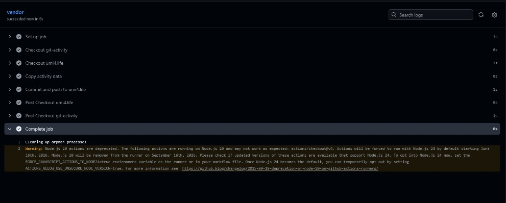
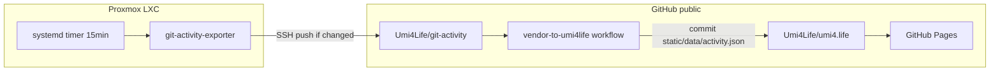
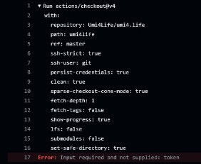
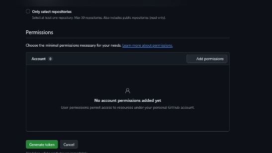
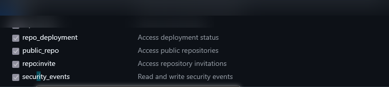

+++
banner = 'https://raw.githubusercontent.com/Umi4Life/umi4.life/refs/heads/master/content/posts/git-activity-heatmap-pipeline/images/heatmap-about-live.png'
cover = 'https://raw.githubusercontent.com/Umi4Life/umi4.life/refs/heads/master/content/posts/git-activity-heatmap-pipeline/images/heatmap-about-live.png'
date = '2026-06-08T03:00:00+07:00'
draft = false
translationKey = 'git-activity-heatmap-pipeline'
title = 'Three Repos, One Heatmap: Sanitized Git Activity on umi4.life'
subtitle = 'Private exporter, public artifact, CI-vendored blog JSON — counts only, no repo names.'
description = 'How I built a GitHub-style activity heatmap for umi4.life that merges public GitHub and private Gitea counts without leaking repository metadata, using a Proxmox LXC exporter, systemd timer, and cross-repo GitHub Actions.'
tags = ["homelab", "github", "gitea", "github-actions", "systemd", "hugo", "automation", "proxmox", "gitops"]
categories = ["homelab", "infrastructure", "automation"]
mermaid = true
+++



> **Operator note:** screenshots in this post are redacted. Tokens, account headers, and workflow metadata are blurred. Config examples use placeholders only.






I wanted a GitHub-style contribution graph on the [About](/about/) page — but I also run a private Gitea forge for homelab and infrastructure work. Publishing that activity is useful. Publishing *which* private repositories I touched, with commit messages and branch names attached, is not.

So I split the problem into three repositories with a hard boundary:

```text
private exporter  →  public artifact  →  public blog display
```

The blog never calls GitHub or Gitea APIs. It only renders committed JSON. The homelab never needs a token for `umi4.life`. The only cross-repo credential lives in GitHub Actions on the artifact repo.

Interesting. Version 1 was "just fetch at build time." Version 2 was "three repos and a timer." Version 2 is the one that stopped being rude.

---

## The architecture



| Repo | Visibility | Role |
|------|------------|------|
| `git-activity-exporter` | Private Gitea | Fetch GitHub + Gitea APIs, merge counts, render SVG, push artifacts |
| `git-activity` | Public GitHub | Sanitized `data/activity.json` + `public/activity.svg` |
| `umi4.life` | Public GitHub | Hugo blog; heatmap shortcode reads vendored JSON |

Sensitive values stay out of all three public surfaces: no API tokens in the blog repo, no private repo slugs in the JSON contract, no commit messages in the heatmap payload.

---

## What the blog actually renders

Each day is one `ActivityDay` row:

```json
{
  "date": "2026-06-01",
  "github": 2,
  "private": 5,
  "total": 7
}
```

The renderer lives in the blog repo:

- Shortcode: `layouts/shortcodes/git-activity.html`
- Client script: `assets/js/git-activity-heatmap.js`
- Styles: `assets/css/git-activity-heatmap.css`

Color semantics:

- **Green** — public GitHub activity only
- **Blue** — private forge activity only
- **Purple** — both on the same day

The live widget on About and on [`/activity/`](/activity/) reads `/data/activity.json`. That file is **vendored by CI** from `Umi4Life/git-activity`. Do not edit it manually on the blog — use `scripts/vendor-activity.sh` for local Hugo parity.

Example embedded in this post:



---

## The private exporter

The exporter runs on a Proxmox LXC (`exporter-lxc` in my notes — hostname redacted in screenshots). It is a small Python project:

1. **GitHub** — GraphQL `contributionsCollection` for the public profile
2. **Gitea** — heatmap API on `https://git.umi4.life`, with a repo-scan fallback if the endpoint shape changes
3. **Merge** — per-day `github`, `private`, and `total` counts over a 365-day window
4. **Render** — optional SVG preview in the artifact repo

`.env` on the homelab (placeholders only):

```bash
GITEA_BASE_URL="https://git.umi4.life"
GITEA_USERNAME="umi4life"
GITEA_TOKEN="{GITEA_READONLY_TOKEN}"
GITHUB_USERNAME="Umi4Life"
GITHUB_TOKEN="{GITHUB_PAT_READONLY}"
ACTIVITY_REPO_PATH="/srv/automation/git-activity"
WINDOW_DAYS="365"
```

`publish_activity.sh` is the entry point the systemd unit calls:

```bash
python3 scripts/run_export.py --live --sync-repo
cd "${ACTIVITY_REPO_PATH}"
git add data/activity.json public/activity.svg
git diff --staged --quiet && exit 0
git commit -m "Update sanitized git activity artifacts"
git push
```

Conditional push matters. Without it, a 15-minute timer would spam empty commits. With it, idle ticks log `No artifact changes to publish.` and exit cleanly.

**No Docker.** A oneshot systemd service plus timer is enough for a single Python script on an LXC. Docker would add image builds and volume wiring for no real gain here.

---

## Homelab setup scars (real order, not idealized)

1. **Clone** exporter to `/srv/automation/git-activity-exporter`
2. **`apt update`** then **`python3-venv`** — stale package lists caused a 404 on first try
3. **Recreate venv after `mv`** — moving the repo breaks venv symlinks
4. **Use `python3`, not `python`** — Debian Bookworm does not alias `python`
5. **Clone** `Umi4Life/git-activity` to `/srv/automation/git-activity`
6. **SSH deploy key** with write access — HTTPS push prompted for a username; automation hosts should not do that
7. **`git config user.email`** in the artifact clone — otherwise commit fails with "Author identity unknown"
8. **systemd `Environment=PATH=.../.venv/bin:...`** — the service runs outside your interactive shell

The exporter LXC only needs outbound HTTPS to GitHub and Gitea plus SSH push to the public artifact repo.

---

## CI: vending JSON into the blog

When `data/activity.json` changes on `master`, a workflow in `Umi4Life/git-activity` checks out both repos, copies the file to `umi4life/static/data/activity.json`, and pushes **only if the content changed**.

The first run failed exactly where it should:





`actions/checkout` on a sibling repository needs a PAT. The default `GITHUB_TOKEN` only covers the repo running the workflow.

Fix: add `UMI4LIFE_REPO_TOKEN` to **git-activity** → Settings → Secrets → Actions. I used a classic PAT with the `repo` scope scoped to what that token can access. Fine-grained tokens with **Contents: Read and write** on `umi4.life` only are tighter.






After the secret landed, the vendor job went green:





That commit triggers the existing Hugo deploy workflow on `umi4.life`. No changes to the blog's deploy pipeline were required.

---

## Operational loop (closed)

```text
systemd timer (15min)
→ publish_activity.sh
  → run_export.py --live --sync-repo
  → git push git-activity (if changed)
→ git-activity vendor CI
→ umi4.life bot commit on static/data/activity.json
→ Hugo Pages deploy
→ /about/ heatmap updates
```

Manual one-shot on the LXC:

```bash
systemctl start git-activity-exporter.service
journalctl -u git-activity-exporter.service -n 30 --no-pager
```

---

## Lessons learned

| Symptom | Cause | Fix |
|---------|-------|-----|
| `python: command not found` | Debian ships `python3` only | Use `python3`; put venv on systemd `PATH` |
| venv broken after move | Absolute paths inside `.venv` | `rm -rf .venv && python3 -m venv .venv` |
| `Author identity unknown` | No `git config` in artifact clone | Local `user.name` / `user.email` in that repo only |
| `Input required: token` in CI | Missing `UMI4LIFE_REPO_TOKEN` | PAT secret on `git-activity`, not the blog |
| Empty commits every 15 min | Unconditional `git push` | `git diff --staged --quiet` guard |

The Node.js 20 deprecation warning on `actions/checkout@v4` is GitHub housekeeping. It did not block the pipeline.

---

## Outcomes and skills demonstrated

- **Security boundary design**: split private export, public artifact, and read-only blog display so tokens and metadata never cross the wrong trust line.
- **Multi-forge API integration**: GitHub GraphQL contributions plus Gitea heatmap API, with a repo-scan fallback when the endpoint shape shifts.
- **Homelab automation**: systemd oneshot + timer, conditional `git push`, SSH deploy keys, and venv-aware service units on Proxmox LXC.
- **Cross-repo CI**: GitHub Actions checkout of a sibling repository via PAT, with idempotent vendor commits.
- **Frontend data contract**: sanitized `ActivityDay` JSON, Hugo shortcode renderer, and CI-vendored static assets for deterministic builds.
- **Operational writeups**: redacted screenshots, placeholder secrets in examples, and engineering notes from real setup failures.

---

## What we deliberately did not do

- **Fetch at Hugo build time** — the JSON is committed; builds stay deterministic and token-free
- **Blog PAT on the homelab** — push target is `git-activity` only; vendor CI owns the blog update
- **Private metadata in public JSON** — no repo names, messages, or branch names in the artifact contract

---

## Links

- Public artifact repo: [github.com/Umi4Life/git-activity](https://github.com/Umi4Life/git-activity)
- Blog repo: [github.com/Umi4Life/umi4.life](https://github.com/Umi4Life/umi4.life)
- Live heatmap: [About](/about/) and [/activity/](/activity/)
- Local dev vendor helper: `scripts/vendor-activity.sh` / `scripts/vendor-activity.ps1`

The exporter itself stays on private Gitea. If you self-host a similar pipeline, treat the homelab as a count exporter, the public repo as a sanitized artifact, and the blog as a read-only display layer.

Good. That is a real improvement — and the chart finally updates itself.
