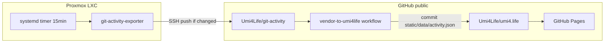

+++
banner = 'https://raw.githubusercontent.com/Umi4Life/umi4.life/refs/heads/master/content/posts/git-activity-heatmap-pipeline/images/vendor-ci-success-redacted.png'
cover = 'https://raw.githubusercontent.com/Umi4Life/umi4.life/refs/heads/master/content/posts/git-activity-heatmap-pipeline/images/vendor-ci-success-redacted.png'
date = '2026-06-08T03:00:00+07:00'
draft = false
translationKey = 'git-activity-heatmap-pipeline'
title = 'สาม Repo หนึ่ง Heatmap: Git Activity ที่ปลอดภัยบน umi4.life'
subtitle = 'exporter ส่วนตัว, artifact สาธารณะ, JSON บนบล็อกผ่าน CI — มีแค่ตัวเลข ไม่มีชื่อ repo'
description = 'วิธีสร้าง heatmap กิจกรรม Git แบบ GitHub บน umi4.life ที่รวม GitHub สาธารณะกับ Gitea ส่วนตัวโดยไม่รั่ว metadata ของ repository ใช้ exporter บน Proxmox LXC, systemd timer และ GitHub Actions ข้าม repo'
tags = ["homelab", "github", "gitea", "github-actions", "systemd", "hugo", "automation", "proxmox", "gitops"]
categories = ["homelab", "infrastructure", "automation"]
mermaid = true
+++


> **หมายเหตุผู้ปฏิบัติการ:** ภาพในบทความนี้ถูก redact แล้ว token, ส่วนหัวบัญชี และ metadata ของ workflow ถูกเบลอ ตัวอย่าง config ใช้ placeholder เท่านั้น






ผมอยากได้กราฟ contribution แบบ GitHub บนหน้า [About](/about/) — แต่ก็มี Gitea ส่วนตัวสำหรับงาน homelab และ infrastructure การเผยแพร่*จำนวน*กิจกรรมมีประโยชน์ การเผยแพร่ว่าแตะ private repo ไหน พร้อม commit message และชื่อ branch ไม่ใช่

เลยแบ่งปัญหาเป็นสาม repository ด้วยขอบเขตที่ชัดเจน:

```text
private exporter  →  public artifact  →  public blog display
```

บล็อกไม่เรียก GitHub หรือ Gitea API เลย แค่ render JSON ที่ commit ไว้ homelab ไม่ต้องมี token สำหรับ `umi4.life` credential ข้าม repo มีแค่ใน GitHub Actions ของ artifact repo

Interesting. Version 1 คือ "fetch ตอน build" Version 2 คือ "สาม repo กับ timer" Version 2 คือเวอร์ชันที่หยุดทำร้ายจิตใจ

---

## สถาปัตยกรรม



| Repo | การมองเห็น | หน้าที่ |
|------|------------|---------|
| `git-activity-exporter` | Gitea ส่วนตัว | ดึง GitHub + Gitea API, รวมตัวเลข, render SVG, push artifact |
| `git-activity` | GitHub สาธารณะ | `data/activity.json` + `public/activity.svg` ที่ sanitize แล้ว |
| `umi4.life` | GitHub สาธารณะ | บล็อก Hugo; shortcode อ่าน JSON ที่ vendor มา |

ค่าที่ละเอียดอ่อนไม่อยู่ในพื้นที่สาธารณะทั้งสาม: ไม่มี API token ใน repo บล็อก ไม่มีชื่อ private repo ใน JSON contract ไม่มี commit message ใน payload

---

## สิ่งที่บล็อก render จริงๆ

แต่ละวันคือหนึ่งแถว `ActivityDay`:

```json
{
  "date": "2026-06-01",
  "github": 2,
  "private": 5,
  "total": 7
}
```

ตัว renderer อยู่ใน repo บล็อก:

- Shortcode: `layouts/shortcodes/git-activity.html`
- Client script: `assets/js/git-activity-heatmap.js`
- Styles: `assets/css/git-activity-heatmap.css`

ความหมายของสี:

- **เขียว** — GitHub สาธารณะเท่านั้น
- **น้ำเงิน** — private forge เท่านั้น
- **ม่วง** — ทั้งสองแหล่งในวันเดียวกัน

widget บน About และ [`/activity/`](/activity/) อ่าน `/data/activity.json` ไฟล์นี้ **ถูก vendor โดย CI** จาก `Umi4Life/git-activity` อย่าแก้มือบนบล็อก — ใช้ `scripts/vendor-activity.sh` สำหรับ Hugo local

ตัวอย่างในโพสต์นี้:



---

## Exporter ส่วนตัว

Exporter รันบน Proxmox LXC (ในบันทึกเรียก `exporter-lxc` — hostname ถูก redact ในภาพ) เป็นโปรเจกต์ Python เล็กๆ:

1. **GitHub** — GraphQL `contributionsCollection` สำหรับโปรไฟล์สาธารณะ
2. **Gitea** — heatmap API ที่ `https://git.umi4.life` พร้อม repo-scan fallback
3. **Merge** — ตัวเลข `github`, `private`, `total` ต่อวัน ในหน้าต่าง 365 วัน
4. **Render** — SVG preview ใน artifact repo (ถ้าต้องการ)

`.env` บน homelab (placeholder เท่านั้น):

```bash
GITEA_BASE_URL="https://git.umi4.life"
GITEA_USERNAME="umi4life"
GITEA_TOKEN="{GITEA_READONLY_TOKEN}"
GITHUB_USERNAME="Umi4Life"
GITHUB_TOKEN="{GITHUB_PAT_READONLY}"
ACTIVITY_REPO_PATH="/srv/automation/git-activity"
WINDOW_DAYS="365"
```

`publish_activity.sh` คือจุดเข้าที่ systemd เรียก:

```bash
python3 scripts/run_export.py --live --sync-repo
cd "${ACTIVITY_REPO_PATH}"
git add data/activity.json public/activity.svg
git diff --staged --quiet && exit 0
git commit -m "Update sanitized git activity artifacts"
git push
```

conditional push สำคัญ ถ้าไม่มี ทุก 15 นาทีจะ spam empty commit ถ้ามี tick ที่ไม่มีอะไรเปลี่ยนจะ log `No artifact changes to publish.` แล้ว exit สะอาด

**ไม่ใช้ Docker** systemd oneshot + timer พอสำหรับสคริปต์ Python บน LXC

---

## รอยแผลการตั้งค่า homelab (ลำดับจริง ไม่ใช่ idealized)

1. **Clone** exporter ไป `/srv/automation/git-activity-exporter`
2. **`apt update`** แล้ว **`python3-venv`** — package list เก่าทำให้ 404 ครั้งแรก
3. **สร้าง venv ใหม่หลัง `mv`** — ย้าย repo ทำให้ symlink ใน venv พัง
4. **ใช้ `python3` ไม่ใช่ `python`** — Debian Bookworm ไม่มี alias `python`
5. **Clone** `Umi4Life/git-activity` ไป `/srv/automation/git-activity`
6. **SSH deploy key** พร้อม write access — HTTPS push ถาม username ซึ่งไม่เหมาะกับ automation
7. **`git config user.email`** ใน artifact clone — ไม่งั้น commit ล้มด้วย "Author identity unknown"
8. **systemd `Environment=PATH=.../.venv/bin:...`** — service รันนอก shell ที่เรา login

LXC exporter ต้องการแค่ HTTPS ออกไป GitHub/Gitea และ SSH push ไป artifact repo สาธารณะ

---

## CI: vendor JSON เข้าบล็อก

เมื่อ `data/activity.json` เปลี่ยนบน `master` workflow ใน `Umi4Life/git-activity` จะ checkout ทั้งสอง repo คัดลอกไฟล์ไป `umi4life/static/data/activity.json` แล้ว push **เฉพาะเมื่อเนื้อหาเปลี่ยน**

รอบแรกล้มตรงจุดที่ควรล้ม:





`actions/checkout` บน sibling repository ต้องใช้ PAT `GITHUB_TOKEN` เริ่มต้นครอบแค่ repo ที่รัน workflow

วิธีแก้: เพิ่ม `UMI4LIFE_REPO_TOKEN` ที่ **git-activity** → Settings → Secrets → Actions ผมใช้ classic PAT ที่มี scope `repo` fine-grained ที่มี **Contents: Read and write** เฉพาะ `umi4.life` จะแคบกว่า






หลังใส่ secret งาน vendor เป็นสีเขียว:





commit นั้น trigger Hugo deploy workflow เดิมบน `umi4.life` ไม่ต้องแก้ pipeline deploy ของบล็อก

---

## วงจรปฏิบัติการ (ปิดแล้ว)

```text
systemd timer (15min)
→ publish_activity.sh
  → run_export.py --live --sync-repo
  → git push git-activity (if changed)
→ git-activity vendor CI
→ umi4.life bot commit บน static/data/activity.json
→ Hugo Pages deploy
→ heatmap บน /about/ อัปเดต
```

รันมือครั้งเดียวบน LXC:

```bash
systemctl start git-activity-exporter.service
journalctl -u git-activity-exporter.service -n 30 --no-pager
```

---

## บทเรียน

| อาการ | สาเหตุ | แก้ |
|-------|--------|-----|
| `python: command not found` | Debian มีแค่ `python3` | ใช้ `python3`; ใส่ venv ใน systemd `PATH` |
| venv พังหลังย้าย | path แบบ absolute ใน `.venv` | `rm -rf .venv && python3 -m venv .venv` |
| `Author identity unknown` | ไม่มี `git config` ใน artifact clone | ตั้ง `user.name` / `user.email` ใน repo นั้น |
| `Input required: token` ใน CI | ไม่มี `UMI4LIFE_REPO_TOKEN` | PAT secret บน `git-activity` ไม่ใช่บล็อก |
| empty commit ทุก 15 นาที | `git push` ไม่มีเงื่อนไข | ใช้ `git diff --staged --quiet` |

คำเตือน Node.js 20 deprecation บน `actions/checkout@v4` เป็นเรื่อง housekeeping ของ GitHub ไม่ได้บล็อก pipeline

---

## ผลลัพธ์และทักษะที่แสดงออก

- **การออกแบบขอบเขตความปลอดภัย**: แยก private export, public artifact และ blog แบบ read-only เพื่อไม่ให้ token และ metadata ข้ามเส้น trust ผิดที่
- **การเชื่อมต่อ API หลาย forge**: GitHub GraphQL contributions กับ Gitea heatmap API พร้อม repo-scan fallback เมื่อ endpoint เปลี่ยนรูปแบบ
- **ระบบอัตโนมัติบน homelab**: systemd oneshot + timer, `git push` แบบมีเงื่อนไข, SSH deploy key และ service unit ที่รู้จัก venv บน Proxmox LXC
- **CI ข้าม repo**: GitHub Actions checkout sibling repository ผ่าน PAT พร้อม vendor commit แบบ idempotent
- **สัญญา data ฝั่ง frontend**: JSON `ActivityDay` ที่ sanitize, Hugo shortcode renderer และ static asset ที่ vendor ผ่าน CI เพื่อ build ที่ deterministic
- **การเขียนเชิงปฏิบัติการ**: ภาพที่ redact แล้ว, placeholder secret ในตัวอย่าง และบันทึกจากความล้มเหลวจริงระหว่างตั้งค่า

---

## สิ่งที่ตั้งใจไม่ทำ

- **Fetch ตอน Hugo build** — JSON ถูก commit แล้ว build จึง deterministic และไม่ต้องมี token
- **Blog PAT บน homelab** — push ไปแค่ `git-activity` vendor CI เป็นคนอัปเดตบล็อก
- **Private metadata ใน JSON สาธารณะ** — ไม่มีชื่อ repo, message หรือ branch ใน artifact contract

---

## ลิงก์

- Artifact repo สาธารณะ: [github.com/Umi4Life/git-activity](https://github.com/Umi4Life/git-activity)
- Repo บล็อก: [github.com/Umi4Life/umi4.life](https://github.com/Umi4Life/umi4.life)
- Heatmap สด: [About](/about/) และ [/activity/](/activity/)
- Local dev: `scripts/vendor-activity.sh` / `scripts/vendor-activity.ps1`

ตัว exporter อยู่บน Gitea ส่วนตัว ถ้าทำ pipeline คล้ายกัน ให้มอง homelab เป็น count exporter, repo สาธารณะเป็น sanitized artifact และบล็อกเป็น display layer แบบ read-only

ดี นี่คือการปรับปรุงที่ใช้ได้จริง — และกราฟอัปเดตตัวเองได้แล้ว
