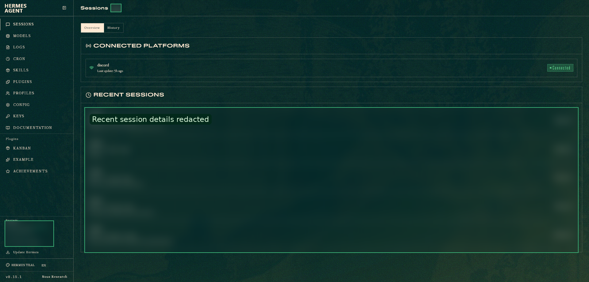
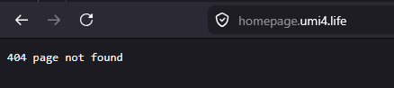
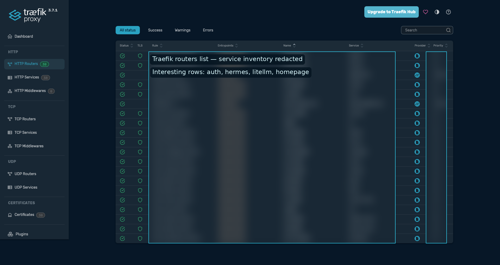

+++
date = '2026-06-03T18:30:00+07:00'
draft = false
translationKey = 'hermes-litellm-authelia-control-plane'
title = 'Untangling the Homelab After a Hermes Dashboard Setup Went Sideways'
description = 'A homelab incident story: setting up Hermes Dashboard exposed old routing and auth tech debt, broke Traefik and Authelia OIDC assumptions, and ended with a cleaner LiteLLM public API plus private admin workflow.'
tags = ["hermes-agent", "litellm", "authelia", "oidc", "traefik", "cloudflare", "homelab", "sso", "docker", "debugging"]
categories = ["homelab", "infrastructure", "automation"]
+++

# Untangling the Homelab After a Hermes Dashboard Setup Went Sideways

**Subtitle:** We tried to expose one dashboard, tripped over old routing and auth tech debt, broke a few things, then used the incident to make the stack less cursed.






This was not supposed to become an infrastructure incident.

The original task was small: make the Hermes Dashboard reachable from the LAN so the agent had a proper web control surface. That should have been a tidy fifteen-minute homelab change.

Instead, it pulled on a thread.

First the dashboard was only listening on `localhost`. Then Traefik routing assumptions surfaced. Then HTTPS forwarding broke OIDC redirects. Then Authelia rejected token exchange requests. Then the LiteLLM container could not resolve the LAN-only identity provider. Then, after all of that, the final bug was a tiny copy-paste mistake: LiteLLM's `userinfo` endpoint pointed at the `token` endpoint.

The funny part is that every failure was real signal. The setup did not merely break; it showed where the homelab had accumulated tech debt:

- unclear boundary between public routes and LAN-only routes
- split DNS assumptions that were not documented well enough
- reverse-proxy auth and OIDC being treated as if they were the same shape
- forwarded-header behavior depending on implicit proxy trust
- container debugging commands assuming friendly base images
- config values that looked close enough to be right, until they were not

The end result was still the architecture we wanted:

```text
Public services
  -> https://litellm.umi4.life/v1/...
  -> LiteLLM API keys

Admin browser on LAN/VPN
  -> https://litellm.umi4.life/ui
  -> LiteLLM OIDC login
  -> LAN-only Authelia
```

But the real story is not “how to configure LiteLLM.”

The story is: we set up Hermes Dashboard, uncovered a pile of homelab infrastructure debt, broke Traefik and Authelia in educational ways, then untangled the stack until the public API/private control-plane model was actually intentional instead of accidental.

Interesting. Version 1 produced data. Version 2 produced more data. Version 3 finally stopped being rude.

---

## Step 1 — The innocent dashboard change exposed the first assumption

The first issue was not exotic. Hermes Dashboard was running, but only on the loopback interface:

```text
127.0.0.1:9119
```

That works from inside the VM. It does not work from a browser elsewhere on the LAN.

The fix was to start the dashboard on all interfaces:

```text
0.0.0.0:9119
```



Then the dashboard became reachable from the Hermes VM's LAN IP. A small watchdog script was added so the dashboard could stay boring: silent when healthy, noisy only when it failed to start.

The useful lesson here was not “dashboards are hard.” It was this:

> In a VM, `localhost` means the VM, not your laptop, not your browser, and not the rest of the homelab.

Mou... obvious after the fact. Most infrastructure bugs are.

---

## Step 2 — The stack needed a real public/private boundary

The LiteLLM goal was intentionally split:

1. **API access should be public** so services can call local models through a stable endpoint.
2. **Admin UI access should be private** so configuration requires LAN/VPN plus SSO.

That means this is acceptable:

```text
curl https://litellm.umi4.life/v1/models \
  -H "Authorization: Bearer {LITELLM_API_KEY}"
```

But this should not be freely usable from the public internet:

```text
https://litellm.umi4.life/ui
```

This part was intentional, not accidental. The security model was: any service may use the local LLM through API keys, but nobody should be able to configure the gateway unless their browser is connected to the LAN/VPN and can complete the Authelia SSO flow.

So the current “I can’t access LiteLLM UI from outside the LAN” behavior is not always a bug. For the admin UI, it is the desired failure mode. Public API traffic is allowed; public control-plane access is not.



The intended shape became:

```text
Cloudflare tunnel
  -> Traefik
  -> LiteLLM API/UI host

LAN/VPN admin browser
  -> LiteLLM UI
  -> Authelia OIDC
  -> auth.umi4.life on LAN only
```



This is a valid pattern: public API, private control plane.

It is also where OIDC starts being picky.

---

## Step 3 — OIDC revealed the split-DNS debt

Authelia reverse-proxy auth already worked for other LAN services like Coder and Hermes. That made the LiteLLM failure look suspicious at first.

But those services used a different auth shape:

```text
Browser -> service -> Traefik forward-auth -> Authelia
```

LiteLLM OIDC uses this shape:

```text
Browser -> LiteLLM UI
Browser -> Authelia authorization endpoint
Authelia -> browser callback to LiteLLM
LiteLLM backend -> Authelia token endpoint
LiteLLM backend -> Authelia userinfo endpoint
```

That last part matters. LiteLLM itself must be able to reach Authelia, not just the browser. When it could not resolve the private issuer hostname, the callback path failed with the very unhelpful-looking but actually precise error:

```text
httpx.ConnectError: [Errno -2] Name or service not known
```

That was not LDAP. It was not the user's password. It was the LiteLLM container failing to resolve the Authelia issuer hostname during the server-side OIDC exchange.

Because Authelia was intentionally LAN-only, the solution was not “publish Authelia to the internet.” The solution was to make LAN/VPN clients and the LiteLLM container resolve the same issuer hostname correctly:

```text
auth.umi4.life -> LAN Traefik IP
```

For the LiteLLM container, that can be forced with Docker Compose:

```yaml
extra_hosts:
  - "auth.umi4.life:{TRAEFIK_LAN_IP}"
```

Then the container must be recreated, not merely restarted:

```bash
docker compose up -d --force-recreate litellm
```

---

## Step 4 — Traefik and forwarded headers made HTTPS trust explicit

Early in the debugging, LiteLLM generated redirects with `http://` instead of `https://`.

That is fatal for OIDC because the redirect URI must match exactly.

The public callback was supposed to be:

```text
https://litellm.umi4.life/sso/callback
```

Not:

```text
http://litellm.umi4.life/sso/callback
```

The fix was to make LiteLLM know its public URL and trust forwarded proxy headers:

```yaml
PROXY_BASE_URL: "https://litellm.umi4.life"
FORWARDED_ALLOW_IPS: "*"
```

One small YAML trap appeared here too. This is wrong:

```yaml
FORWARDED_ALLOW_IPS: *
```

YAML treats `*` as an alias marker. It needs quotes:

```yaml
FORWARDED_ALLOW_IPS: "*"
```

A useful sanity check was the UI config endpoint. Once the proxy settings were correct, it reported the public URL correctly:

```json
{
  "proxy_base_url": "https://litellm.umi4.life",
  "auto_redirect_to_sso": true,
  "admin_ui_disabled": false,
  "sso_configured": true
}
```

After that, `/ui` redirecting to `/ui/` was no longer a bug. That 307 is normal.

---

## Step 5 — Authelia made bad issuer assumptions visible

The next failure appeared in Authelia logs:

```text
method=POST path=/api/oidc/token
error="invalid X-Forwarded-Proto header value 'http'"
```

That looked like an Authelia client problem, but the real issue was routing.

LiteLLM was calling an internal HTTP Authelia endpoint. Authelia's issuer was HTTPS, so the token request arrived with the wrong effective scheme.

The fix was to keep the OIDC endpoints on the HTTPS issuer hostname:

```yaml
GENERIC_AUTHORIZATION_ENDPOINT: "https://auth.umi4.life/api/oidc/authorization"
GENERIC_TOKEN_ENDPOINT: "https://auth.umi4.life/api/oidc/token"
GENERIC_USERINFO_ENDPOINT: "https://auth.umi4.life/api/oidc/userinfo"
```

Not internal HTTP URLs like:

```text
http://192.168.x.x:9091/api/oidc/token
```

If the hostname is LAN-only, use split DNS or Docker `extra_hosts`, but keep the URL as HTTPS with the issuer hostname.

---

## Step 6 — Minimal containers made debugging assumptions visible

At one point, the LiteLLM container could not run:

```bash
docker exec litellm getent hosts auth.umi4.life
```

because `getent` did not exist in the image.

A Python fallback works, but only if stdin is attached with `-i`:

```bash
docker exec -i litellm python - <<'PY'
import socket
print(socket.getaddrinfo("auth.umi4.life", 443))
PY
```

Without `-i`, the command may appear to do nothing because the heredoc never reaches the Python process inside the container.

This was one of those tiny operational mistakes that looks like the system is haunted. It was not haunted. The command was incomplete.

---

## Step 7 — The final boss was one wrong endpoint

After fixing routing, DNS, HTTPS, and Authelia client settings, LiteLLM still returned an internal server error at the callback URL:

```text
GET /sso/callback?code=... -> 500 Internal Server Error
```

In the browser it looked like this was still an OIDC or Authelia problem. In reality, LiteLLM had already received the code and was failing after that.

The bad line was this:

```yaml
GENERIC_USERINFO_ENDPOINT: "https://auth.umi4.life/api/oidc/token"
```

That endpoint is for token exchange, not profile lookup.

The correct line is:

```yaml
GENERIC_USERINFO_ENDPOINT: "https://auth.umi4.life/api/oidc/userinfo"
```

Once that was fixed, the flow worked.

The working LiteLLM shape became:

```yaml
environment:
  SSO_ENABLED: "true"
  AUTO_REDIRECT_UI_LOGIN_TO_SSO: "true"
  DISABLE_ADMIN_UI_AUTH: "false"

  GENERIC_CLIENT_ID: "litellm"
  GENERIC_CLIENT_SECRET: "{PLAINTEXT_SECRET_MATCHING_AUTHELIA_HASH}"

  GENERIC_AUTHORIZATION_ENDPOINT: "https://auth.umi4.life/api/oidc/authorization"
  GENERIC_TOKEN_ENDPOINT: "https://auth.umi4.life/api/oidc/token"
  GENERIC_USERINFO_ENDPOINT: "https://auth.umi4.life/api/oidc/userinfo"

  PROXY_BASE_URL: "https://litellm.umi4.life"
  FORWARDED_ALLOW_IPS: "*"
```

Authelia used a confidential OIDC client:

```yaml
identity_providers:
  oidc:
    clients:
      - client_id: litellm
        client_name: "LiteLLM Proxy"
        client_secret: "{ARGON2_HASH_OF_LITELLM_PLAINTEXT_SECRET}"
        public: false
        authorization_policy: one_factor
        consent_mode: implicit
        token_endpoint_auth_method: client_secret_basic
        redirect_uris:
          - https://litellm.umi4.life/sso/callback
        scopes:
          - openid
          - profile
          - email
        grant_types:
          - authorization_code
        response_types:
          - code
        require_pkce: false
```

Authelia 4.39 also warned about older field names:

```text
id -> client_id
description -> client_name
secret -> client_secret
issuer_private_key -> jwks
```

Those warnings were useful cleanup notes, but they were not the main blocker.

---

## The final workflow

The final behavior is exactly what we wanted:

```text
Public internet:
  LiteLLM API works with API keys.
  Admin UI cannot be configured without completing SSO.

LAN/VPN:
  Admin browser reaches LiteLLM UI.
  LiteLLM redirects to LAN-only Authelia.
  Authelia completes OIDC.
  LiteLLM UI opens with admin auth.
```

This keeps the useful part public and the dangerous part local.

Or, more simply:

> Public data plane. Private control plane.

---

## What this incident taught

The important lesson was not any single LiteLLM setting. The important lesson was that the homelab had several undocumented contracts hiding under the surface.

The incident forced those contracts into the open:

1. **Listener scope matters.** `127.0.0.1` inside a VM is not LAN access.
2. **Public routes and private control planes need names.** If a route is intentionally unavailable from outside LAN/VPN, document that as desired behavior, not as a mystery outage.
3. **Reverse-proxy auth is not OIDC.** Forward-auth can work while OIDC fails because OIDC has browser-side and backend-side calls.
4. **Split DNS is infrastructure, not vibes.** If `auth.umi4.life` means LAN-only, both browsers and containers need a deterministic way to resolve it.
5. **Proxies need explicit trust.** `PROXY_BASE_URL` and `FORWARDED_ALLOW_IPS: "*"` were not decoration; they decided whether callbacks used `https://` or broke.
6. **Minimal containers change the debugging playbook.** If `getent` is missing, use `docker exec -i ... python` or another tool that actually exists in the image.
7. **Almost-right endpoints are still wrong.** `/api/oidc/token` and `/api/oidc/userinfo` are one copy-paste apart and completely different in the flow.

## What should improve next time

Version 2 of this homelab workflow should make the intended shape harder to break:

- document each public hostname as either `public API`, `public app`, or `LAN-only control plane`
- keep split-DNS records and Docker `extra_hosts`/network exceptions near the service config
- add a small smoke-test script for each exposed service: public API check, LAN UI check, and auth callback check
- keep known-good OIDC snippets for Authelia clients and LiteLLM env vars
- prefer reusable watchdog/scripts over one-off manual commands
- write down “expected failure modes,” especially cases where public UI access should fail by design

That last point matters. “I cannot access the admin UI from outside the LAN” sounds like an outage until the architecture says otherwise.

For this setup, that failure is the lock on the door.

Public data plane. Private control plane. Fewer spooky assumptions next time.

Yoshi. The chart was cursed, but the final architecture is cleaner than where we started.
