+++
date = '2026-06-19T16:20:00+07:00'
draft = true
translationKey = 'queue-reminiscence-agent-worker-rails'
title = 'Queue Reminiscence: Testing Agent-Worker Rails with a Queue Board'
description = 'A real arcade queue-board MVP became the test fixture for a Hermes worker-fleet experiment: Discord-only control, VM coding workers, PR-sized lanes, and the operating policy that kept the drones useful.'
tags = ["hermes-agent", "ai-agents", "cursor", "worker-fleet", "queue-reminiscence", "homelab"]
categories = ["automation", "ai", "homelab"]
cover = '/images/queue-reminiscence-agent-worker-rails/reminiscence-cover.png'
banner = '/images/queue-reminiscence-agent-worker-rails/reminiscence-banner.png'
mermaid = true
weight = 2
+++

Queue Reminiscence started as a very ordinary product: replace the paper queue sheet at an arcade cabinet without turning it into reservation SaaS.

That product shipped as an MVP. Players can scan a QR code, add a display name, remove ghost entries, and keep playing. Operators can manage venues, boards, access rotation, and open/closed state. The public board keeps the social feel of marker-on-whiteboard, minus the lost pens and cursed handwriting.

But this post is mostly for people building agent workflows, not arcade software.

The queue board was the test fixture. The actual question was whether a chat-only Hermes controller could take a bounded full-stack product from empty repo to deployed MVP while remote coding CLI workers handled implementation lanes on separate VMs.

Reader takeaway: the useful pattern was not "AI wrote an app." It was closer to a small product team with a very unusual org chart:

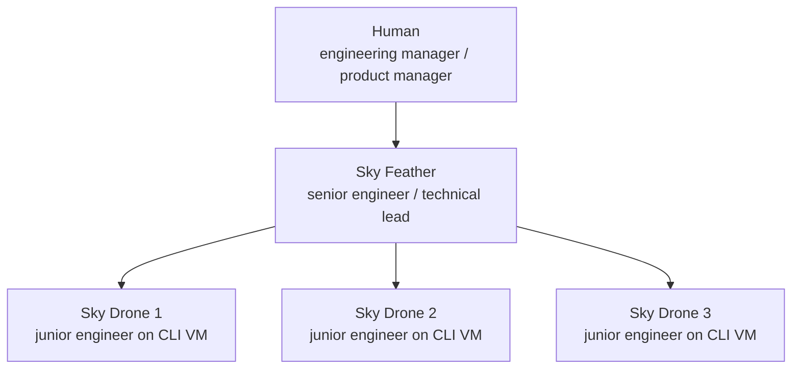
```mermaid
flowchart TD
    human["Human<br/>engineering manager / product manager"]
    sky["Sky Feather<br/>senior engineer / technical lead"]
    drone1["Sky Drone 1<br/>junior engineer on CLI VM"]
    drone2["Sky Drone 2<br/>junior engineer on CLI VM"]
    drone3["Sky Drone 3<br/>junior engineer on CLI VM"]

    human --> sky
    sky --> drone1
    sky --> drone2
    sky --> drone3
```

That role split only worked when the operating contract was explicit:

```text
Hermes plans, dispatches, verifies, journals.
Workers implement, test, push, open PRs.
Humans review and merge.
```

When that contract was explicit, the system behaved like a worker pool. When it was implicit, Hermes drifted back into single-agent mode and burned quota doing work the drones should have owned.

No IDE. No sitting in Cursor clicking around. Just Discord, worker prompts, PRs, tests, journal entries, and the occasional quota bonfire trying to sneak into the room.

## Start with the product, then hand it to agents

The first useful constraint was not "use this framework." It was "do not jump to tech stack yet." The early planning centered on the product behavior: a web-based queue board that feels socially equivalent to the paper/marker board it replaces.

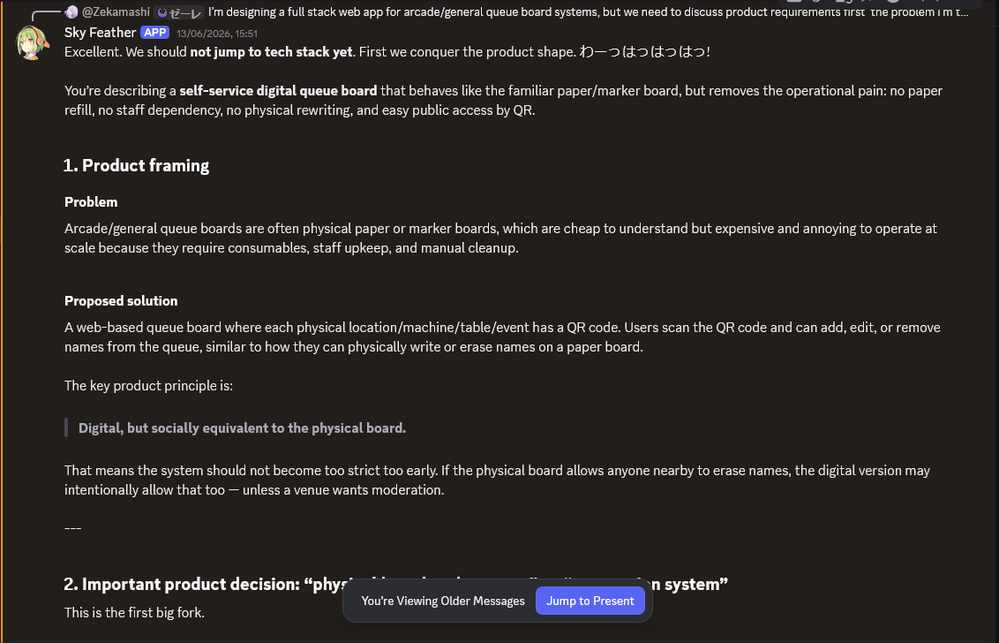

That led to the name and thesis. Queue Reminiscence was deliberately framed away from reservation SaaS: semi-anonymous, public, arcade-friendly, and closer to a physical queue sheet than a private booking app.

Then the requirements got sharper. We had to decide what operators control, what participants can do without accounts, and how much abuse resistance can exist without destroying the no-account arcade flow.

One important modeling decision came from venue reality: Organization, Venue, and Board are separate concepts. `Round1` is not the same thing as `Round1 Ikebukuro`, and neither is the same thing as `CHUNITHM Cabinet 1`.

Another requirement came from future hardware: dynamic QR on e-ink displays. Static QR stickers are easy, but rotating access displayed on low-power panels turns the queue board into a living access token.

I am not embedding every planning screenshot here. The archive has the full trail; the article only needs enough screenshots to prove the handoff shape without turning into a Discord scrapbook.

Once the product shape was solid, the PRD became the handoff artifact. The screenshot matters because it shows the boring-but-important part: the file was attached, counted, and verified before the architecture handoff.

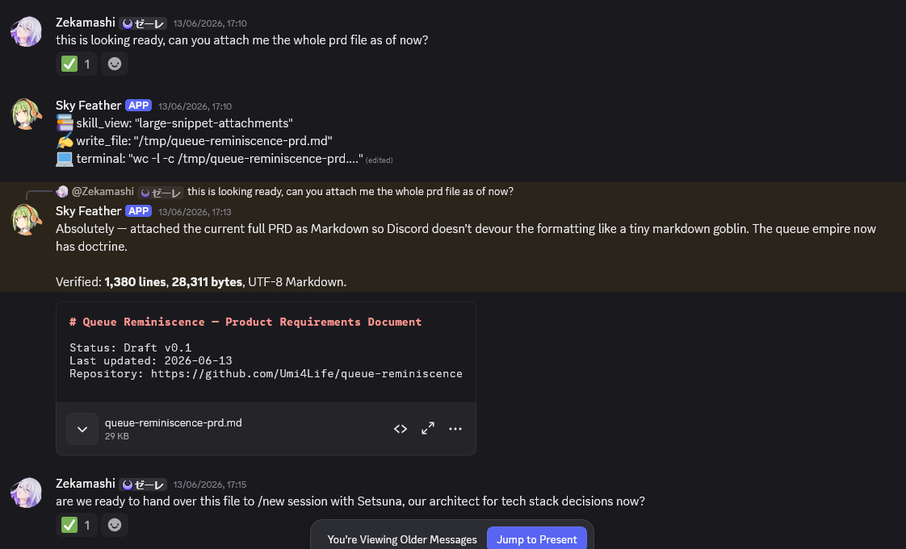

Only after that did the tech-stack planning start. The architecture handoff asked for web framework, database, auth/session model, public/admin separation, QR/access credential design, display-state API, and deployment shape.

The stack decision landed on Elysia/Bun, SvelteKit, PostgreSQL, Drizzle, DB-backed admin sessions, short-lived public mutation sessions, Docker Compose, and an HTTP display-state API before MQTT.

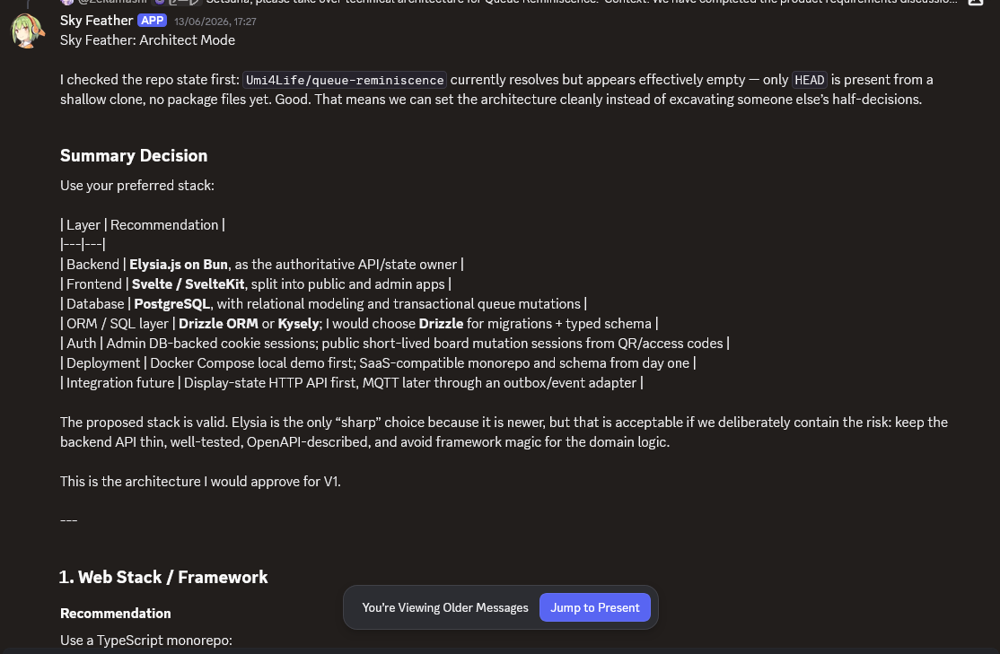

Deployment planning also happened before implementation. The important choice was to support self-contained local development while treating Postgres and Traefik as shared external homelab services in the real deployment path.

The architecture brief then became a real artifact in the repo, not a chat vibe. The baseline was checked first (`main` at `d282127`), then the MVP technical architecture brief was written under `docs/architecture/`.

After that came the implementation plan: phase order, task breakdown, and the build sequence. This is where the project stopped being "we should build a thing" and became a queue of executable slices.

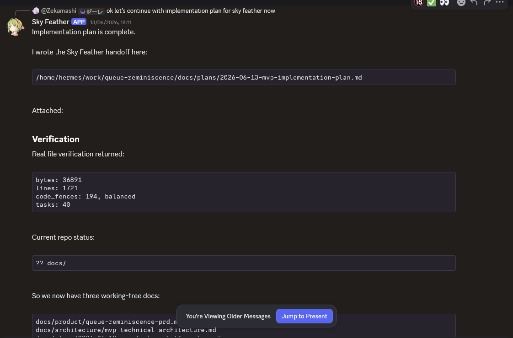

The final implementation brief pointed Sky Feather at the PRD, architecture brief, and MVP implementation plan in priority order, then told the worker to start at Phase 0 with the actual stack and constraints.

Phase 0 immediately produced evidence: branch pushed, docs added, tests/review loop started, and a useful permissions failure. GitHub API PR creation hit `HTTP 422 Validation Failed` because the actor was not a collaborator yet, but the branch itself pushed successfully. Version 1 produced data.

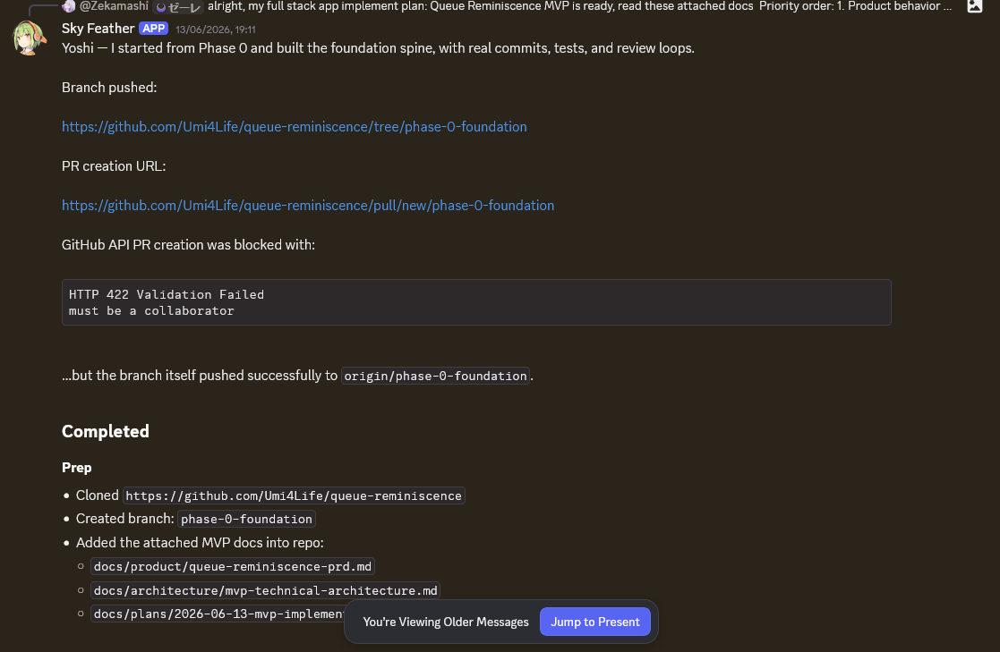

The next iteration fixed the workflow by using fork PRs. The first PR was opened and verified with explicit state: `STATE=open`, `HEAD=sky-feather:phase-0-foundation`, `BASE=Umi4Life:main`, and title `Build Queue Reminiscence MVP foundation`.

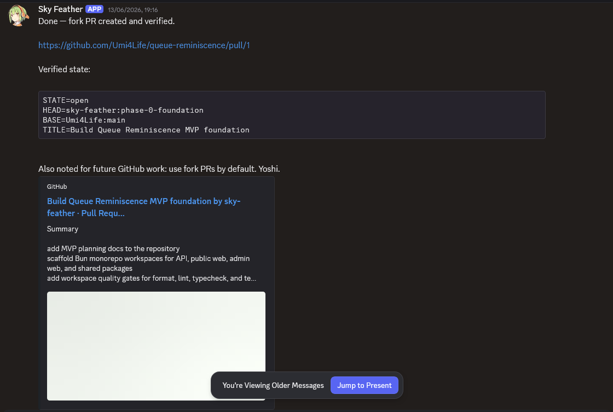

That became the project’s default GitHub motion: fork branch, PR, verified state, merge by the human account. No collaborator fairy tale required.

The chat interface also stayed intentionally readable. There were real PR states and merge instructions, but also enough Sky Feather voice that the work did not feel like babysitting a gray support macro. The useful line in this screenshot is still operational: `Fleet does the typing, I do the verify-and-ship loop.`

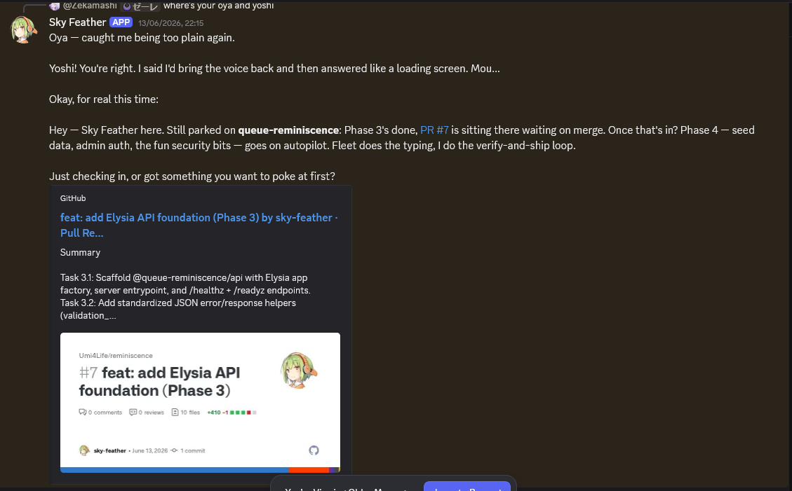

That sequence matters. Product shape first. Architecture second. Implementation plan third. Phase 0 fourth. Then fix the workflow when GitHub tells you the truth. Boring order, better results.

## The boring product still had to work

The MVP is a self-hostable digital queue board for arcade/general queue use.

The stack landed as:

- Bun workspaces monorepo
- Elysia API on Bun
- SvelteKit public app
- SvelteKit admin app
- PostgreSQL with Drizzle migrations
- Docker/Compose deployment paths for local dev and homelab use

The stack choice was intentionally visible: fast Bun-native API work on Elysia, SvelteKit for the public/admin surfaces, and Postgres/Drizzle underneath instead of turning the MVP into framework soup.


The service split is intentionally plain:

```text
queue.umi4.life           -> public web (:3000)
admin.queue.umi4.life     -> admin web (:3001)
*/api                     -> API (:3002)
```

The MVP acceptance checklist ended at 17 rows, all satisfied:

- admin login/logout
- admin org, venue, and board views
- board create/edit/delete plus open/close/reset
- QR/access rotation
- public claim flow from current QR URL
- public add/remove queue entries
- removed entries retained in history only
- mutation events and recent activity
- rate limiting
- expired/revoked link rejection
- display-state API with ETag/304
- local dev and homelab deployment docs

Final gate:

```bash
bun run check    # format, lint, typecheck, 231 unit tests pass
bun run e2e      # 10/10 Playwright pass
```

And yes, there is an actual product screen at the end of the PR train. The admin UI shows the operator view: board cards, open/closed state, queue counts, and the boring but necessary `New board` / `Log out` controls. It is not glamorous. It is legible, which is better.

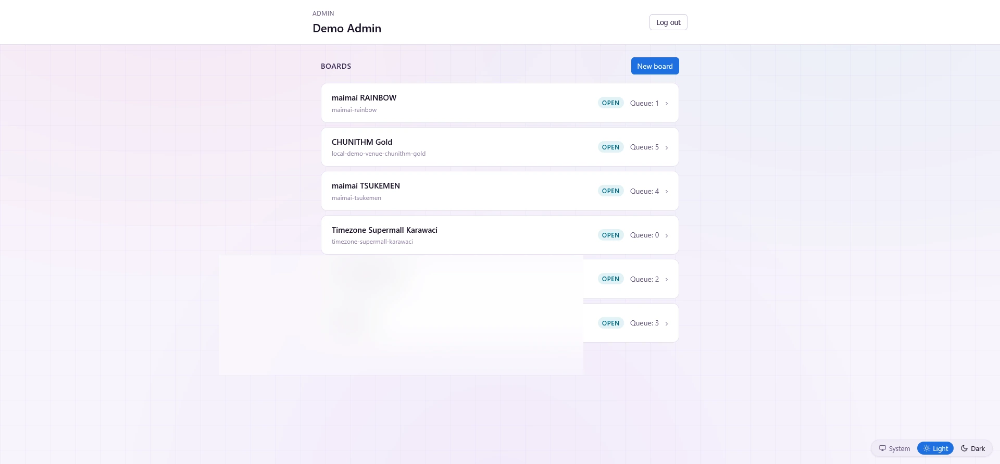

The public board is the other half: a venue label, board title, open status, numbered queue, remove buttons, a display-name input, and a `Join queue` action. The point was not to make arcade queueing more complicated. The point was to preserve the paper-board ritual in a web shape.

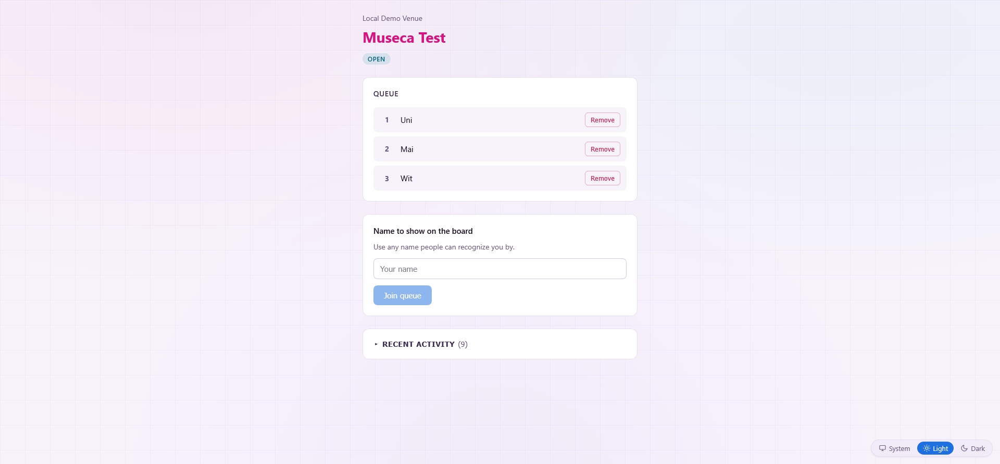

That is the boring part of the result. Boring is good. Boring means the artifact survived contact with tests and produced a UI a human can understand without a tour guide.

## What the agent workflow tested

The workflow target was this:

```text
Human in Discord
    -> Hermes controller
        -> remote coding CLI workers on VM lanes
            -> implementation
            -> local checks
            -> push branch
            -> open PR
        -> Hermes verifies and journals
    -> human reviews and merges
```

The worker pool was three Cursor/CLI VMs:

```text
hermes-cursor-1  192.168.1.214
hermes-cursor-2  192.168.1.215
hermes-cursor-3  192.168.1.216
```

The first useful delegation question was simple: which slices are safe for Cursor CLI VMs? Phase 4 had good candidates, but security and integration review stayed with Hermes before merge.

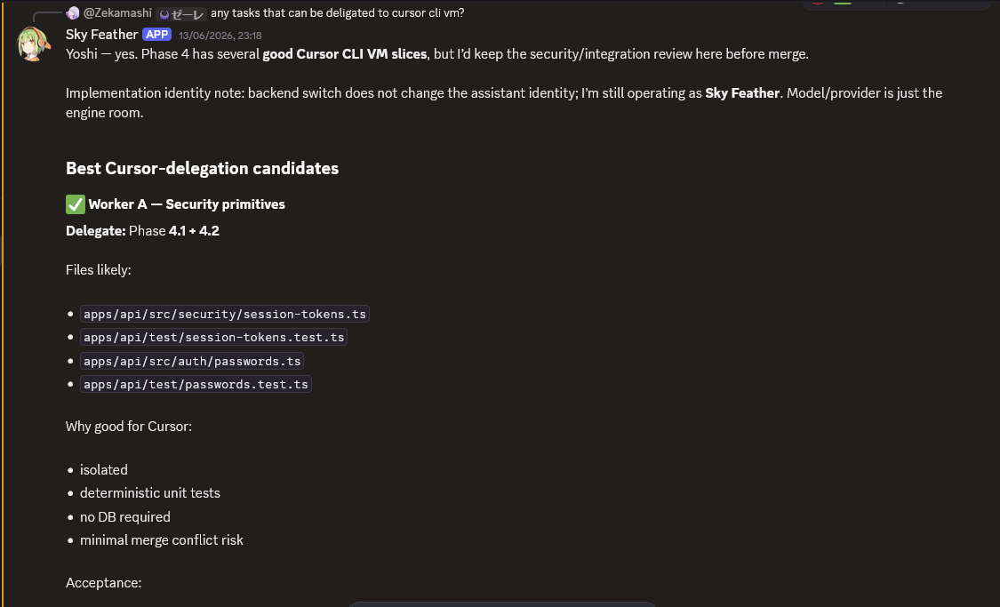

That split produced concrete worker assignments. Worker B got RBAC helper and unit fixtures because the work was isolated, table-driven, and did not need the auth routes to exist yet.

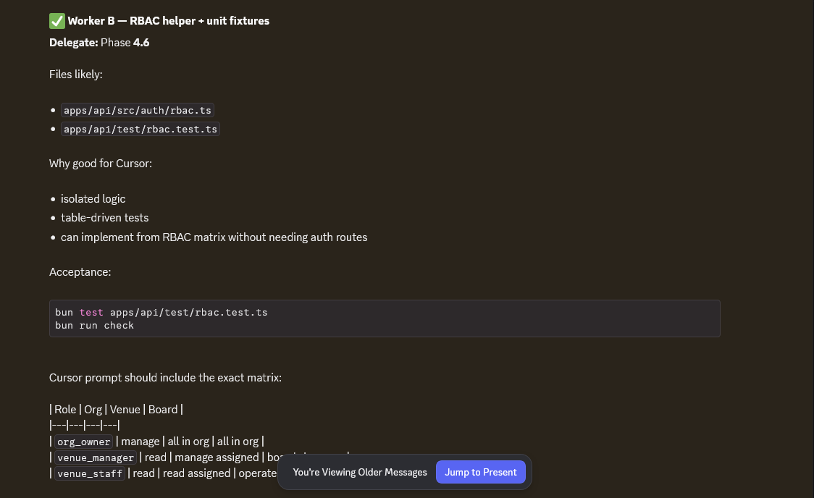

Worker C got seed script and package wiring, with explicit risk notes around password hashing, hardcoded seed passwords, and not overwriting an existing admin password hash.

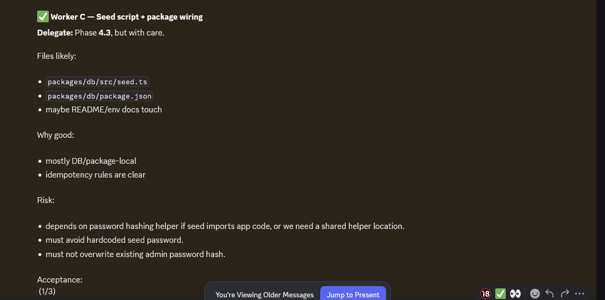

Then the drones actually launched. All three Cursor VMs passed readiness on the LAN, using Composer 2.5, and Worker C got forced back to Bun `1.2.23` because these VMs exposed no AVX flags. Avoiding the known `SIGILL` bonfire was not glamorous, but it was the difference between a worker pool and a crash farm.

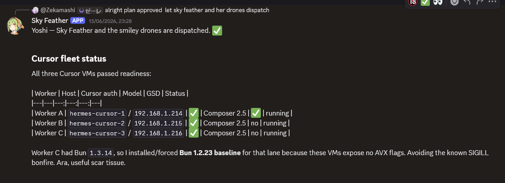

The output kept coming back as PR-sized implementation status. One update shows tenant and board schema work: `organizations`, `venues`, `boards`, Postgres enums, uniqueness constraints, Drizzle migration, and snapshot.

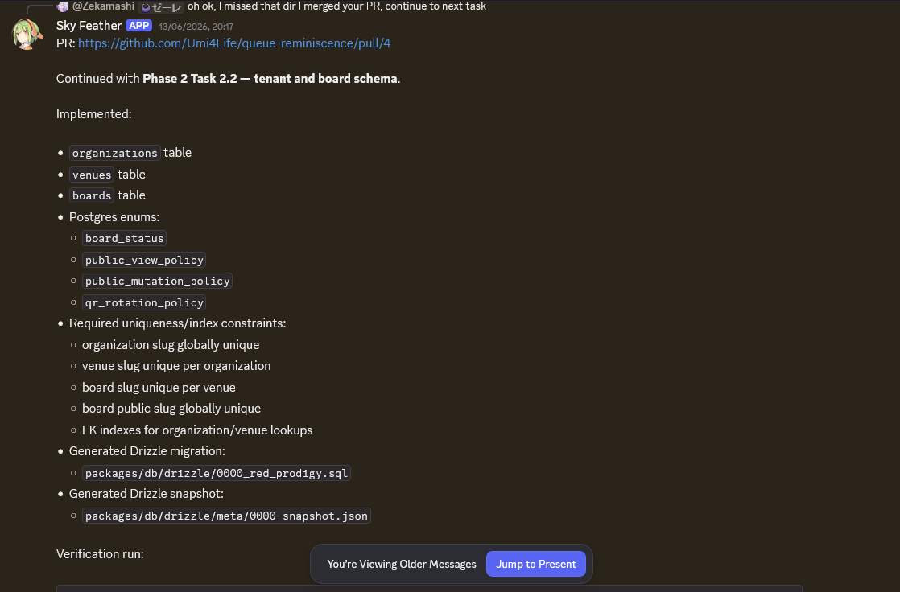

Later read-backs summarized PRs directly in chat. Phase 4 auth/RBAC work came back as reviewable GitHub cards: Argon2id helpers, opaque admin session tokens, HMAC hashing, and pure RBAC helpers.

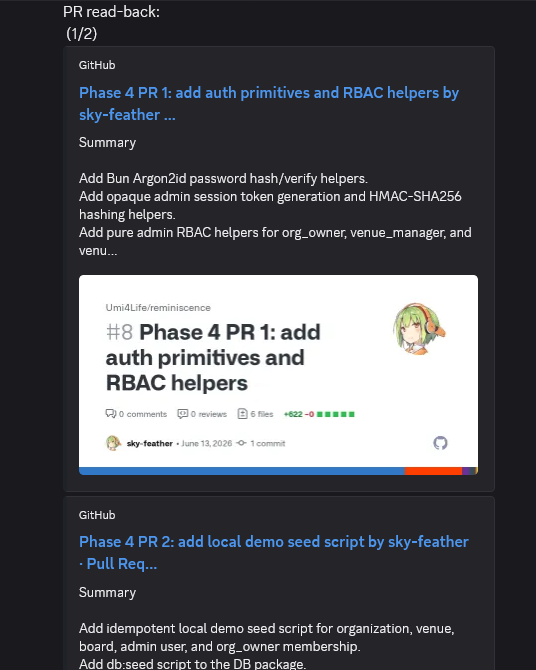

The shape is different from ordinary in-process subagents. These workers have their own VM state, repo checkouts, CLI auth, shell environment, and failure modes. Hermes is not supposed to be the hero typing all the code. Hermes is supposed to be the conductor: split the work, dispatch lanes, check the evidence, and keep the journal honest.

When it worked, it worked well. Phases could split into PR-sized lanes: public read vs public mutations, web scaffold vs board UI, Docker images vs Compose vs homelab docs. The human job stayed close to the intended shape: review and merge.

That last verb matters. The workflow was not "let the drones merge code into main while everyone claps." The mobile GitHub review view shows the human side of the loop: an open PR, files changed, the `Review` control, and actual code diff inspection from a phone. Tiny screen, real gate.

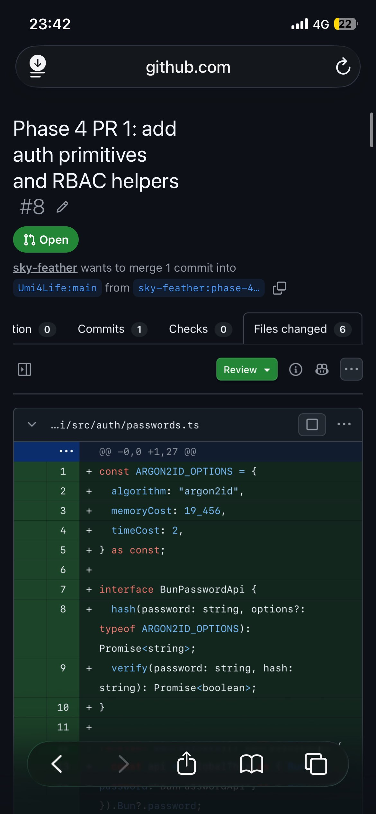

The matching PR summary shows the implementation note and verification block: Cursor workers A/B implemented the auth/RBAC slice, then Sky Feather reviewed and verified it locally before the human merge path. That is the division of labor I want from this system.

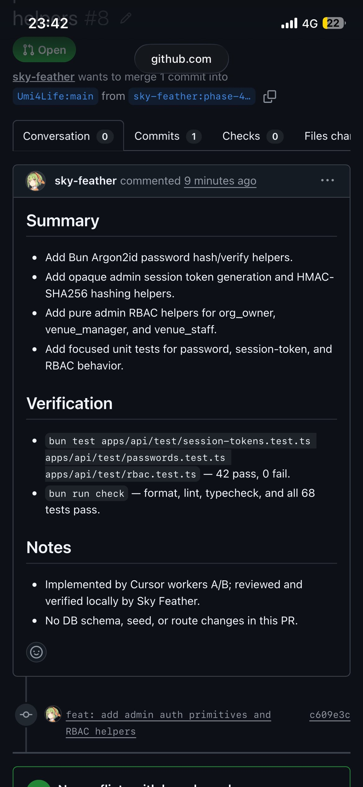

And the PR trail is visible. The closed pull request page shows 44 closed PRs, with the visible page running from Phase 14 closure back through Phase 7/9 work. Most of them are authored by `sky-feather`: docs, features, fixes, Docker, E2E, admin UI, public UI, QR, display-state, rate limiting, and audit metadata.

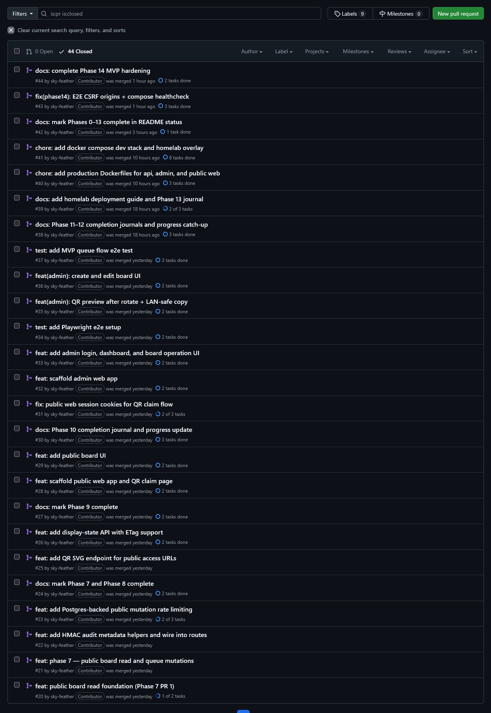

One representative PR is #25, `feat: add QR SVG endpoint for public access URLs`. It was merged from `sky-feather:phase9-qr-svg` into `main`, with a summary that names the endpoint and verification: `bun run check` returning 188 passing tests at that phase. Tiny lane, clear artifact, merged result. That is the worker-pool unit of progress.

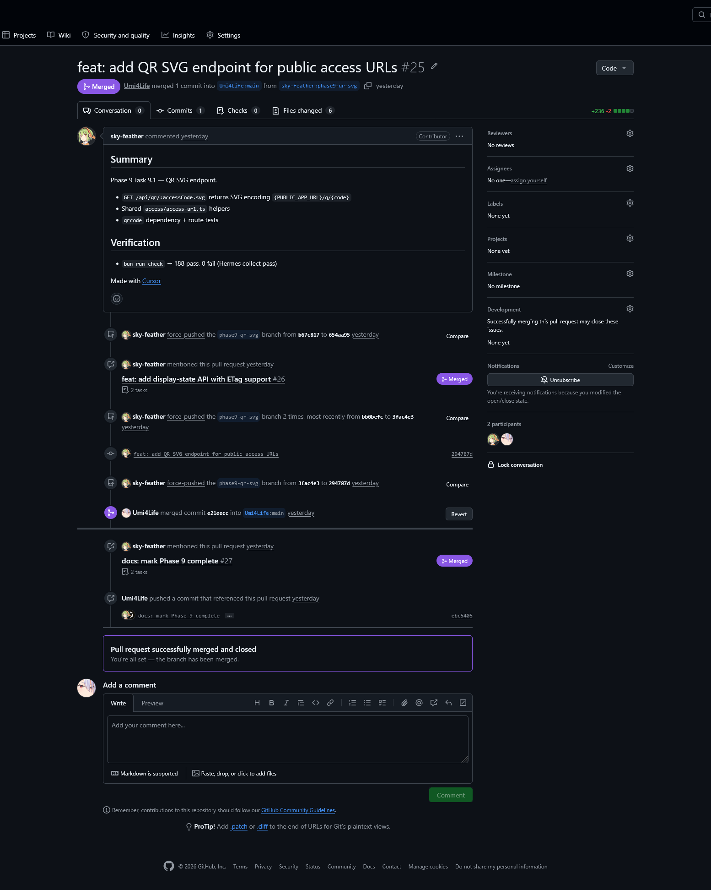

When it did not work, the failure was usually not "the model cannot code." It was orchestration glue.

Mou. The boring glue always gets a vote.

## The bug was policy, not code

The largest mistake was not technical in the product code. It was that the worker policy was implicit at the start.

Early in the project, Hermes defaulted to doing too much locally: implementation, review, conflict handling, PR prep, and verification. That burned premium model quota and serialized work that should have moved through the worker pool.

The fix is almost embarrassingly simple: put the worker policy in the session-start brief.

A future project should begin with something like:

```text
Use the Cursor worker pool for implementation lanes.
Hermes is controller only.
Workers own implementation -> check -> push -> PR.
Hermes verifies gates and handles integration conflicts only.
Report worker, runtime, branch, PR, checks, and evidence.
```

That line changes the whole project. Without it, the path of least resistance is the controller doing everything. With it, the system starts behaving like a pool.

This is the part I care about most from the MVP. Not "AI wrote a queue board." That is too vague to be useful. The useful rule is:

> Agent-worker architecture is an operating policy, not a vibe.

If the policy is not explicit at handoff time, the system will drift back into single-agent mode.

## Scars that shaped the next run

The project also collected the kind of scars that make the next run cleaner.

### Bun and the AVX trap

Hermes hit Bun `1.3.14` `SIGILL` on hosts without AVX/AVX2. At first the workaround was to use the Bun `1.2.23` linux-x64-baseline build.

Then the same class of problem showed up on the Cursor worker VMs. They were exposing an emulated QEMU CPU instead of host CPU flags, and their Bun installs had drifted.

The fix was infrastructure, not app code:

- Terraform: expose host CPU to the Hermes/Cursor VMs
- Ansible: pin Bun to `1.2.23`
- verification: all three worker VMs reported AVX/AVX2 and passed Bun smoke tests

This matters because worker fleets are only useful if the workers are boringly consistent. A drone that fails because of CPU flags is not a clever agent problem. It is an ops problem wearing a fake mustache.

### Poll artifacts, not vibes

One phase looked stuck because polling watched log byte growth from a `claude --print` style command. Stdout buffered until exit, so log size stayed quiet while the worker was still doing useful work.

The fix: stop treating log growth as liveness.

Poll branch/PR/git artifacts instead:

- did the fork branch appear?
- did the PR open?
- did git status change?
- did the process exit?

Logs are helpful after something fails. They are a bad heartbeat when the CLI buffers output.

### Localhost vs LAN origin

Phase 14 E2E failed at admin login with:

```text
Cross-origin request rejected.
```

The cause was not auth. It was origin mismatch.

The dev `.env` had:

```text
ADMIN_APP_URL=http://192.168.1.213:3001
```

Playwright was hitting:

```text
http://localhost:3001
```

The API CSRF middleware compared `Origin` against `ADMIN_APP_URL`, so the browser looked hostile even though it was the test runner. The fix was to force localhost URL env values inside `playwright.config.ts` for the webServer processes.

That failure was useful. It caught a real homelab-shaped edge: LAN URLs, localhost URLs, cookies, CORS, and CSRF rules all need to agree. Desktop demos hide this stuff until they do not.

## What shipped, and what did not

A Hermes exploratory stack was brought up on `192.168.1.213`:

```text
qr-postgres-homelab
qr-api
qr-admin
qr-display
```

Smoke checks passed for health/readiness, admin login via the intended admin origin, and the public board page on port 3000.

The remaining cutover is operator work, not hidden coding work:

- apply Traefik file-provider config on `192.168.1.3`
- confirm DNS for `queue.umi4.life` and `admin.queue.umi4.life`
- move to shared Postgres at `192.168.1.30` when credentials exist
- run the HTTPS smoke through the real route

So the honest status is:

> MVP coding is complete, and the homelab stack has been smoke-tested on the Hermes host. Public HTTPS cutover still needs the manual Traefik/DNS/operator pass.

No pretending. The scoreboard is cleaner when it says what actually happened.

## What the experiment actually proved

Queue Reminiscence proved a few things worth keeping.

First, a chat-only controller can carry a real full-stack MVP through many small PRs if the project has strong gates and durable notes.

Second, remote coding CLI workers are useful when the work is split into lanes with crisp ownership. "Build the entire app" is mush. "Worker A owns public read endpoints and opens the PR after `bun run check`" is usable.

Third, journaling is not decoration. The project survived session drift, tool glitches, worker detours, stale local checkouts, and deployment context switches because the NAS journal had enough evidence to reconstruct the state. Without that journal, every restart would have become archaeology.

Fourth, the worker-pool pattern needs explicit policy. The controller must not casually become the implementor unless that is the actual plan.

## What it did not prove

It did not prove exact cost savings. The quota pressure was visible, but not measured as a clean A/B experiment.

It did not prove that every project should be split across worker VMs. Small, tightly coupled changes may be faster in one lane.

It did not prove production is done just because the code is done. Homelab cutover has real infrastructure steps, and those steps deserve their own smoke test.

Run this as an experiment, not as folklore.

## The rule for the next project

The next project should start with the orchestration contract, not discover it halfway through.

My default now:

```text
Hermes plans, dispatches, verifies, journals.
Workers implement, test, push, open PRs.
Humans review and merge.
```

That is the clean version.

The spicy version is building enough automation around that loop that the controller can maintain a live board of worker lanes, expected artifacts, stalled PRs, test status, and quota risk without needing a human to ask "what is happening right now?"

But for now, the clean version is enough.

Queue Reminiscence shipped. The queue board works. The worker fleet learned where its rails need to be.

See you next play.
