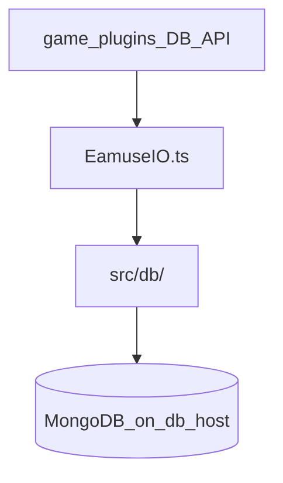
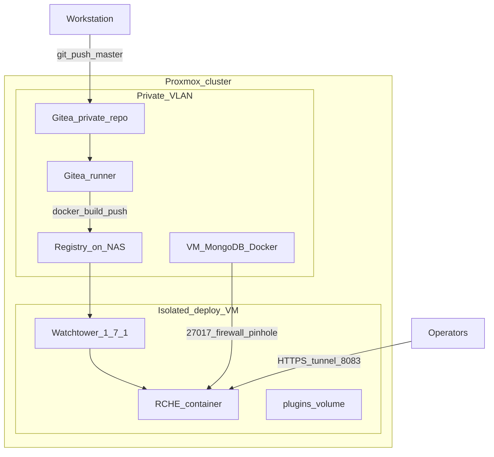

+++
banner = 'https://raw.githubusercontent.com/Umi4Life/umi4.life/refs/heads/master/content/posts/self-host-eamusement-server/cover.jpg'
cover = 'https://raw.githubusercontent.com/Umi4Life/umi4.life/refs/heads/master/content/posts/self-host-eamusement-server/cover.jpg'
date = '2026-05-30T15:45:33+07:00'
draft = false
title = 'Self Host Eamusement Server'
description = 'Rebuilding, refactoring and hosting bemani server'
tags = ["proxmox", "mongo", "server", "documentation"]
+++

# From a GitHub clone to a production homelab: MongoDB, private CI, and automated deploy

**Fork extension and Proxmox infrastructure (RCHE)**

---

## How this started

A friend wanted to run a private Bemani-style arcade backend after discovering [Asphyxia CORE](https://github.com/asphyxia-core/core) on GitHub—a community, open-source eAmusement server that recently became publicly available. In theory that could have been a weekend job: clone the repo, run Docker, keep the default embedded database on disk, and call it done.

I went further. The goal became a setup that could live on my **Proxmox homelab**: a dedicated database VM, an application host on a restricted network segment, **private Git** and a **container registry**, and **automated deploys** when I push to `master`—without the deploy host ever needing access to Gitea. I also wanted to **merge upstream releases** without re-fighting a giant diff every time.

This document is about that engineering work: persistence, fork layout, and operations. The upstream project already implements the cabinet HTTP layer; I did not write the emulator from scratch.

*Disclaimer: RCHE is a private fork for homelab hosting. It is community software, not affiliated with Konami. Game plugins and titles are separate open-source repositories.*

---

## What Asphyxia CORE is (briefly)

Asphyxia CORE is a **Node.js / Express** application that stands in for Konami's **eAmusement** online services used by arcade cabinets (Beatmania IIDX, DDR, Sound Voltex, and others). Cabinets and the operator WebUI talk HTTP to the server; **per-game plugins** under `plugins/<identifier>/` supply title-specific save logic.

Out of the box, persistence is **NeDB**: Mongo-like document files under `savedata/` on the same machine as the app (`core.db` for cards and profiles, one file per plugin). That is simple for development and single-node installs.

| Layer | Upstream Asphyxia CORE | This fork (RCHE) |
|-------|------------------------|------------------|
| Runtime | Node 16+, TypeScript, Express | Same |
| WebUI | Pug templates, Bulma CSS | Rebranded operator-facing strings |
| Cabinet traffic | Custom middleware (KBin/XML, optional encryption/compression) | Unchanged |
| Persistence | NeDB files on local disk | **MongoDB 6+** on a separate host |
| Production deploy | Dockerfile, manual pull | **Gitea Actions → private registry → Watchtower** |

---

## Why MongoDB—and why keep the fork rebase-friendly

The hosting layout drove the database choice, not curiosity about alternative databases.

- A **MongoDB VM** on Proxmox holds all saves; the **RCHE VM** only runs the app container.
- A second app node later should share the same data without file replication.
- The fork stays in **private Git** but must **track upstream** when the open-source project releases updates.

NeDB on a network share is a non-starter (locking and corruption). PostgreSQL would work but would mean a large, permanent rewrite inside `src/utils/EamuseIO.ts`, the file upstream edits most often. A separate HTTP “data microservice” adds moving parts without reducing merge pain.

| Approach | Assessment |
|----------|------------|
| **MongoDB + new `src/db/` package** | Document model and query operators match what NeDB already used; **smallest ongoing conflict surface** |
| PostgreSQL | Higher rewrite cost in `EamuseIO.ts` |
| NeDB over NFS/SMB | Tiny code diff, unreliable in production |
| Scatter Mongo calls through plugins | Breaks upstream plugin compatibility |

MongoDB on a private `db-host` with authentication, firewall allowlisting only from the app VM, and routine backups was the pragmatic fit.

---

## Unintrusive migration: the main code contribution

Community plugins never talk to NeDB directly. They call `DB.Find`, `DB.Insert`, and related helpers exposed through the plugin API (`plugins/asphyxia-core.d.ts`). Those helpers are implemented in **`src/utils/EamuseIO.ts`**. That single choke point is the right seam.

### Design

1. Introduce a **`DbStore` interface** and Mongo implementation under **`src/db/`** (fork-only paths).
2. Replace “open a NeDB file” with “open a store for this affiliation (`core` or plugin id)” inside `EamuseIO.ts`.
3. Leave **plugin source and typings unchanged** so existing game plugins keep working.
4. Move connection settings to **`.env`** (`MONGODB_URI`, `MONGODB_NAME`) via `src/utils/EnvConfig.ts`, not the WebUI.

### Fork-only files

| Path | Role |
|------|------|
| `src/db/types.ts` | `DbStore` contract (find, insert, update, count, indexes) |
| `src/db/mongo-store.ts` | MongoDB driver, collections, index setup |
| `src/db/index.ts` | `initCoreStore`, per-plugin store cache |
| `src/db/admin.ts` | WebUI/admin helpers for plugin data |
| `src/utils/EnvConfig.ts` | Load `.env`, optional migration from legacy `config.ini` db keys |

### Minimal touch of upstream-owned files

| File | Change |
|------|--------|
| `src/utils/EamuseIO.ts` | Delegate persistence to `src/db`; `resolveAssetsPath()` for Docker vs dev asset directories |
| `src/AsphyxiaCore.ts` | Read config before database init |
| `src/middlewares/EamuseMiddleware.ts`, `src/utils/ArgConfig.ts`, branding | Small hooks as needed |

Collections mirror the old file split: a `core` collection for cards, profiles, and counters; per-plugin collections for global and per-profile plugin documents. Document shape still uses `__s` and `__refid` as before.

### Rebase strategy

- Track **upstream tags** on [asphyxia-core/core](https://github.com/asphyxia-core/core).
- Keep **database** and **deploy** commits in separate, named commits on top of upstream.
- After a merge, re-apply only the thin hooks in `EamuseIO.ts` / boot order if they conflict—most new logic stays in `src/db/`, which upstream does not touch.

---

## Proxmox homelab: private Git, registry, automated deploy

The production story is a **self-hosted pipeline** on Proxmox, not “SSH from CI into a DMZ box.”

### Components

**Private Gitea** hosts the fork. Pushing to `master` triggers **Gitea Actions** (`.gitea/workflows/deploy.yaml`): the runner builds the repo `Dockerfile` and pushes `registry.example.internal/rche:latest` and a commit SHA tag. Registry credentials live in Gitea secrets.

**Container registry** runs on NAS (HTTP registry on the LAN). The deploy VM is **network-isolated** from Gitea—it cannot `git clone` private repos. It only **pulls images** from the registry, the same pattern I use for other stacks on that host.

**Deploy VM** runs Docker Compose from `deploy/production/`:

- `rche` service: image from registry, `.env` for Mongo URI, volumes for `plugins/`, `savedata/`, and `config.ini`.
- **Watchtower 1.7.1** with `WATCHTOWER_LABEL_ENABLE` so only labeled containers update; registry auth via mounted `~/.docker/config.json` and `DOCKER_CONFIG=/`.

After each successful CI push, Watchtower detects a new digest for `:latest` and recreates the `rche` container within a few minutes—no manual `docker compose pull` for routine app updates.

**MongoDB VM** (`db-host`, e.g. `10.0.0.9:27017`) runs `mongo:7` in Docker with authentication. The firewall allows **only** the deploy VM to reach port 27017. One operational lesson: on Proxmox, a CPU type without **AVX** (e.g. generic `x86-64-v2`) can make Mongo 5+ crash with illegal instruction; setting the VM CPU to **host** or a newer type fixed startup.

**HTTPS for operators**: Cloudflare Tunnel terminates TLS and forwards to **port 8083** on the deploy host—the only port needed for the WebUI. Mongo is never exposed to the internet.

### Plugins on the deploy host

Game plugins are **public GitHub repositories** ([plugin index](https://github.com/asphyxia-core/plugins)). The deploy VM can clone them into `plugins/<identifier>/` even though it cannot reach private Gitea. A one-time scaffold (`tsconfig.json`, `package.json`, type definitions) is copied via `deploy/production/scripts/init-plugins.sh`.

---

## How the running system fits together (light touch)

- **Port 8083**: the only HTTP listener—WebUI and cabinet API share it (`config.ini` / CLI `port`).
- **Port 5700**: advertised in core `facility.get` for matchmaking; the core process does not open a separate UDP/TCP server on 5700 in this codebase—compose may publish it for plugin compatibility.
- **Traffic split**: non-browser User-Agents hit `EamuseMiddleware` (parse KBin/XML, route by `module.method`); browsers skip to the WebUI router.

Enough context to read the architecture; not a protocol specification.

---

## Lessons learned

**1. Docker WebUI returned 500 behind a reverse proxy**

Logs showed views loaded from `/app/build-env/build-env/assets/views`—a doubled path. In the container, `WORKDIR` is already `/app/build-env`, but asset resolution still appended `build-env/assets`. Fix: detect layout on disk (`assets/views` next to cwd vs under `build-env/assets`).

**2. Watchtower did not update images**

Two issues: an old Watchtower image used Docker API 1.25 while the host required 1.40+; and the Watchtower container had no registry credentials. Fix: pin `containrrr/watchtower:1.7.1`, mount the host's `config.json` from `docker login`, set `DOCKER_API_VERSION` if needed.

**3. Automation scope**

Watchtower updates **container images** only. Changes to `compose.yaml`, volume paths, or `.env` still need a one-time `docker compose up -d` on the deploy host.

---

## Outcomes and skills demonstrated

- **Fork maintenance**: isolate persistence and deploy artifacts so upstream merges stay tractable.
- **Adapter pattern**: swap NeDB for MongoDB without breaking the plugin `DB.*` contract.
- **Multi-tier homelab design**: Proxmox VMs, firewall pinholes, split DB and app roles.
- **Private CI/CD**: Gitea Actions, self-hosted registry, Watchtower-based continuous deploy to an isolated host.
- **Production Docker debugging**: asset paths, registry auth, API version mismatches.

Deliberately **not** the focus of this project: claiming protocol reverse engineering, Konami cryptography, or ownership of the upstream emulator.

---

## References

- Upstream: [asphyxia-core/core](https://github.com/asphyxia-core/core), [community plugins](https://github.com/asphyxia-core/plugins)
- This repo: [README.md](README.md) (runbook), [deploy/production/README.md](deploy/production/README.md) (first boot on deploy host)
