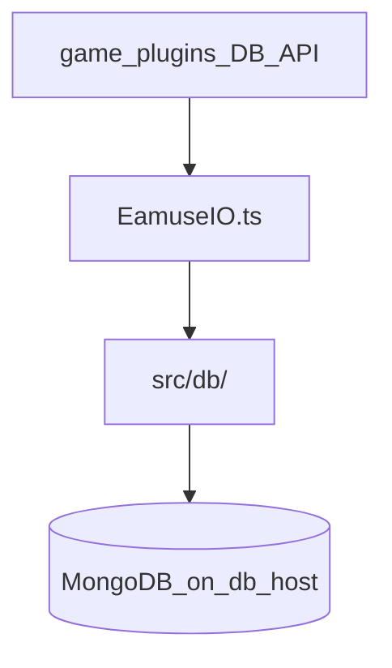
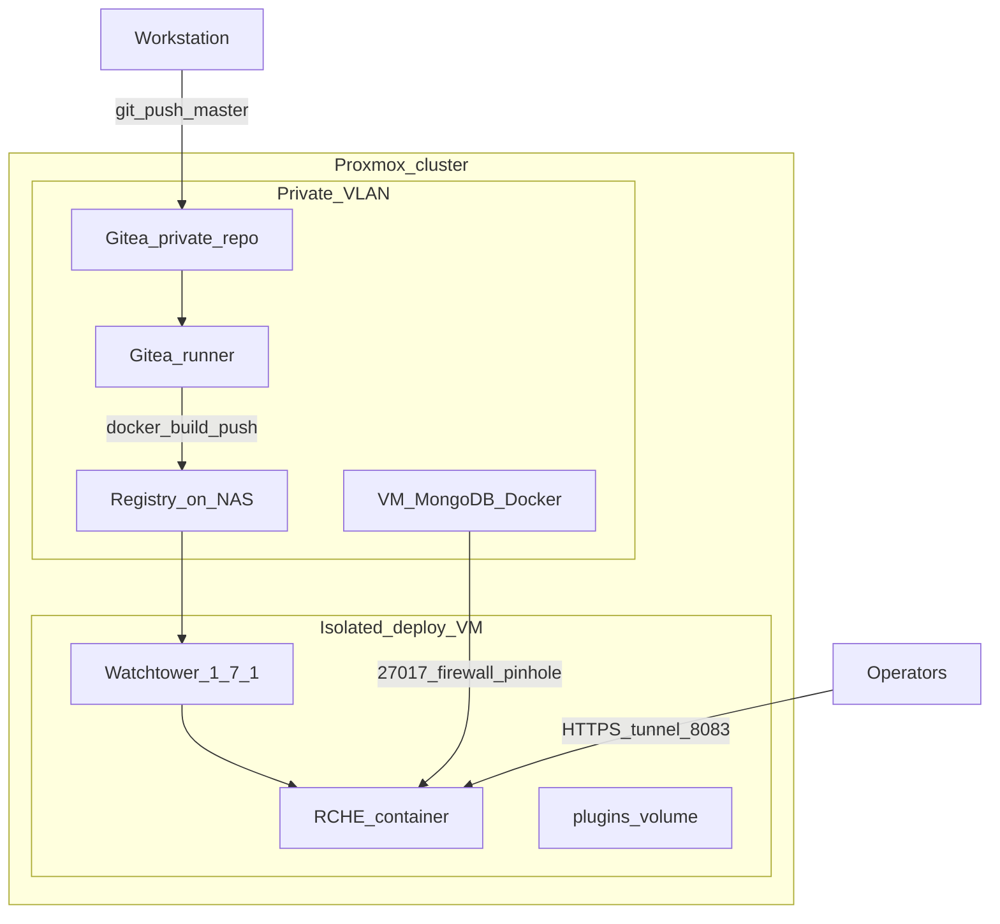

+++
banner = 'https://raw.githubusercontent.com/Umi4Life/umi4.life/refs/heads/master/content/posts/self-host-eamusement-server/cover.jpg'
cover = 'https://raw.githubusercontent.com/Umi4Life/umi4.life/refs/heads/master/content/posts/self-host-eamusement-server/cover.jpg'
date = '2026-05-30T15:45:33+07:00'
draft = false
translationKey = 'self-host-eamusement-server'
title = 'โฮสต์เซิร์ฟเวอร์ eAmusement เอง'
description = 'รีบิลด์ รีแฟกเตอร์ และโฮสต์เซิร์ฟเวอร์ Bemani'
tags = ["proxmox", "mongo", "server", "documentation"]
categories = ["homelab", "private-server"]
mermaid = true
+++

**Fork extension และโครงสร้างพื้นฐานบน Proxmox (RCHE)**

### https://rche.umi4.life/

---

## จุดเริ่มต้น

เพื่อนคนหนึ่งอยากรัน backend อาร์เคดสไตล์ Bemani แบบ private หลังจากเจอ [Asphyxia CORE](https://github.com/asphyxia-core/core) บน GitHub, เซิร์ฟเวอร์ eAmusement แบบโอเพนซอร์สจากชุมชนที่เพิ่งเปิด public เมื่อไม่นานมานี้ ตามทฤษฎีแล้วงานนี้อาจจบได้ในสุดสัปดาห์เดียว: clone repo, รัน Docker, ใช้ embedded database ดีฟอลต์เก็บบนดิสก์ แล้วถือว่าเสร็จ

แต่ผมไปไกลกว่านั้น เป้าหมายกลายเป็น setup ที่อยู่บน **Proxmox homelab** ของผมได้จริง: VM สำหรับฐานข้อมูลแยกต่างหาก, application host บน network segment ที่ถูกจำกัด, **private Git** และ **container registry**, รวมถึง **automated deploys** ทุกครั้งที่ push ไป `master`, โดยที่ deploy host ไม่จำเป็นต้องเข้าถึง Gitea ได้เลย ผมยังอยากให้สามารถ **merge upstream releases** ได้โดยไม่ต้องกลับมาสู้กับ diff ก้อนใหญ่ทุกครั้ง

เอกสารนี้พูดถึงงานวิศวกรรมส่วนนั้น: persistence, โครงสร้าง fork และ operations ส่วน upstream project ทำ cabinet HTTP layer ไว้อยู่แล้ว ผมไม่ได้เขียน emulator จากศูนย์

*หมายเหตุ: RCHE เป็น private fork สำหรับโฮสต์ใน homelab เป็นซอฟต์แวร์จากชุมชน ไม่ได้เกี่ยวข้องกับ Konami ส่วน game plugins และ titles เป็น repository โอเพนซอร์สแยกต่างหาก*

---

## Asphyxia CORE คืออะไร (แบบสั้น ๆ)

Asphyxia CORE เป็นแอป **Node.js / Express** ที่ทำหน้าที่แทนบริการออนไลน์ **eAmusement** ของ Konami ซึ่งตู้ arcade ใช้งานอยู่ (Beatmania IIDX, DDR, Sound Voltex และอื่น ๆ) ทั้ง cabinet และ operator WebUI คุยกับเซิร์ฟเวอร์ผ่าน HTTP ส่วน **per-game plugins** ภายใต้ `plugins/{identifier}/` จะจัดการ logic การ save เฉพาะของแต่ละเกม

โดยค่าเริ่มต้น persistence จะเป็น **NeDB**: ไฟล์ document แบบคล้าย Mongo อยู่ใต้ `savedata/` บนเครื่องเดียวกับแอป (`core.db` สำหรับ cards และ profiles และหนึ่งไฟล์ต่อ plugin) วิธีนี้ง่ายสำหรับ development และการติดตั้งแบบ single-node

| Layer | Upstream Asphyxia CORE | Fork นี้ (RCHE) |
|-------|------------------------|------------------|
| Runtime | Node 16+, TypeScript, Express | เหมือนเดิม |
| WebUI | Pug templates, Bulma CSS | เปลี่ยนข้อความที่ operator เห็นให้เป็น branding ใหม่ |
| Cabinet traffic | Custom middleware (KBin/XML, optional encryption/compression) | ไม่เปลี่ยน |
| Persistence | ไฟล์ NeDB บน local disk | **MongoDB 6+** บน host แยก |
| Production deploy | Dockerfile, manual pull | **Gitea Actions → private registry → Watchtower** |

---

## ทำไมต้อง MongoDB, และทำไม fork ต้อง rebase-friendly

รูปแบบการโฮสต์เป็นตัวกำหนดการเลือก database ไม่ใช่เพราะอยากลอง database ทางเลือกเฉย ๆ

- **MongoDB VM** บน Proxmox เก็บ saves ทั้งหมด ส่วน **RCHE VM** รันแค่ app container
- ถ้ามี app node ตัวที่สองในอนาคต ควรใช้ข้อมูลชุดเดียวกันได้โดยไม่ต้องทำ file replication
- Fork อยู่ใน **private Git** แต่ยังต้อง **track upstream** เมื่อโปรเจกต์โอเพนซอร์สออกอัปเดต

NeDB บน network share ไม่ใช่ทางเลือกที่ดีเลย (locking และ corruption) PostgreSQL ก็ทำได้ แต่จะต้อง rewrite ถาวรค่อนข้างใหญ่ใน `src/utils/EamuseIO.ts` ซึ่งเป็นไฟล์ที่ upstream แก้บ่อยที่สุด ส่วน HTTP “data microservice” แยกต่างหากก็เพิ่ม moving parts โดยไม่ได้ลดความเจ็บตอน merge เท่าไร

| Approach | Assessment |
|----------|------------|
| **MongoDB + package ใหม่ `src/db/`** | Document model และ query operators ใกล้เคียงกับที่ NeDB ใช้อยู่แล้ว; **ลดพื้นที่ conflict ระยะยาวได้มากที่สุด** |
| PostgreSQL | ต้นทุน rewrite ใน `EamuseIO.ts` สูงกว่า |
| NeDB over NFS/SMB | code diff เล็ก แต่ไม่น่าเชื่อถือใน production |
| กระจาย Mongo calls เข้าไปใน plugins | ทำให้ compatibility กับ upstream plugins พัง |

MongoDB บน `db-host` แบบ private พร้อม authentication, firewall allowlist เฉพาะจาก app VM และ routine backups คือทางเลือกที่ pragmatic ที่สุด

---

## Migration แบบไม่รบกวนโค้ดหลัก: contribution สำคัญของงานนี้

Community plugins ไม่ได้คุยกับ NeDB โดยตรง แต่เรียก `DB.Find`, `DB.Insert` และ helpers อื่น ๆ ที่ expose ผ่าน plugin API (`plugins/asphyxia-core.d.ts`) helpers เหล่านี้ implement อยู่ใน **`src/utils/EamuseIO.ts`** จุด choke point จุดเดียวนี้จึงเป็น seam ที่เหมาะมาก

### Design

1. เพิ่ม **`DbStore` interface** และ Mongo implementation ภายใต้ **`src/db/`** (path เฉพาะของ fork)
2. แทนที่ “เปิดไฟล์ NeDB” ด้วย “เปิด store สำหรับ affiliation นี้ (`core` หรือ plugin id)” ภายใน `EamuseIO.ts`
3. ปล่อย **plugin source และ typings ไว้เหมือนเดิม** เพื่อให้ game plugins เดิมยังทำงานได้
4. ย้าย connection settings ไปที่ **`.env`** (`MONGODB_URI`, `MONGODB_NAME`) ผ่าน `src/utils/EnvConfig.ts` ไม่ใช่ใน WebUI

### ไฟล์เฉพาะของ fork

| Path | Role |
|------|------|
| `src/db/types.ts` | contract ของ `DbStore` (find, insert, update, count, indexes) |
| `src/db/mongo-store.ts` | MongoDB driver, collections, การตั้งค่า index |
| `src/db/index.ts` | `initCoreStore`, cache store แยกตาม plugin |
| `src/db/admin.ts` | helpers สำหรับ WebUI/admin เพื่อจัดการข้อมูล plugin |
| `src/utils/EnvConfig.ts` | โหลด `.env`, migration แบบ optional จาก db keys เก่าใน `config.ini` |

### แตะไฟล์ที่ upstream เป็นเจ้าของให้น้อยที่สุด

| File | Change |
|------|--------|
| `src/utils/EamuseIO.ts` | delegate persistence ไปที่ `src/db`; `resolveAssetsPath()` สำหรับ asset directories ระหว่าง Docker กับ dev |
| `src/AsphyxiaCore.ts` | อ่าน config ก่อน init database |
| `src/middlewares/EamuseMiddleware.ts`, `src/utils/ArgConfig.ts`, branding | hooks เล็ก ๆ เท่าที่จำเป็น |

Collections สะท้อนการแยกไฟล์แบบเดิม: collection `core` สำหรับ cards, profiles และ counters; per-plugin collections สำหรับ global และ per-profile plugin documents รูปทรง document ยังใช้ `__s` และ `__refid` เหมือนเดิม

### Rebase strategy

- Track **upstream tags** บน [asphyxia-core/core](https://github.com/asphyxia-core/core)
- เก็บ commit ของ **database** และ **deploy** แยกเป็น commit ชัดเจนไว้บน upstream
- หลัง merge ให้ re-apply เฉพาะ thin hooks ใน `EamuseIO.ts` / boot order ถ้ามี conflict, logic ใหม่ส่วนใหญ่อยู่ใน `src/db/` ซึ่ง upstream ไม่ได้แตะ

---

## Proxmox homelab: private Git, registry, automated deploy

เรื่อง production ของงานนี้คือ **self-hosted pipeline** บน Proxmox ไม่ใช่ “SSH จาก CI เข้า DMZ box”

### Components

**Private Gitea** โฮสต์ fork นี้ การ push ไป `master` จะ trigger **Gitea Actions** (`.gitea/workflows/deploy.yaml`): runner build repo `Dockerfile` แล้ว push `registry.example.internal/rche:latest` และ tag เป็น commit SHA ส่วน registry credentials เก็บใน Gitea secrets

**Container registry** รันบน NAS (HTTP registry บน LAN) ส่วน deploy VM ถูก **แยก network** ออกจาก Gitea, มัน `git clone` private repos ไม่ได้ มันทำได้แค่ **pull images** จาก registry ซึ่งเป็น pattern เดียวกับที่ผมใช้กับ stack อื่น ๆ บน host นี้

**Deploy VM** รัน Docker Compose จาก `deploy/production/`:

- service `rche`: image จาก registry, `.env` สำหรับ Mongo URI, volumes สำหรับ `plugins/`, `savedata/` และ `config.ini`
- **Watchtower 1.7.1** พร้อม `WATCHTOWER_LABEL_ENABLE` เพื่อให้ update เฉพาะ containers ที่ติด label; registry auth ผ่าน `~/.docker/config.json` ที่ mount เข้ามา และ `DOCKER_CONFIG=/`

หลัง CI push สำเร็จแต่ละครั้ง Watchtower จะ detect digest ใหม่ของ `:latest` แล้ว recreate container `rche` ภายในไม่กี่นาที, ไม่ต้อง `docker compose pull` เองสำหรับการอัปเดตแอปตามปกติ

**MongoDB VM** (`db-host` เช่น `10.0.0.9:27017`) รัน `mongo:7` ใน Docker พร้อม authentication firewall อนุญาตให้ **เฉพาะ** deploy VM เข้าถึง port 27017 ได้ บทเรียนหนึ่งใน operation: บน Proxmox ถ้า CPU type ไม่มี **AVX** (เช่น generic `x86-64-v2`) อาจทำให้ Mongo 5+ crash ด้วย illegal instruction ได้ การตั้ง CPU ของ VM เป็น **host** หรือ type ที่ใหม่กว่าช่วยแก้ startup ได้

**HTTPS สำหรับ operators**: Cloudflare Tunnel terminate TLS แล้ว forward ไปที่ **port 8083** บน deploy host, เป็น port เดียวที่ WebUI ต้องใช้ Mongo ไม่เคยถูก expose สู่อินเทอร์เน็ต

### Plugins บน deploy host

Game plugins เป็น **public GitHub repositories** ([plugin index](https://github.com/asphyxia-core/plugins)) deploy VM จึง clone เข้า `plugins/{identifier}/` ได้ ถึงแม้จะเข้า private Gitea ไม่ได้ก็ตาม scaffold ที่ใช้ครั้งเดียว (`tsconfig.json`, `package.json`, type definitions) ถูก copy ผ่าน `deploy/production/scripts/init-plugins.sh`

---

## ภาพรวมระบบที่กำลังรันอยู่ (แบบพอเข้าใจ)

- **Port 8083**: HTTP listener เดียว, WebUI และ cabinet API ใช้ร่วมกัน (`config.ini` / CLI `port`)
- **Port 5700**: advertise ใน core `facility.get` สำหรับ matchmaking; core process ใน codebase นี้ไม่ได้เปิด UDP/TCP server แยกบน 5700, compose อาจ publish ไว้เพื่อ compatibility กับ plugin
- **Traffic split**: User-Agents ที่ไม่ใช่ browser จะเข้า `EamuseMiddleware` (parse KBin/XML, route ตาม `module.method`); browsers จะข้ามไป WebUI router

บริบทเท่านี้พอสำหรับอ่าน architecture แต่ไม่ใช่ protocol specification

---

## บทเรียนที่ได้

**1. Docker WebUI คืนค่า 500 เมื่ออยู่หลัง reverse proxy**

Logs แสดงว่า views ถูกโหลดจาก `/app/build-env/build-env/assets/views`, path ซ้ำกัน ใน container นั้น `WORKDIR` เป็น `/app/build-env` อยู่แล้ว แต่ asset resolution ยัง append `build-env/assets` เพิ่มเข้าไป วิธีแก้: detect layout บนดิสก์ (`assets/views` ถัดจาก cwd เทียบกับใต้ `build-env/assets`)

**2. Watchtower ไม่ update images**

มีสองปัญหา: image Watchtower เก่าใช้ Docker API 1.25 ในขณะที่ host ต้องการ 1.40+; และ container Watchtower ไม่มี registry credentials วิธีแก้: pin `containrrr/watchtower:1.7.1`, mount `config.json` ของ host จาก `docker login`, ตั้ง `DOCKER_API_VERSION` ถ้าจำเป็น

**3. Scope ของ automation**

Watchtower update เฉพาะ **container images** เท่านั้น การเปลี่ยน `compose.yaml`, volume paths หรือ `.env` ยังต้อง `docker compose up -d` บน deploy host หนึ่งครั้ง

---

## ผลลัพธ์และทักษะที่แสดงให้เห็น

- **Fork maintenance**: แยก persistence และ deploy artifacts ออกมา เพื่อให้ upstream merges ยังจัดการได้
- **Adapter pattern**: เปลี่ยนจาก NeDB เป็น MongoDB โดยไม่ทำให้สัญญา plugin `DB.*` พัง
- **Multi-tier homelab design**: Proxmox VMs, firewall pinholes, แยกบทบาท DB และ app
- **Private CI/CD**: Gitea Actions, self-hosted registry, continuous deploy ผ่าน Watchtower ไปยัง isolated host
- **Production Docker debugging**: asset paths, registry auth, API version mismatches

สิ่งที่ตั้งใจให้ **ไม่ใช่** focus ของโปรเจกต์นี้: การ claim ว่าทำ protocol reverse engineering, cryptography ของ Konami หรือเป็นเจ้าของ upstream emulator

---

## References

- Upstream: [asphyxia-core/core](https://github.com/asphyxia-core/core), [community plugins](https://github.com/asphyxia-core/plugins)
- Repo นี้: [README.md](https://git.umi4.life/umi4life/rche/src/branch/master/README.md) (runbook), [deploy/production/README.md](https://git.umi4.life/umi4life/rche/src/branch/master/deploy/production/README.md) (first boot บน deploy host) **ต้องใช้ private VPN ของผมถึงจะเข้าถึงได้**
