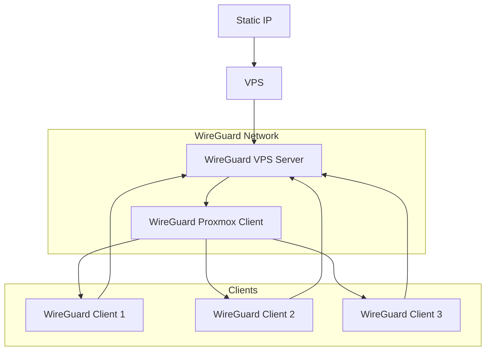
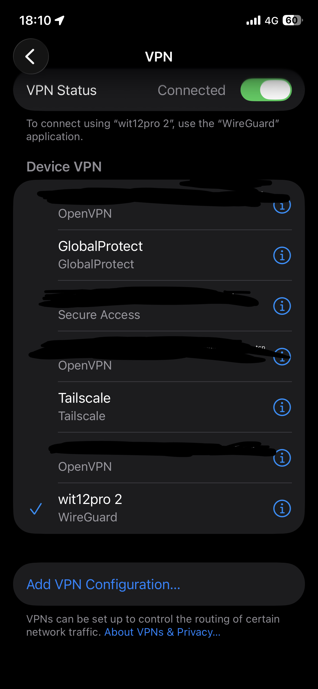
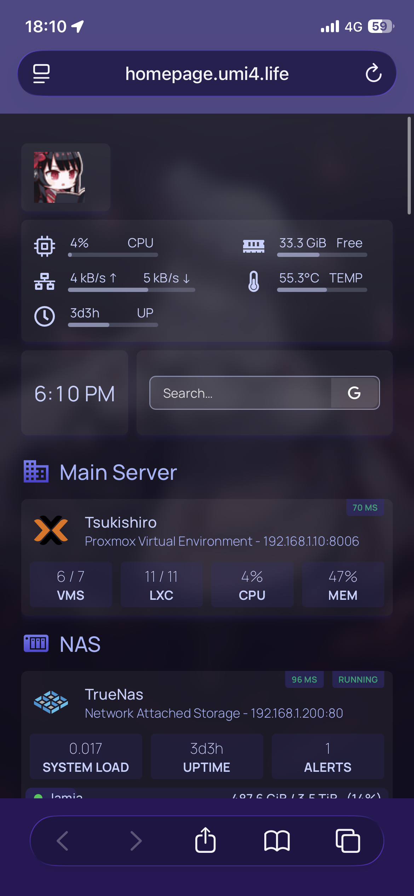
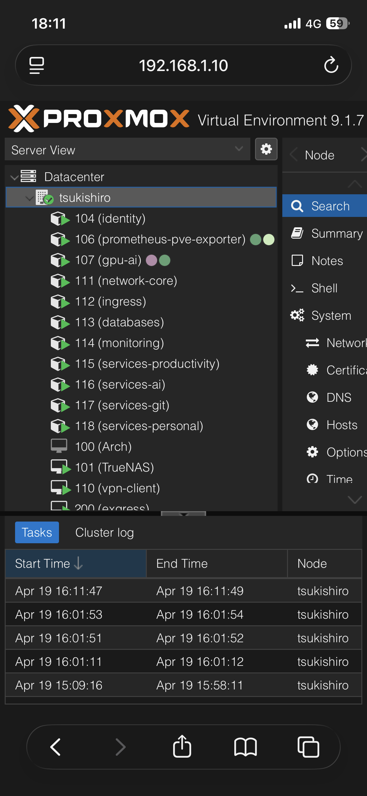
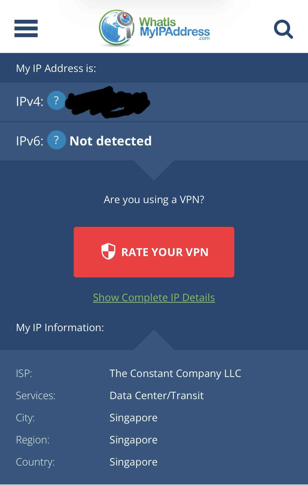

+++
date = '2026-04-19T15:33:15+07:00'
draft = false
title = 'WireGuard Network Setup'
cover = 'https://arknightshipship.com/cdn/shop/files/ArknightsNianBean.jpg?v=1721956346'
description = 'Creating VPN for people to my local network access'
tags = ["proxmox", "linux", "homelab", "vpn", "documentation"]
categories = ["homelab"]
mermaid = true
+++

## The Problem

Right now, I'm using Tailscale as a VPN for homelab access from remote (external wifi & cellular). What I don't like about this set up is that Tailscale free plan is very difficult to scale users as the user limit is only 6. If I want to share my internal services to my friend groups, they need to sign up for Tailscale account first and go through their onboarding. The only way to get aroud user limit I could think of is to add by device which is also a nightmare onboarding process (Tailscale login from user's device -> use the auth link to sign in to my account).

In short, Tailscale is great for personal use. But a pain to add users. WireGuard is much more simplified as all I have to do is generate QR link send it to my friend, and they only need to install WireGuard app and nothing else.

## Making the most out of my VPS
I recently set up a Vultr VPS for a static IP access for minecraft server TCP forwarding. It boasts 1 vCPU, 1 GB of memory, 25 GB of storage and costs a whopping $5 per month. I wanted to get the most out of it's value.


## Design

I'll implement full tunnel on this WireGuard network. The VPS server will host WireGuard server, have Proxmox connect as client and route local subnet all other clients. This gives client devices access to my local network from anywhere and also full tunnels to VPS server to be able to hide their own IP under VPS IP.

## Steps
### Setting up WireGuard Easy on VPS
I will be using `vpn.domain.name` as a placeholder here


#### Create docker compsoe
```bash
nano compose.yml
```
```yml
services:
  wg-easy:
    image: ghcr.io/wg-easy/wg-easy:15
    container_name: wg-easy
    restart: unless-stopped
    environment:
       - WG_HOST=vpn.domain.name
    volumes:
      - ./wg-easy/wireguard:/etc/wireguard
      - /lib/modules:/lib/modules:ro
    network_mode: "host"
    cap_add:
      - NET_ADMIN
      - SYS_MODULE

  caddy:
    container_name: caddy
    image: caddy:latest
    restart: unless-stopped
    volumes:
        - ./caddy/Caddyfile:/etc/caddy/Caddyfile
        - ./caddy/caddyconfig:/config
        - ./caddy/caddydata:/data
    network_mode: "host
```
#### Create caddyfile
```bash
nano caddy/Caddyfile
```
```caddy
{
    email email@email.com
}

vpn.domain.name {
    reverse_proxy 127.0.0.1:51821
}
```

Then start docker `docker compose up -d`

Afterwards, map the actual `vpn.domain.name` to the domain provider
| Attribute | Value |
| :--- | :--- |
| **Type** | A |
| **Name** | vpn |
| **Address** | VPS IP |
| **Proxy Status** | DNS only |

The WireGuard admin UI will now be accessible in `vpn.domain.name`

### Setting up WireGuard client on Proxmox VM
On admin UI, create a new configuration and download it. The file will be something like this
```cfg
[Interface]
PrivateKey = <PRIVATE_KEY>
Address = 10.8.0.2/32, fdcc:ad94:bacf:61a4::cafe:4/128
...

[Peer]
PublicKey = <PUBLIC_KEY>
PresharedKey = <PRESHARED_KEY>
...
Endpoint = vpn.domain.name:51820
```
Then spin up a Proxmox VM to install WireGuard client and use the keys and endpoint from this configuration. I'll be using Debian 13 in this example.

#### On terminal

Install WireGuard
```bash
sudo apt update && apt install wireguard -y
```
Create config and use the address, keys and endpoint from configuration file downloadeded from admin
```bash
sudo nano /etc/wireguard/wg0.conf
```
```cfg
[Interface]
PrivateKey = <PRIVATE_KEY>
Address = 10.8.0.2/32
MTU = 1420
DNS = 192.168.1.2, 1.1.1.1

PostUp = sysctl -w net.ipv4.ip_forward=1
PostUp = iptables -t nat -A POSTROUTING -s 10.8.0.0/24 -o ens18 -j MASQUERADE
PostUp = iptables -A FORWARD -i wg0 -o ens18 -j ACCEPT
PostUp = iptables -A FORWARD -i ens18 -o wg0 -m state --state RELATED,ESTABLISHED -j ACCEPT

PostDown = iptables -t nat -D POSTROUTING -s 10.8.0.0/24 -o ens18 -j MASQUERADE
PostDown = iptables -D FORWARD -i wg0 -o ens18 -j ACCEPT
PostDown = iptables -D FORWARD -i ens18 -o wg0 -m state --state RELATED,ESTABLISHED -j ACCEPT

[Peer]
PublicKey = <PUBLIC_KEY>
PresharedKey = <PRESHARED_KEY>
AllowedIPs = 0.0.0.0/0, ::/0
PersistentKeepalive = 25
Endpoint = vpn.domain.name:51820
```
Let's breakdown what we're doing here
#### DNS
The address of my Adguard for DNS rewrite and the address of Cloudflare DNS for fallback
#### PostUp = sysctl -w net.ipv4.ip_forward=1
Enables IP forward on every start up
#### The rest of PostUp = iptables
`iptables -t nat -A POSTROUTING -s 10.8.0.0/24 -o ens18 -j MASQUERADE`:
- NAT (Masquerading)
- Table: nat
- Chain: POSTROUTING (after routing decision)
- Meaning:
  - Any packet originating from VPN subnet 10.8.0.0/24
  - Going out via ens18 (my LAN interface, use `ip a` to find yours)

`iptables -A FORWARD -i wg0 -o ens18 -j ACCEPT`:
- Forward traffic from VPN to Internet
- Allow packets:
  - entering via wg0 (VPN clients)
  - leaving via ens18
- Without this, VM would drop forwarded packets by default.

`iptables -A FORWARD -i ens18 -o wg0 -m state --state RELATED,ESTABLISHED -j ACCEPT`
- Allow return traffic (stateful)
- Allows response packets only
- Uses connection tracking:
  - ESTABLISHED: part of an existing connection
  - RELATED: related (e.g., ICMP errors)

#### PostDowns
Wipes rules added by PostUps

#### PersistentKeepalive = 25
Keepalive packet is sent to the server endpoint once every 25s. VM client will automatically disconnect without it and the rest of client will lose all connection including internet access

After saving the config file, start WireGuard client and make it persistent
```bash
systemctl start wg-quick@wg0
systemctl enable wg-quick@wg0
```

### Setting up WireGuard on other clients
First, go back to WireGuard admin and set allowed IPs and DNS on server side
1. Go to Proxmox VM client -> edit 
    - set Allow IPs to 10.8.0.0/24 and 192.168.1.0/24 (my adguard interface and local network subnets in this case)
    - set Server Allowed IPs to 192.168.1.0/24
    - set DNS to 192.168.1.2 (my local network's DNS)
    - this will make Proxmox advertise the local subnets routes to clients
2. Go to Admistrator -> Admin Panel -> Config
    - set Allowed IPs to 0.0.0.0/0 and 192.168.1.0/24
    - set DNS to 192.168.1.2
    - this will override client config to use subnets routes
3. It should be noted that my DNS service (Adguard at 192.168.1.0) also has Cloudflare's dns (1.1.1.1) as upstream
4. Go back to root page/Administrator -> client and create a new configuration file for client
5. Download Wiregard on target client
6. Use QR or downlaoded JSON or share link to install tunnel on target
7. Now the client will be able to access all local network including Proxmox servers even on cellular







As a bonus, my client IP is also hidden under VPS datacenter(I don't live in Singapore)
