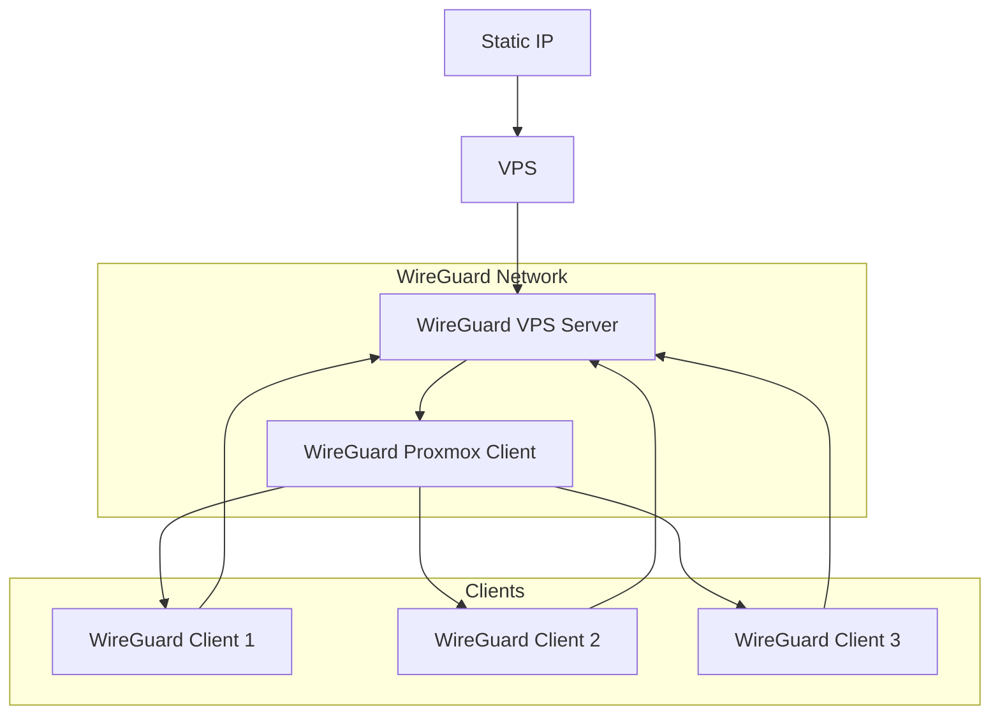

+++
date = '2026-04-19T15:33:15+07:00'
draft = false
translationKey = 'wireguard-network-setup'
title = 'ตั้งค่า WireGuard Network'
cover = 'https://arknightshipship.com/cdn/shop/files/ArknightsNianBean.jpg?v=1721956346'
description = 'สร้าง VPN ให้เพื่อนเข้าถึง local network ของผมได้ง่ายขึ้น'
tags = ["proxmox", "linux", "homelab", "vpn", "documentation"]
categories = ["homelab"]
mermaid = true
+++

## The Problem


ตอนนี้ผมใช้ Tailscale เป็น VPN สำหรับเข้า homelab จากข้างนอกบ้าน เช่น Wi‑Fi นอกบ้านหรือ cellular สิ่งที่ไม่ชอบใน setup นี้คือ free plan ของ Tailscale scale ผู้ใช้ยากมาก เพราะจำกัดไว้แค่ 6 users ถ้าผมอยากแชร์ internal services ให้กลุ่มเพื่อน ทุกคนต้องสมัครบัญชี Tailscale และผ่าน onboarding ของ Tailscale ก่อน วิธีเดียวที่พอจะเลี่ยง user limit ได้คือเพิ่มเป็นราย device ซึ่ง onboarding ก็ปวดหัวพอกัน: ให้ user login Tailscale จากเครื่องตัวเอง แล้วใช้ auth link เพื่อ sign in เข้าบัญชีของผม

สรุปสั้น ๆ คือ Tailscale ดีมากสำหรับใช้งานส่วนตัว แต่เพิ่ม user ใหม่ลำบาก WireGuard ตรงไปตรงมากว่าเยอะ เพราะแค่ generate QR link แล้วส่งให้เพื่อน เพื่อนติดตั้งแอป WireGuard ก็ใช้งานได้ ไม่ต้องสมัครอะไรเพิ่ม

## ใช้ VPS ให้คุ้มที่สุด

ช่วงก่อนผมตั้งค่า Vultr VPS เพื่อใช้ static IP สำหรับ TCP forwarding ของ Minecraft server ตัว VPS มี 1 vCPU, RAM 1 GB, storage 25 GB และราคาแรงมากถึง $5 ต่อเดือน ผมเลยอยากรีดประโยชน์จากมันให้คุ้มกว่านี้

## Design



ผมจะทำ full tunnel บน WireGuard network นี้ VPS จะเป็น WireGuard server ส่วนฝั่ง Proxmox จะ connect เข้าไปเป็น client แล้ว route local subnet ให้ client อื่น ๆ วิธีนี้ทำให้ device ของเพื่อนเข้าถึง local network ของผมจากที่ไหนก็ได้ และยังทำ full tunnel ออกผ่าน VPS ได้ด้วย หมายความว่า IP ฝั่ง client จะถูกซ่อนอยู่หลัง IP ของ VPS

## Steps

### ตั้งค่า WireGuard Easy บน VPS

ในตัวอย่างนี้ผมจะใช้ `vpn.domain.name` เป็น placeholder

#### สร้าง docker compose

```bash
nano compose.yml
```

```yml
services:
  wg-easy:
    image: ghcr.io/wg-easy/wg-easy:15
    container_name: wg-easy
    restart: unless-stopped
    environment:
       - WG_HOST=vpn.domain.name
    volumes:
      - ./wg-easy/wireguard:/etc/wireguard
      - /lib/modules:/lib/modules:ro
    network_mode: "host"
    cap_add:
      - NET_ADMIN
      - SYS_MODULE

  caddy:
    container_name: caddy
    image: caddy:latest
    restart: unless-stopped
    volumes:
        - ./caddy/Caddyfile:/etc/caddy/Caddyfile
        - ./caddy/caddyconfig:/config
        - ./caddy/caddydata:/data
    network_mode: "host
```

#### สร้าง Caddyfile

```bash
nano caddy/Caddyfile
```

```caddy
{
    email email@email.com
}

vpn.domain.name {
    reverse_proxy 127.0.0.1:51821
}
```

จากนั้น start Docker ด้วย `docker compose up -d`

หลังจากนั้น map `vpn.domain.name` จริงไปที่ domain provider

| Attribute | Value |
| :--- | :--- |
| **Type** | A |
| **Name** | vpn |
| **Address** | VPS IP |
| **Proxy Status** | DNS only |

ตอนนี้ WireGuard admin UI จะเข้าได้ที่ `vpn.domain.name`

### ตั้งค่า WireGuard client บน Proxmox VM

ใน admin UI ให้สร้าง configuration ใหม่แล้ว download ออกมา ไฟล์จะหน้าตาประมาณนี้

```cfg
[Interface]
PrivateKey = {PRIVATE_KEY}
Address = 10.8.0.2/32, fdcc:ad94:bacf:61a4::cafe:4/128
...

[Peer]
PublicKey = {PUBLIC_KEY}
PresharedKey = {PRESHARED_KEY}
...
Endpoint = vpn.domain.name:51820
```

จากนั้น spin up Proxmox VM สำหรับติดตั้ง WireGuard client แล้วใช้ keys และ endpoint จาก configuration นี้ ในตัวอย่างนี้ผมใช้ Debian 13

#### On terminal

ติดตั้ง WireGuard

```bash
sudo apt update && apt install wireguard -y
```

สร้าง config แล้วใส่ address, keys และ endpoint จากไฟล์ configuration ที่ download มาจาก admin

```bash
sudo nano /etc/wireguard/wg0.conf
```

```cfg
[Interface]
PrivateKey = {PRIVATE_KEY}
Address = 10.8.0.2/32
MTU = 1420
DNS = 192.168.1.2, 1.1.1.1

PostUp = sysctl -w net.ipv4.ip_forward=1
PostUp = iptables -t nat -A POSTROUTING -s 10.8.0.0/24 -o ens18 -j MASQUERADE
PostUp = iptables -A FORWARD -i wg0 -o ens18 -j ACCEPT
PostUp = iptables -A FORWARD -i ens18 -o wg0 -m state --state RELATED,ESTABLISHED -j ACCEPT

PostDown = iptables -t nat -D POSTROUTING -s 10.8.0.0/24 -o ens18 -j MASQUERADE
PostDown = iptables -D FORWARD -i wg0 -o ens18 -j ACCEPT
PostDown = iptables -D FORWARD -i ens18 -o wg0 -m state --state RELATED,ESTABLISHED -j ACCEPT

[Peer]
PublicKey = {PUBLIC_KEY}
PresharedKey = {PRESHARED_KEY}
AllowedIPs = 0.0.0.0/0, ::/0
PersistentKeepalive = 25
Endpoint = vpn.domain.name:51820
```

มาดูทีละส่วนว่า config นี้ทำอะไรบ้าง

#### DNS

`192.168.1.2` คือ AdGuard ของผมสำหรับ DNS rewrite ส่วน `1.1.1.1` คือ Cloudflare DNS สำหรับ fallback

#### PostUp = sysctl -w net.ipv4.ip_forward=1

เปิด IP forwarding ทุกครั้งที่ interface เริ่มทำงาน

#### ส่วนที่เหลือของ PostUp = iptables

`iptables -t nat -A POSTROUTING -s 10.8.0.0/24 -o ens18 -j MASQUERADE`:

- NAT หรือ Masquerading
- Table: nat
- Chain: POSTROUTING หลัง routing decision
- ความหมาย:
  - packet ที่มาจาก VPN subnet `10.8.0.0/24`
  - และออกผ่าน `ens18` ซึ่งเป็น LAN interface ของผม ใช้ `ip a` เพื่อหา interface ของเครื่องตัวเอง

`iptables -A FORWARD -i wg0 -o ens18 -j ACCEPT`:

- forward traffic จาก VPN ไป Internet/LAN
- อนุญาต packet ที่:
  - เข้าจาก `wg0` หรือ VPN clients
  - ออกทาง `ens18`
- ถ้าไม่มี rule นี้ VM จะ drop forwarded packets ตาม default

`iptables -A FORWARD -i ens18 -o wg0 -m state --state RELATED,ESTABLISHED -j ACCEPT`:

- อนุญาต return traffic แบบ stateful
- อนุญาตเฉพาะ response packets
- ใช้ connection tracking:
  - `ESTABLISHED`: เป็นส่วนหนึ่งของ connection ที่มีอยู่แล้ว
  - `RELATED`: เกี่ยวข้องกับ connection เดิม เช่น ICMP errors

#### PostDowns

ลบ rules ที่ PostUp เพิ่มไว้ตอนปิด interface

#### PersistentKeepalive = 25

ส่ง keepalive packet ไปที่ server endpoint ทุก 25 วินาที ถ้าไม่มีตัวนี้ VM client อาจ disconnect เอง แล้ว client อื่น ๆ จะเสีย connection ทั้งหมด รวมถึง internet access ผ่าน tunnel

หลัง save config แล้ว ให้ start WireGuard client และ enable ให้ขึ้นเองหลัง reboot

```bash
systemctl start wg-quick@wg0
systemctl enable wg-quick@wg0
```

### ตั้งค่า WireGuard บน client อื่น ๆ

กลับไปที่ WireGuard admin แล้วตั้งค่า allowed IPs และ DNS ฝั่ง server ก่อน

1. ไปที่ Proxmox VM client -> edit
   - ตั้ง `Allow IPs` เป็น `10.8.0.0/24` และ `192.168.1.0/24` ในกรณีนี้คือ subnet ของ AdGuard interface และ local network ของผม
   - ตั้ง `Server Allowed IPs` เป็น `192.168.1.0/24`
   - ตั้ง `DNS` เป็น `192.168.1.2` ซึ่งเป็น DNS ใน local network ของผม
   - ขั้นตอนนี้ทำให้ Proxmox advertise local subnet routes ไปหา clients
2. ไปที่ Administrator -> Admin Panel -> Config
   - ตั้ง `Allowed IPs` เป็น `0.0.0.0/0` และ `192.168.1.0/24`
   - ตั้ง `DNS` เป็น `192.168.1.2`
   - ค่านี้จะ override client config ให้ใช้ subnet routes
3. หมายเหตุ: DNS service ของผมคือ AdGuard ที่ `192.168.1.2` และมี Cloudflare DNS (`1.1.1.1`) เป็น upstream
4. กลับไปที่ root page/Administrator -> client แล้วสร้าง configuration file ใหม่ให้ client
5. Download WireGuard บน target client
6. ใช้ QR, JSON ที่ download มา, หรือ share link เพื่อติดตั้ง tunnel บนเครื่องเป้าหมาย
7. ตอนนี้ client จะเข้าถึง local network ได้ทั้งหมด รวมถึง Proxmox servers แม้จะอยู่บน cellular






เป็น bonus เพิ่มเติม IP ของ client จะถูกซ่อนอยู่หลัง VPS datacenter ด้วย ในเคสนี้คือผมไม่ได้อยู่ Singapore แต่ปลายทางจะเห็น IP ของ VPS แทน


